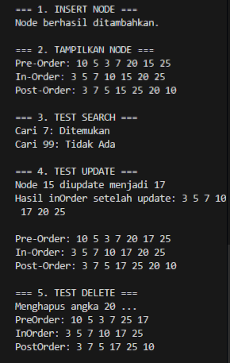
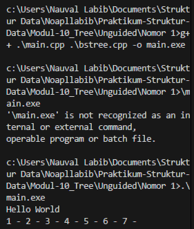
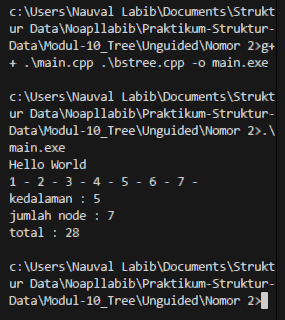
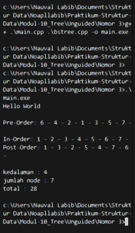

# <h1 align="center">Laporan Praktikum Modul 10 <br> Tree </h1>
<p align="center">Naufal Labib Asyidiq - 103112400108</p>

## Dasar Teori

Dasar Teori

Konsep dasar dari ketiga kode tersebut berakar pada teori struktur data **Binary Search Tree (BST)**, sebuah bentuk pohon biner yang dirancang untuk menjaga data tetap terurut secara dinamis. Setiap node memiliki tiga elemen fundamental: nilai data, pointer anak kiri, dan pointer anak kanan. Aturan utama BST menuntut bahwa seluruh nilai pada subtree kiri harus lebih kecil dari nilai node induk, sedangkan seluruh nilai pada subtree kanan harus lebih besar; aturan ini bukan sekadar formalitas—tanpa konsistensi tersebut, efisiensi pencarian dan penyisipan akan runtuh dan kinerja pohon tidak lebih baik daripada daftar linear biasa. Proses penyisipan memanfaatkan rekursi untuk menemukan lokasi yang tepat di dalam tree, memastikan struktur tetap terjaga setiap kali data baru dimasukkan. Traversal (in-order, pre-order, post-order) digunakan untuk menyisir seluruh node dengan pola sistematis yang masing-masing memiliki tujuan berbeda: in-order menghasilkan urutan nilai yang terurut, pre-order merepresentasikan urutan konstruksi tree, dan post-order berguna untuk kebutuhan seperti penghapusan tree dari bawah ke atas. Pencarian pada BST bergantung pada sifat terurut ini sehingga hanya satu cabang yang ditelusuri, bukan seluruh node, menjadikannya lebih efisien dibandingkan pencarian linear. Sementara itu, fungsi untuk menghitung jumlah node, total nilai, dan kedalaman pohon menunjukkan bagaimana rekursi digunakan untuk mereduksi masalah besar (seluruh tree) menjadi submasalah yang lebih kecil (subtree kiri dan kanan), sehingga setiap informasi struktural dapat diperoleh dengan menyisir node secara menyeluruh namun tetap terorganisir. Semua teori ini menunjukkan bahwa BST tidak hanya menyimpan data, tetapi mengaturnya dalam hierarki yang membuat operasi dasar menjadi lebih cepat, selama aturan strukturnya dipertahankan secara konsisten.


## Guided
```cpp
#include <iostream>
using namespace std;

struct Node {
    int data;
    Node *kiri, *kanan;
}; 

Node *buatNode(int nilai) {
    Node *baru = new Node;
    baru->data = nilai;
    baru->kiri = baru->kanan = NULL;
    return baru;
}

Node *insert(Node *root, int nilai) {
    if (root == NULL) {
        return buatNode(nilai);
    }
    if (nilai < root->data) {
        root->kiri = insert(root->kiri, nilai);
    } else {
        root->kanan = insert(root->kanan, nilai);
    }
    return root;
}

Node *search(Node *root, int nilai) {
    if (root == NULL || root->data == nilai) {
        return root;
    }
    if (nilai < root->data) {
        return search(root->kiri, nilai);
    }
    return search(root->kanan, nilai);
}

Node *nilaiTerkecil(Node *node) {
    Node *current = node;
    while (current && current->kiri != NULL) {
        current = current->kiri;
    }
    return current;
}

Node *hapus(Node *root, int nilai) {
    if (root == NULL) {
        return root;
    }
    if (nilai < root->data) {
        root->kiri = hapus(root->kiri, nilai);
    } else if (nilai > root->data) {
        root->kanan = hapus(root->kanan, nilai);
    } else {
        if (root->kiri == NULL) {
            Node *temp = root->kanan;
            delete root;
            return temp;
        } else if (root->kanan == NULL) {
            Node *temp = root->kiri;
            delete root;
            return temp;
        }
        Node *temp = nilaiTerkecil(root->kanan);
        root->data = temp->data;
        root->kanan = hapus(root->kanan, temp->data);
    }
    return root;
}

Node *update(Node *root, int lama, int baru) {
    if (search(root, lama) != NULL) { 
        root = hapus(root, lama);
        root = insert(root, baru);
        cout << "Node " << lama << " diupdate menjadi " << baru << endl;
    }
    else {
        cout << "Node " << lama << " tidak ditemukan." << endl;
    }
    return root;
}

void preOrder(Node *root) {  
    if (root != NULL) {
        cout << root->data << " ";
        preOrder(root->kiri);
        preOrder(root->kanan);
    }
}

void inOrder(Node *root) {  
    if (root != NULL) {
        inOrder(root->kiri);
        cout << root->data << " ";
        inOrder(root->kanan);
    }
}

void postOrder(Node *root) {  
    if (root != NULL) {
        postOrder(root->kiri);
        postOrder(root->kanan);
        cout << root->data << " ";
    }
}

int main() {  
    Node *root = NULL;
    cout << "=== 1. INSERT NODE ===" << endl;
    root = insert(root, 10);
    root = insert(root, 5);      
    root = insert(root, 20);     
    root = insert(root, 3);      
    root = insert(root, 7);      
    root = insert(root, 15);     
    root = insert(root, 25);     
    cout << "Node berhasil ditambahkan." << endl;

    cout << "\n=== 2. TAMPILKAN NODE ===" << endl;
    cout << "Pre-Order: ";
    preOrder(root);
    cout << endl;

    cout << "In-Order: ";
    inOrder(root);
    cout << endl;

    cout << "Post-Order: ";
    postOrder(root);
    cout << endl;

    cout << "\n=== 3. TEST SEARCH ===" << endl;
    int cari1 = 7, cari2 = 99;
    cout << "Cari " << cari1 << ": " << (search(root, cari1) ? "Ditemukan" : "Tidak Ada") << endl; 
    cout << "Cari " << cari2 << ": " << (search(root, cari2) ? "Ditemukan" : "Tidak Ada") << endl; 
    
    cout << "\n=== 4. TEST UPDATE ===" << endl;
    root = update(root, 15, 17);
    cout << "Hasil inOrder setelah update: ";  
    inOrder(root);
    cout << endl;

    cout << "\nPre-Order: ";
    preOrder(root);
    cout << endl;
    cout << "In-Order: ";
    inOrder(root);
    cout << endl;
    cout << "Post-Order: ";
    postOrder(root);
    cout << endl;
    
    cout << "\n=== 5. TEST DELETE ===" << endl;
    cout << "Menghapus angka 20 ..." << endl;
    root = hapus(root, 20); 

    cout << "PreOrder: ";
    preOrder(root);
    cout << endl;
    cout << "InOrder: ";
    inOrder(root);
    cout << endl;   
    cout << "PostOrder: ";
    postOrder(root);
    cout << endl;
    
    return 0;
}

```
### OUTPUT

> Output
> 

Program ini membangun **Binary Search Tree** lengkap dengan operasi insert, search, delete, update, dan tiga jenis traversal. Setiap nilai baru dimasukkan dengan aturan dasar BST: lebih kecil menuju anak kiri dan lebih besar menuju anak kanan. Proses pencarian juga mengikuti pola yang sama sehingga efisien karena hanya menelusuri cabang yang relevan. Operasi penghapusan menangani tiga kondisi utama: node tanpa anak yang bisa langsung dihapus, node dengan satu anak yang digantikan oleh anaknya, dan node dengan dua anak yang nilainya diganti menggunakan nilai terkecil dari subtree kanan agar struktur BST tetap konsisten. Fungsi update bekerja dengan cara menghapus nilai lama dan memasukkan nilai baru untuk menjaga urutan tree tetap valid. Terakhir, traversal preorder, inorder, dan postorder digunakan untuk menampilkan isi tree dari sudut pandang yang berbeda—dengan inorder menghasilkan urutan nilai yang terurut secara alami.

## UNGUIDED
### SOAL 1
> Output
> 

#### bstree.h

```cpp
#ifndef BSTREE_H
#define BSTREE_H

#include <iostream>
using namespace std;

typedef int infotype;
typedef struct Node* address;

struct Node {
    infotype info;
    address left;
    address right;
};

address alokasi(infotype x);
void insertNode(address &root, infotype x);
void inOrder(address root);
address findNode(infotype x, address root);
void printInOrder(address root);

#endif
```

##### bstree.cpp
```cpp
#include "bstree.h"

address alokasi(infotype x) {
    address newNode = new Node;
    newNode->info = x;
    newNode->left = NULL;
    newNode->right = NULL;
    return newNode;
}

void insertNode(address &root, infotype x) {
    if (root == NULL) {
        root = alokasi(x);
    } else {
        if (x < root->info) {
            insertNode(root->left, x);
        } else if (x > root->info) {
            insertNode(root->right, x);
        }
    }
}

void inOrder(address root) {
    if (root != NULL) {
        inOrder(root->left);        
        cout << root->info << " - "; 
        inOrder(root->right);       
    }
}

address findNode(infotype x, address root) {
    if (root == NULL) {
        return NULL;
    } else if (x == root->info) {
        return root;
    } else if (x < root->info) {
        return findNode(x, root->left);
    } else {
        return findNode(x, root->right);
    }
}

void printInOrder(address root) {
    inOrder(root);
    cout << endl;
}
```

#### main.cpp
```cpp
#include <iostream>
#include "bstree.h"

using namespace std;

int main() {
    cout << "Hello World" << endl;
    
    address root = NULL;
    
    insertNode(root, 1);
    insertNode(root, 2);
    insertNode(root, 3);
    insertNode(root, 4);
    insertNode(root, 5);
    insertNode(root, 6);
    insertNode(root, 7);
    
    inOrder(root);
    
    return 0;
}
```
#### OUTPUT

> Output
> 

Program ini membangun struktur Binary Search Tree dengan beberapa fungsi utama: `alokasi` membuat node baru berisi nilai yang diberikan dan menginisialisasi pointer kiri serta kanan dengan nilai kosong. Fungsi `insertNode` menempatkan nilai baru ke dalam tree berdasarkan perbandingan dengan nilai pada node saat ini; nilai yang lebih kecil diarahkan ke subtree kiri dan nilai yang lebih besar diarahkan ke subtree kanan, sehingga tree tersusun berdasarkan aturan BST. Fungsi `findNode` menelusuri tree dari root dengan mengikuti percabangan kiri atau kanan sesuai besar–kecilnya nilai yang dicari hingga menemukan node yang sesuai atau mencapai akhir tree. Fungsi `inOrder` melakukan penelusuran secara rekursif dari subtree kiri, mencetak nilai pada node, kemudian melanjutkan ke subtree kanan; urutan seperti ini menghasilkan tampilan data secara terurut. Dalam `main`, nilai 1 sampai 7 dimasukkan secara berurutan sehingga node-node akan tersusun membentuk rantai ke arah kanan. Setelah seluruh data dimasukkan, pemanggilan `inOrder` menampilkan semua nilai berdasarkan aturan traversal tersebut.


### SOAL 2
> Output
> 

#### bstree.h

```cpp
#ifndef BSTREE_H
#define BSTREE_H

#include <iostream>
using namespace std;

typedef int infotype;
typedef struct Node* address;

struct Node {
    infotype info;
    address left;
    address right;
};

address alokasi(infotype x);
void insertNode(address &root, infotype x);
void inOrder(address root);
address findNode(infotype x, address root);
void printInOrder(address root);

int hitungJumlahNode(address root);
int hitungTotalInfo(address root, int start);
int hitungKedalaman(address root, int start);

#endif
```

#### bstree.cpp
```cpp
#include "bstree.h"

address alokasi(infotype x) {
    address newNode = new Node;
    newNode->info = x;
    newNode->left = NULL;
    newNode->right = NULL;
    return newNode;
}

void insertNode(address &root, infotype x) {
    if (root == NULL) {
        root = alokasi(x);
    } else {
        if (x < root->info) {
            insertNode(root->left, x);
        } else if (x > root->info) {
            insertNode(root->right, x);
        }
    }
}

void inOrder(address root) {
    if (root != NULL) {
        inOrder(root->left);        
        cout << root->info << " - "; 
        inOrder(root->right);       
    }
}

address findNode(infotype x, address root) {
    if (root == NULL) {
        return NULL;
    } else if (x == root->info) {
        return root;
    } else if (x < root->info) {
        return findNode(x, root->left);
    } else {
        return findNode(x, root->right);
    }
}

void printInOrder(address root) {
    inOrder(root);
    cout << endl;
}
int hitungJumlahNode(address root) {
    if (root == NULL) {
        return 0;
    } else {
        return 1 + hitungJumlahNode(root->left) + hitungJumlahNode(root->right);
    }
}

int hitungTotalInfo(address root, int start) {
    if (root == NULL) {
        return start;
    } else {
        start = start + root->info;
        start = hitungTotalInfo(root->left, start);
        start = hitungTotalInfo(root->right, start);
        return start;
    }
}

int hitungKedalaman(address root, int start) {
    if (root == NULL) {
        return start;
    } else {
        int kedalamanKiri = hitungKedalaman(root->left, start + 1);
        int kedalamanKanan = hitungKedalaman(root->right, start + 1);
        
        if (kedalamanKiri > kedalamanKanan) {
            return kedalamanKiri;
        } else {
            return kedalamanKanan;
        }
    }
}
```

#### main.cpp
```cpp
#include <iostream>
#include "bstree.h"

using namespace std;

int main() {
    cout << "Hello World" << endl;
    address root = NULL;
    
    insertNode(root, 1);
    insertNode(root, 2);
    insertNode(root, 6);
    insertNode(root, 4);
    insertNode(root, 5);
    insertNode(root, 3);
    insertNode(root, 6);
    insertNode(root, 7);
    
    inOrder(root);
    cout << endl;
    
    cout << "kedalaman : " << hitungKedalaman(root, 0) << endl;
    cout << "jumlah node : " << hitungJumlahNode(root) << endl;    
    cout << "total : " << hitungTotalInfo(root, 0) << endl;
    return 0;
}
```
#### OUTPUT

> Output
> 

Program ini menyusun Binary Search Tree yang dapat melakukan penyisipan data, pencarian, penelusuran, serta perhitungan atribut dasar pohon. Struktur node terdiri dari sebuah nilai dan dua pointer anak. Fungsi `alokasi` membuat node baru, sedangkan `insertNode` menempatkan data ke posisi yang sesuai berdasarkan perbandingan nilai untuk menjaga aturan BST. Fungsi `inOrder` mencetak isi tree dengan urutan kiri–root–kanan, sementara `findNode` menelusuri tree mengikuti aturan besar–kecil hingga menemukan nilai atau mencapai akhir cabang. Tiga fungsi tambahan menghitung karakteristik tree: `hitungJumlahNode` menelusuri seluruh node secara rekursif untuk mendapatkan total jumlah node, `hitungTotalInfo` menjumlahkan seluruh nilai `info` pada setiap node, dan `hitungKedalaman` menentukan kedalaman maksimum dengan membandingkan panjang jalur dari root menuju subtree kiri dan kanan. Dalam fungsi `main`, beberapa nilai dimasukkan ke tree, lalu program menampilkan isi tree melalui traversal in-order, diikuti kedalaman tree, jumlah node, dan total seluruh nilai yang tersimpan di setiap node.


### SOAL 3
> Output
> 

#### bstree.h

```cpp
#ifndef BSTREE_H
#define BSTREE_H

#include <iostream>
using namespace std;

typedef int infotype;
typedef struct Node* address;

struct Node {
    infotype info;
    address left;
    address right;
};

address alokasi(infotype x);
void insertNode(address &root, infotype x);
void inOrder(address root);
address findNode(infotype x, address root);
void printInOrder(address root);

int hitungJumlahNode(address root);
int hitungTotalInfo(address root, int start);
int hitungKedalaman(address root, int start);

void preOrder(address root);
void postOrder(address root);
void printPreOrder(address root);
void printPostOrder(address root);

#endif 
```

#### bstree.cpp
```cpp
#include "bstree.h"

address alokasi(infotype x) {
    address newNode = new Node;
    newNode->info = x;
    newNode->left = NULL;
    newNode->right = NULL;
    return newNode;
}

void insertNode(address &root, infotype x) {
    if (root == NULL) {
        root = alokasi(x);
    } else {
        if (x < root->info) {
            insertNode(root->left, x);
        } else if (x > root->info) {
            insertNode(root->right, x);
        }
    }
}

void inOrder(address root) {
    if (root != NULL) {
        inOrder(root->left);        
        cout << root->info << " - "; 
        inOrder(root->right);       
    }
}

address findNode(infotype x, address root) {
    if (root == NULL) {
        return NULL;
    } else if (x == root->info) {
        return root;
    } else if (x < root->info) {
        return findNode(x, root->left);
    } else {
        return findNode(x, root->right);
    }
}

void printInOrder(address root) {
    inOrder(root);
    cout << endl;
}
int hitungJumlahNode(address root) {
    if (root == NULL) {
        return 0;
    } else {
        return 1 + hitungJumlahNode(root->left) + hitungJumlahNode(root->right);
    }
}

int hitungTotalInfo(address root, int start) {
    if (root == NULL) {
        return start;
    } else {
        start = start + root->info;
        start = hitungTotalInfo(root->left, start);
        start = hitungTotalInfo(root->right, start);
        return start;
    }
}

int hitungKedalaman(address root, int start) {
    if (root == NULL) {
        return start;
    } else {
        int kedalamanKiri = hitungKedalaman(root->left, start + 1);
        int kedalamanKanan = hitungKedalaman(root->right, start + 1);
        
        if (kedalamanKiri > kedalamanKanan) {
            return kedalamanKiri;
        } else {
            return kedalamanKanan;
        }
    }
}

void preOrder(address root) {
    if (root != NULL) {
        cout << root->info << " - "; 
        preOrder(root->left);        
        preOrder(root->right);       
    }
}

void postOrder(address root) {
    if (root != NULL) {
        postOrder(root->left);       
        postOrder(root->right);      
        cout << root->info << " - "; 
    }
}

void printPreOrder(address root) {
    preOrder(root);
    cout << endl;
}
void printPostOrder(address root) {
    postOrder(root);
    cout << endl;
}
```

#### main.cpp
```cpp
    #include <iostream>
#include "bstree.h"

using namespace std;

int main() {
    cout << "Hello World" << endl;
    
    address root = NULL;
    
    insertNode(root, 6);
    insertNode(root, 4);
    insertNode(root, 7);
    insertNode(root, 2);
    insertNode(root, 5);
    insertNode(root, 1);
    insertNode(root, 3);
    
    cout << "\nPre-Order: ";
    printPreOrder(root);
    
    cout << "In-Order: ";
    printInOrder(root);
    
    cout << "Post-Order: ";
    printPostOrder(root);
    
    cout << "\nkedalaman : " << hitungKedalaman(root, 0) << endl;
    cout << "jumlah node : " << hitungJumlahNode(root) << endl;
    cout << "total : " << hitungTotalInfo(root, 0) << endl;
    
    return 0;
}
```
#### OUTPUT

> Output
> 

Program ini membangun sebuah Binary Search Tree lengkap dengan fungsi penyisipan data, pencarian, tiga jenis traversal, serta perhitungan karakteristik dasar tree. Struktur node berisi sebuah nilai dan dua pointer anak, sementara fungsi `alokasi` membuat node baru dengan nilai tersebut. Penyisipan dilakukan melalui `insertNode`, yang menempatkan nilai ke subtree kiri atau kanan berdasarkan aturan perbandingan nilai khas BST. Tiga fungsi traversal disediakan: `inOrder` mencetak isi tree secara terurut, `preOrder` mengunjungi root terlebih dahulu lalu subtree kiri dan kanan, dan `postOrder` menampilkan hasil setelah seluruh subtree selesai diproses. Untuk pencarian, `findNode` menelusuri tree mengikuti perbandingan nilai hingga menemukan node atau mencapai ujung cabang. Selain itu, terdapat fungsi tambahan seperti `hitungJumlahNode` yang menjumlahkan seluruh node secara rekursif, `hitungTotalInfo` yang mengakumulasi nilai `info` pada setiap node, dan `hitungKedalaman` yang menghitung kedalaman maksimum berdasarkan jalur terpanjang dari root ke node daun. Pada fungsi `main`, data dimasukkan sedemikian rupa sehingga tree tersusun rapi, kemudian program menampilkan hasil traversal dan menghitung tiga informasi penting kedalaman tree, jumlah node, dan total seluruh nilai yang tersimpan.


## Referensi

1. Samala, A. D., Fajri, B. R., & Ranuarja, F. (2021). PEMROGRAMAN C++. UNP PRESS. https://books.google.com/books?hl=id&lr=&id=49ZbEAAAQBAJ&oi=fnd&pg=PA2&dq=pemrograman+c%2B%2B&ots=4sYIx_JYCx&sig=ouhrRQNOGTjAM3F2phz0_RIeUjY

2. Indahyanti, U., & Rahmawati, Y. (2020). Buku Ajar Algoritma Dan Pemrograman Dalam Bahasa C++. Umsida Press, 1-146. https://press.umsida.ac.id/index.php/umsidapress/article/view/978-623-6833-67-4

3. Santoso, L. E. (2004). STANDARD TEMPLATE LIBRARY C++ UNTUK MENGAJARKAN STRUKTUR DATA. Jurnal FASILKOM Vol, 2(2). https://www.academia.edu/download/56411324/standard-template-library-c__-untuk-mengajarkan-struktur-data.pdf

4. Anita Sindar, R. M. S. (2019). Struktur Data Dan Algoritma Dengan C++ (Vol. 1). CV. AA. RIZKY. https://books.google.com/books?hl=en&lr=&id=GP_ADwAAQBAJ&oi=fnd&pg=PA23&dq=stack+pada+c%2B%2B&ots=86k4Nl2OhV&sig=0KNR8rE2WYaLliEAZmi71x2eU7k
