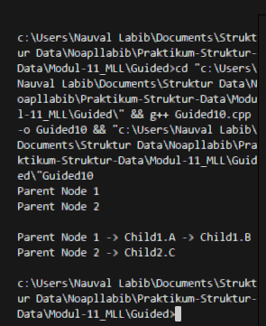
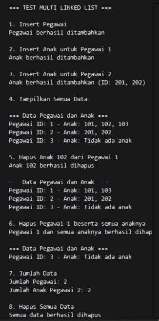
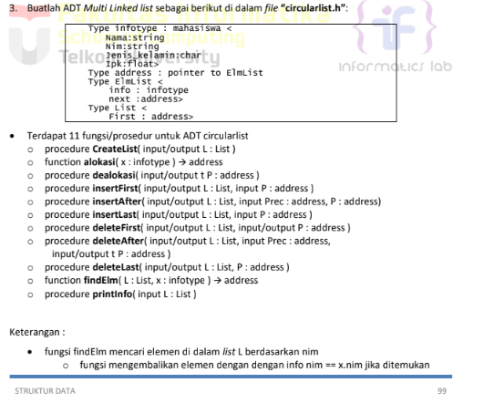
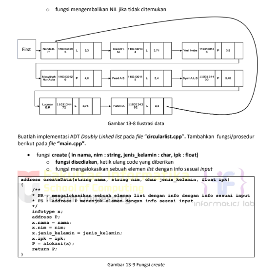
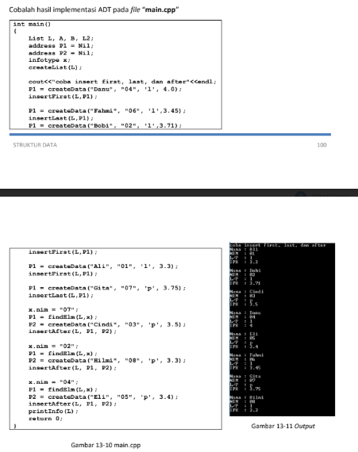
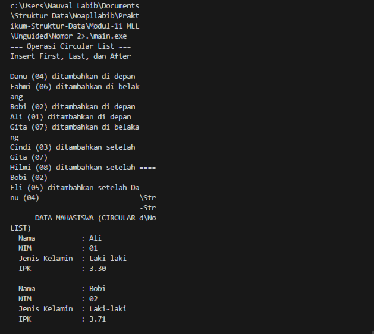
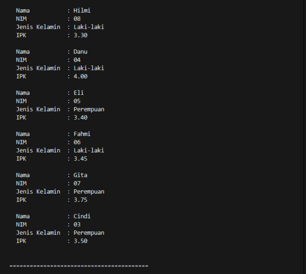

# <h1 align="center">Laporan Praktikum Modul 11 <br> Multi Linked List </h1>
<p align="center">Naufal Labib Asyidiq - 103112400108</p>

## Dasar Teori

Dasar Teori

Struktur program tersebut menunjukkan implementasi Multi Linked List dua tingkat di mana setiap node kategori berperan sebagai induk yang menyimpan nama kategori dan pointer menuju node transaksi pertama, sedangkan setiap node transaksi berisi jenis transaksi, jumlah, pointer ke transaksi berikutnya, serta pointer kembali ke kategori induknya; mekanisme ini memungkinkan hubungan satu-ke-banyak tanpa perlu menyalin data sehingga tiap kategori dapat memiliki rantai transaksi sendiri yang terpisah. Pada multilist.cpp, fungsi createCategory, createTransaction, dan addTransaction mengatur pembuatan node serta penyambungan antar-pointer sehingga hirarki kategori→transaksi terbentuk konsisten, sementara fungsi displayData menelusuri setiap kategori lalu mengiterasi transaksi miliknya menggunakan pointer nextTransaction sehingga output dapat menampilkan urutan kategori beserta seluruh transaksi terkait. File main.cpp bertindak sebagai driver yang membuat beberapa kategori, menambahkan transaksi ke masing-masing kategori, lalu memanggil displayData sehingga seluruh struktur Multi Linked List dapat diverifikasi; keseluruhan desain ini menekankan keterhubungan dua tingkat melalui pointer yang terorganisir sehingga data hierarkis dapat diakses secara efisien.


## Guided
```cpp
#include <iostream>
#include <string>
using namespace std;

struct ChildNode
{
    string info;
    ChildNode* next;
};

struct ParentNode
{
    string info;
    ParentNode* next;
    ChildNode* childHead;
};

ParentNode *createParent(string info)
{
    ParentNode *newNode = new ParentNode;
    newNode->info = info;
    newNode->childHead = NULL;
    newNode->next = NULL;
    return newNode;
}

ChildNode *createChild(string info)
{
    ChildNode *newNode = new ChildNode;
    newNode->info = info;
    newNode->next = NULL;
    return newNode;
}

void insertParent(ParentNode *&head, string info)
{
    ParentNode *newNode = createParent(info);
    if (head == NULL)
    {
        head = newNode;
    }
    else
    {
        ParentNode *temp = head;
        while (temp->next != NULL)
        {
            temp = temp->next;
        }
        temp->next = newNode;
    }
}

void insertChild(ParentNode *head, string parenInfo, string childInfo)
{
    ParentNode *p = head;
    while (p != NULL && p->info != parenInfo)
    {
        p = p->next;
    }
    if (p != NULL)
    {
        ChildNode *newChild = createChild(childInfo);
        if (p->childHead == NULL)
        {
            p->childHead = newChild;
        }
        else
        {
            ChildNode *c = p->childHead;
            while (c->next != NULL)
            {
                c = c->next;
            }
            c->next = newChild;
        }
    }
}

void printAll(ParentNode *head)
{
    ParentNode *p = head;
    while (p != NULL)
    {
        cout << p ->info;
        ChildNode *c = p->childHead;
        if (c != NULL)
        {
            while (c != NULL)
            {
                cout << " -> " << c->info;
                c = c->next;
            }
        }
        cout << endl;
        p = p->next;
    }
}

int main()
{
    ParentNode *list = NULL;

    insertParent(list, "Parent Node 1");
    insertParent(list, "Parent Node 2");

    printAll(list);
    cout << "\n";
    
    insertChild(list, "Parent Node 1", "Child1.A");
    insertChild(list, "Parent Node 1", "Child1.B");
    insertChild(list, "Parent Node 2", "Child2.C");

    printAll(list);

    return 0;
}

```
### OUTPUT

> Output
> 

Kode MLL (Multi Linked List) ini membangun struktur dua tingkat yang memisahkan data induk (parent) dan data turunannya (child) menggunakan dua jenis node terhubung. Setiap *ParentNode* menyimpan informasi utama dan pointer ke *childHead* yang menjadi awal dari daftar anak miliknya, sementara pointer *next* menghubungkan parent satu dengan parent lainnya sehingga membentuk linked list linear di level atas. Di sisi lain, setiap *ChildNode* membentuk linked list tersendiri di bawah parent yang sesuai. Fungsi *createParent* dan *createChild* menangani pembuatan node baru, sedangkan *insertParent* menambahkan elemen parent ke akhir daftar dengan penelusuran iteratif. Fungsi *insertChild* melakukan pencarian parent berdasarkan string info, lalu menyisipkan child baru ke akhir daftar anak parent tersebut, menunjukkan bagaimana hubungan hierarkis dibangun tanpa struktur statis. Terakhir, fungsi *printAll* menelusuri seluruh parent dan mencetak setiap child yang terhubung, sehingga memperlihatkan representasi eksplisit dari model data bertingkat. Struktur ini mencerminkan dasar teori MLL, yaitu memodelkan relasi satu-ke-banyak menggunakan dua linked list yang saling berhubungan dan tetap fleksibel terhadap pertambahan data.


## UNGUIDED
### SOAL 1
> Output
> 

#### multilist.h

```cpp
#ifndef MULTILIST_H_INCLUDED
#define MULTILIST_H_INCLUDED
#define Nil NULL

typedef int infotypeanak;
typedef int infotypeinduk;
typedef struct elemen_list_induk *address;
typedef struct elemen_list_anak *address_anak;

struct elemen_list_anak {
    infotypeanak info;
    address_anak next;
    address_anak prev;
};

struct listanak {
    address_anak first;
    address_anak last;
};

struct elemen_list_induk {
    infotypeinduk info;
    listanak lanak;
    address next;
    address prev;
};

struct listinduk {
    address first;
    address last;
};

bool ListEmpty(listinduk L);
bool ListEmptyAnak(listanak L);

void CreateList(listinduk &L);
void CreateListAnak(listanak &L);


address alokasi(infotypeinduk X);
address_anak alokasiAnak(infotypeanak X);
void dealokasi(address &P);
void dealokasiAnak(address_anak &P);

address findElm(listinduk L, infotypeinduk X);
address_anak findElmAnak(listanak Lanak, infotypeanak X);

void insertFirst(listinduk &L, address P);
void insertLast(listinduk &L, address P);

void insertFirstAnak(listanak &L, address_anak P);
void insertLastAnak(listanak &L, address_anak P);

void delFirst(listinduk &L, address &P);
void delLast(listinduk &L, address &P);
void delP(listinduk &L, infotypeinduk X);

void delFirstAnak(listanak &L, address_anak &P);
void delLastAnak(listanak &L, address_anak &P);
void delPAnak(listanak &L, infotypeanak X);

void printInfo(listinduk L);
void printInfoAnak(listanak Lanak);
int nbList(listinduk L);
int nbListAnak(listanak Lanak);
void delAll(listinduk &L);

#endif
```

##### multilist.cpp
```cpp
#include "multilist.h"
#include <iostream>
using namespace std;

bool ListEmpty(listinduk L) {
    return L.first == Nil;
}

bool ListEmptyAnak(listanak L) {
    return L.first == Nil;
}

void CreateList(listinduk &L) {
    L.first = Nil;
    L.last = Nil;
}

void CreateListAnak(listanak &L) {
    L.first = Nil;
    L.last = Nil;
}

address alokasi(infotypeinduk X) {
    address P = new elemen_list_induk;
    if (P != Nil) {
        P->info = X;
        CreateListAnak(P->lanak);
        P->next = Nil;
        P->prev = Nil;
    }
    return P;
}

address_anak alokasiAnak(infotypeanak X) {
    address_anak P = new elemen_list_anak;
    if (P != Nil) {
        P->info = X;
        P->next = Nil;
        P->prev = Nil;
    }
    return P;
}

void dealokasi(address &P) {
    delete P;
    P = Nil;
}

void dealokasiAnak(address_anak &P) {
    delete P;
    P = Nil;
}

address findElm(listinduk L, infotypeinduk X) {
    address P = L.first;
    while (P != Nil) {
        if (P->info == X) {
            return P;
        }
        P = P->next;
    }
    return Nil;
}

address_anak findElmAnak(listanak Lanak, infotypeanak X) {
    address_anak P = Lanak.first;
    while (P != Nil) {
        if (P->info == X) {
            return P;
        }
        P = P->next;
    }
    return Nil;
}

void insertFirst(listinduk &L, address P) {
    if (ListEmpty(L)) {
        L.first = P;
        L.last = P;
    } else {
        P->next = L.first;
        L.first->prev = P;
        L.first = P;
    }
}

void insertLast(listinduk &L, address P) {
    if (ListEmpty(L)) {
        L.first = P;
        L.last = P;
    } else {
        L.last->next = P;
        P->prev = L.last;
        L.last = P;
    }
}

void insertFirstAnak(listanak &L, address_anak P) {
    if (ListEmptyAnak(L)) {
        L.first = P;
        L.last = P;
    } else {
        P->next = L.first;
        L.first->prev = P;
        L.first = P;
    }
}

void insertLastAnak(listanak &L, address_anak P) {
    if (ListEmptyAnak(L)) {
        L.first = P;
        L.last = P;
    } else {
        L.last->next = P;
        P->prev = L.last;
        L.last = P;
    }
}

void delFirst(listinduk &L, address &P) {
    if (!ListEmpty(L)) {
        P = L.first;
        if (L.first == L.last) {
            L.first = Nil;
            L.last = Nil;
        } else {
            L.first = L.first->next;
            L.first->prev = Nil;
            P->next = Nil;
        }
    }
}

void delLast(listinduk &L, address &P) {
    if (!ListEmpty(L)) {
        P = L.last;
        if (L.first == L.last) {
            L.first = Nil;
            L.last = Nil;
        } else {
            L.last = L.last->prev;
            L.last->next = Nil;
            P->prev = Nil;
        }
    }
}

void delP(listinduk &L, infotypeinduk X) {
    address P = findElm(L, X);
    if (P != Nil) {
        address_anak PA;
        while (!ListEmptyAnak(P->lanak)) {
            delFirstAnak(P->lanak, PA);
            dealokasiAnak(PA);
        }
    
        if (P == L.first) {
            delFirst(L, P);
        } else if (P == L.last) {
            delLast(L, P);
        } else {
            P->prev->next = P->next;
            P->next->prev = P->prev;
        }
        dealokasi(P);
    }
}

void delFirstAnak(listanak &L, address_anak &P) {
    if (!ListEmptyAnak(L)) {
        P = L.first;
        if (L.first == L.last) {
            L.first = Nil;
            L.last = Nil;
        } else {
            L.first = L.first->next;
            L.first->prev = Nil;
            P->next = Nil;
        }
    }
}

void delLastAnak(listanak &L, address_anak &P) {
    if (!ListEmptyAnak(L)) {
        P = L.last;
        if (L.first == L.last) {
            L.first = Nil;
            L.last = Nil;
        } else {
            L.last = L.last->prev;
            L.last->next = Nil;
            P->prev = Nil;
        }
    }
}

void delPAnak(listanak &L, infotypeanak X) {
    address_anak P = findElmAnak(L, X);
    if (P != Nil) {
        if (P == L.first) {
            delFirstAnak(L, P);
        } else if (P == L.last) {
            delLastAnak(L, P);
        } else {
            P->prev->next = P->next;
            P->next->prev = P->prev;
        }
        dealokasiAnak(P);
    }
}

void printInfoAnak(listanak Lanak) {
    if (ListEmptyAnak(Lanak)) {
        cout << "Tidak ada anak";
    } else {
        address_anak P = Lanak.first;
        while (P != Nil) {
            cout << P->info;
            if (P->next != Nil) {
                cout << ", ";
            }
            P = P->next;
        }
    }
}

void printInfo(listinduk L) {
    if (ListEmpty(L)) {
        cout << "List kosong" << endl;
    } else {
        address P = L.first;
        cout << "\n=== Data Pegawai dan Anak ===" << endl;
        while (P != Nil) {
            cout << "Pegawai ID: " << P->info << " - Anak: ";
            printInfoAnak(P->lanak);
            cout << endl;
            P = P->next;
        }
    }
}

int nbList(listinduk L) {
    int count = 0;
    address P = L.first;
    while (P != Nil) {
        count++;
        P = P->next;
    }
    return count;
}

int nbListAnak(listanak Lanak) {
    int count = 0;
    address_anak P = Lanak.first;
    while (P != Nil) {
        count++;
        P = P->next;
    }
    return count;
}

void delAll(listinduk &L) {
    address P;
    while (!ListEmpty(L)) {
        delFirst(L, P);
        address_anak PA;
        while (!ListEmptyAnak(P->lanak)) {
            delFirstAnak(P->lanak, PA);
            dealokasiAnak(PA);
        }
        dealokasi(P);
    }
}
```

#### main.cpp
```cpp
#include "multilist.h"
#include <iostream>
using namespace std;

int main() {
    listinduk L;
    address P;
    address_anak PA;
    
    CreateList(L);
    
    cout << "=== TEST MULTI LINKED LIST ===" << endl;
    
    cout << "\n1. Insert Pegawai" << endl;
    P = alokasi(1);
    insertLast(L, P);
    
    P = alokasi(2);
    insertLast(L, P);
    
    P = alokasi(3);
    insertLast(L, P);
    
    cout << "Pegawai berhasil ditambahkan" << endl;
    
    cout << "\n2. Insert Anak untuk Pegawai 1" << endl;
    P = findElm(L, 1);
    if (P != Nil) {
        PA = alokasiAnak(101);
        insertLastAnak(P->lanak, PA);
        
        PA = alokasiAnak(102);
        insertLastAnak(P->lanak, PA);
        
        PA = alokasiAnak(103);
        insertLastAnak(P->lanak, PA);
        
        cout << "Anak berhasil ditambahkan" << endl;
    }
    
    cout << "\n3. Insert Anak untuk Pegawai 2" << endl;
    P = findElm(L, 2);
    if (P != Nil) {
        PA = alokasiAnak(201);
        insertLastAnak(P->lanak, PA);
        
        PA = alokasiAnak(202);
        insertLastAnak(P->lanak, PA);
        
        cout << "Anak berhasil ditambahkan (ID: 201, 202)" << endl;
    }
    
    cout << "\n4. Tampilkan Semua Data" << endl;
    printInfo(L);
    
    cout << "\n5. Hapus Anak 102 dari Pegawai 1" << endl;
    P = findElm(L, 1);
    if (P != Nil) {
        delPAnak(P->lanak, 102);
        cout << "Anak 102 berhasil dihapus" << endl;
    }
    
    printInfo(L);
    
    cout << "\n6. Hapus Pegawai 1 beserta semua anaknya" << endl;
    delP(L, 1);
    cout << "Pegawai 1 dan semua anaknya berhasil dihapus" << endl;
    
    printInfo(L);
    
    cout << "\n7. Jumlah Data" << endl;
    cout << "Jumlah Pegawai: " << nbList(L) << endl;
    
    P = findElm(L, 2);
    if (P != Nil) {
        cout << "Jumlah Anak Pegawai 2: " << nbListAnak(P->lanak) << endl;
    }
    
    cout << "\n8. Hapus Semua Data" << endl;
    delAll(L);
    cout << "Semua data berhasil dihapus" << endl;
    
    printInfo(L);
    
    return 0;
}
```
#### OUTPUT

> Output
> 

Kode tersebut mengimplementasikan **multilinked list dua tingkat** yang membentuk relasi hierarkis antara **pegawai sebagai parent** dan **anak sebagai child**, semuanya disusun menggunakan **doubly linked list** sehingga setiap node di kedua tingkat dapat bergerak maju dan mundur melalui pointer `next` dan `prev`. Struktur `elemen_list` berfungsi sebagai node pegawai yang menyimpan data pegawai serta pointer `firstanak` yang akan menunjuk ke awal daftar anak miliknya. Sementara itu, struktur `elemen_list_anak` menjadi node untuk setiap anak, berisi ID anak beserta pointer ganda agar list anak dapat dikelola fleksibel. Di file implementasi, list pegawai dan list anak memiliki operasi fundamental seperti inisialisasi list, penambahan node baru, pencarian node tertentu berdasarkan ID, penghapusan node termasuk proses rekursif menghapus seluruh anak ketika pegawai dihapus, dan prosedur menampilkan keseluruhan struktur. Secara keseluruhan, kode ini membentuk representasi data bertingkat yang memungkinkan tiap pegawai memiliki sublist anak, sekaligus mempertahankan kontrol penuh atas navigasi, penelusuran, dan manipulasi hubungan parent-child melalui pointer yang terhubung secara dua arah.

### SOAL 2
> Output
> 
> Output
> 
> Output
> 

#### multilist.h

```cpp
#ifndef CIRCULARLIST_H
#define CIRCULARLIST_H

#include <iostream>
#include <string>
using namespace std;

#define Nil NULL

struct mahasiswa {
    string nama;
    string nim;
    char jenis_kelamin;
    float ipk;
};

typedef mahasiswa infotype;
typedef struct ElmList* address;

struct ElmList {
    infotype info;
    address next;
};

struct List {
    address first;
};

void createList(List &L);
address alokasi(infotype x);
void dealokasi(address &P);
void insertFirst(List &L, address P);
void insertAfter(List &L, address Prec, address P);
void insertLast(List &L, address P);
void deleteFirst(List &L, address &P);
void deleteAfter(List &L, address Prec, address &P);
void deleteLast(List &L, address &P);
address findElm(List L, infotype x);
void printInfo(List L);

#endif
```

#### Stack.cpp
```cpp
#include "multilist.h"
#include <iomanip>

void createList(List &L) {
    L.first = Nil;
}

address alokasi(infotype x) {
    address P = new ElmList;
    if (P != Nil) {
        P->info = x;
        P->next = Nil;
    }
    return P;
}

void dealokasi(address &P) {
    delete P;
    P = Nil;
}

void insertFirst(List &L, address P) {
    if (L.first == Nil) {
        L.first = P;
        P->next = P;
    } else {
        address last = L.first;
        while (last->next != L.first) {
            last = last->next;
        }
        P->next = L.first;
        last->next = P;
        L.first = P;
    }
}

void insertAfter(List &L, address Prec, address P) {
    if (Prec != Nil) {
        P->next = Prec->next;
        Prec->next = P;
    }
}

void insertLast(List &L, address P) {
    if (L.first == Nil) {
        L.first = P;
        P->next = P;
    } else {
        address last = L.first;
        while (last->next != L.first) {
            last = last->next;
        }
        last->next = P;
        P->next = L.first;
    }
}

void deleteFirst(List &L, address &P) {
    if (L.first != Nil) {
        P = L.first;
        if (L.first->next == L.first) {
            L.first = Nil;
        } else {
            address last = L.first;
            while (last->next != L.first) {
                last = last->next;
            }
            L.first = L.first->next;
            last->next = L.first;
        }
        P->next = Nil;
    }
}

void deleteAfter(List &L, address Prec, address &P) {
    if (Prec != Nil && Prec->next != Nil) {
        P = Prec->next;
        Prec->next = P->next;
        P->next = Nil;
    }
}

void deleteLast(List &L, address &P) {
    if (L.first != Nil) {
        if (L.first->next == L.first) {
            P = L.first;
            L.first = Nil;
        } else {
            address prev = L.first;
            while (prev->next->next != L.first) {
                prev = prev->next;
            }
            P = prev->next;
            prev->next = L.first;
        }
        P->next = Nil;
    }
}

address findElm(List L, infotype x) {
    if (L.first == Nil) {
        return Nil;
    }
    
    address P = L.first;
    do {
        // Bandingkan nim dengan benar (string comparison)
        if (P->info.nim.compare(x.nim) == 0) {
            return P;
        }
        P = P->next;
    } while (P != L.first);
    
    return Nil;
}

void printInfo(List L) {
    if (L.first == Nil) {
        cout << "List kosong" << endl;
        return;
    }
    
    address P = L.first;
    int idx = 1;
    cout << "\n===== DATA MAHASISWA (CIRCULAR LIST) =====" << endl;
    do {
        cout << "  Nama           : " << P->info.nama << endl;
        cout << "  NIM            : " << P->info.nim << endl;
        cout << "  Jenis Kelamin  : " << (P->info.jenis_kelamin == 'l' ? "Laki-laki" : "Perempuan") << endl;
        cout << "  IPK            : " << fixed << setprecision(2) << P->info.ipk << endl;
        cout << " " << endl;
        P = P->next;
    } while (P != L.first);
    cout << "\n=========================================" << endl;
}
```

#### main.cpp
```cpp
#include "multilist.h"

address createData(string nama, string nim, char jenis_kelamin, float ipk) {
    infotype x;
    address P;
    x.nama = nama;
    x.nim = nim;
    x.jenis_kelamin = jenis_kelamin;
    x.ipk = ipk;
    P = alokasi(x);
    return P;
}

int main() {
    List L;
    address P1 = Nil;
    address P2 = Nil;
    infotype x;
    
    createList(L);
    
    cout << "=== Operasi Circular List ===" << endl;
    cout << "Insert First, Last, dan After" << endl << endl;
    
    P1 = createData("Danu", "04", 'l', 4.0);
    insertFirst(L, P1);
    cout << "Danu (04) ditambahkan di depan" << endl;
    
    P1 = createData("Fahmi", "06", 'l', 3.45);
    insertLast(L, P1);
    cout << "Fahmi (06) ditambahkan di belakang" << endl;
    
    P1 = createData("Bobi", "02", 'l', 3.71);
    insertFirst(L, P1);
    cout << "Bobi (02) ditambahkan di depan" << endl;
    
    P1 = createData("Ali", "01", 'l', 3.3);
    insertFirst(L, P1);
    cout << "Ali (01) ditambahkan di depan" << endl;
    
    P1 = createData("Gita", "07", 'p', 3.75);
    insertLast(L, P1);
    cout << "Gita (07) ditambahkan di belakang" << endl;
    
    x.nim = "07";
    P1 = findElm(L, x);
    if (P1 != Nil) {
        P2 = createData("Cindi", "03", 'p', 3.5);
        insertAfter(L, P1, P2);
        cout << "Cindi (03) ditambahkan setelah Gita (07)" << endl;
    }
    
    x.nim = "02";
    P1 = findElm(L, x);
    if (P1 != Nil) {
        P2 = createData("Hilmi", "08", 'l', 3.3);
        insertAfter(L, P1, P2);
        cout << "Hilmi (08) ditambahkan setelah Bobi (02)" << endl;
    }
    
    x.nim = "04";
    P1 = findElm(L, x);
    if (P1 != Nil) {
        P2 = createData("Eli", "05", 'p', 3.4);
        insertAfter(L, P1, P2);
        cout << "Eli (05) ditambahkan setelah Danu (04)" << endl;
    }
    
    printInfo(L);
    
    return 0;
}
```
#### OUTPUT

> Output
> 
> 

Kode tersebut membangun sebuah circular singly linked list yang menyimpan data mahasiswa dalam node bertipe `ElmList`, di mana setiap node berisi informasi lengkap mahasiswa seperti nama, NIM, jenis kelamin, dan IPK, serta pointer `next` yang selalu terhubung melingkar sehingga elemen terakhir menunjuk kembali ke elemen pertama. Header mendefinisikan struktur data, fungsi dasar, dan operasi manipulasi list, sementara implementasinya menyediakan mekanisme alokasi memori, penyisipan node di awal, akhir, maupun setelah node tertentu, serta penghapusan node dengan penyesuaian pointer agar sifat circular tetap terjaga. Fungsi pencarian bekerja dengan menelusuri list secara melingkar hingga kembali ke node awal, sedangkan fungsi cetak menampilkan seluruh data mahasiswa dalam format rapi menggunakan loop `do-while` yang khas untuk circular list. Pada bagian `main`, program membuat list kosong, memasukkan beberapa mahasiswa menggunakan kombinasi `insertFirst`, `insertLast`, dan `insertAfter`, lalu menampilkan seluruh data yang berhasil disimpan. Keseluruhan kode memperlihatkan implementasi struktur list melingkar yang efisien untuk operasi traversal berulang tanpa kondisi akhir, sambil mempertahankan integritas list lewat pengaturan pointer yang konsisten pada setiap operasi insert dan delete.

## Referensi

1. Samala, A. D., Fajri, B. R., & Ranuarja, F. (2021). PEMROGRAMAN C++. UNP PRESS. https://books.google.com/books?hl=id&lr=&id=49ZbEAAAQBAJ&oi=fnd&pg=PA2&dq=pemrograman+c%2B%2B&ots=4sYIx_JYCx&sig=ouhrRQNOGTjAM3F2phz0_RIeUjY

2. Indahyanti, U., & Rahmawati, Y. (2020). Buku Ajar Algoritma Dan Pemrograman Dalam Bahasa C++. Umsida Press, 1-146. https://press.umsida.ac.id/index.php/umsidapress/article/view/978-623-6833-67-4

3. Santoso, L. E. (2004). STANDARD TEMPLATE LIBRARY C++ UNTUK MENGAJARKAN STRUKTUR DATA. Jurnal FASILKOM Vol, 2(2). https://www.academia.edu/download/56411324/standard-template-library-c__-untuk-mengajarkan-struktur-data.pdf
