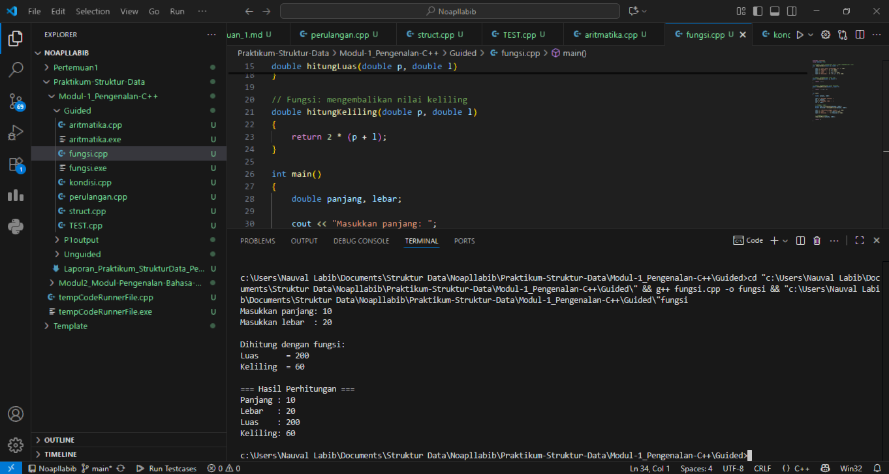

# <h1 align="center">Laporan Praktikum Modul 1 <br> Pengenalan C++</h1>
<p align="center">Naufal Labib Asyidiq - 103112400108</p>

## Dasar Teori

Dalam C++ ada beberapa dasar penting yang sering dipakai saat membuat program. Operasi aritmatika seperti tambah, kurang, kali, bagi, dan sisa bagi digunakan untuk menghitung angka. Kalau memakai tipe data int, hasil bagi hanya bulat karena pecahan dibuang, jadi kalau ingin hasil desimal lebih baik memakai float atau double. Selain itu ada fungsi dan prosedur. Fungsi digunakan untuk menghitung sesuatu dan mengembalikan hasil, sedangkan prosedur hanya menampilkan hasil tanpa mengembalikan nilai. Ada juga percabangan seperti if-else dan switch-case yang dipakai untuk membuat keputusan, misalnya menentukan besar diskon atau membedakan hari kerja dengan hari libur.

Kemudian ada perulangan yang dipakai untuk mengulang perintah berkali-kali supaya lebih singkat dan tidak menulis kode berulang. Bentuk perulangan ada for, while, dan do-while dengan cara kerja masing-masing. C++ juga punya struct yang berguna untuk mengelompokkan data yang berhubungan, misalnya menyimpan nama, NIM, dan IPK mahasiswa dalam satu wadah. Terakhir, untuk membaca satu karakter, bisa menggunakan getchar(), yang langsung mengambil satu huruf dari input. Semua konsep dasar ini membantu membuat program jadi lebih teratur, mudah dipahami, dan lebih efisien.

## Guided

### soal 1 Aritmatika

```cpp
#include <iostream>
using namespace std;
int main()
{
    int W, X, Y;
    float Z;
    X = 7;
    Y = 3;
    W = 1;
    Z = (X + Y) / (Y + W);
    cout << "Nilai z = " << Z << endl;
    return 0;
}
```

> Output
> 

Program C++ ini menghitung hasil operasi aritmatika sederhana. Variabel X, Y, dan W bertipe integer, sedangkan Z bertipe float. Setelah diberi nilai 7, 3, dan 1, program menghitung (X + Y) / (Y + W) atau 10 / 4. Karena pembagian dilakukan dengan integer, hasilnya 2, lalu disimpan ke Z dan ditampilkan sebagai “Nilai z = 2”. Jika ingin memperoleh hasil pecahan 2,5, maka salah satu operand harus dikonversi ke float.

### soal 2 Fungsi

```cpp
#include <iostream>
using namespace std;

// Prosedur: hanya menampilkan hasil, tidak mengembalikan nilai
void tampilkanHasil(double p, double l)
{
    cout << "\n=== Hasil Perhitungan ===" << endl;
    cout << "Panjang : " << p << endl;
    cout << "Lebar   : " << l << endl;
    cout << "Luas    : " << p * l << endl;
    cout << "Keliling: " << 2 * (p + l) << endl;
}

// Fungsi: mengembalikan nilai luas
double hitungLuas(double p, double l)
{
    return p * l;
}

// Fungsi: mengembalikan nilai keliling
double hitungKeliling(double p, double l)
{
    return 2 * (p + l);
}

int main()
{
    double panjang, lebar;

    cout << "Masukkan panjang: ";
    cin >> panjang;
    cout << "Masukkan lebar  : ";
    cin >> lebar;

    // Panggil fungsi
    double luas = hitungLuas(panjang, lebar);
    double keliling = hitungKeliling(panjang, lebar);

    cout << "\nDihitung dengan fungsi:" << endl;
    cout << "Luas      = " << luas << endl;
    cout << "Keliling  = " << keliling << endl;

    // Panggil prosedur
    tampilkanHasil(panjang, lebar);

    return 0;
}
```

> Output
> 

Program ini ditulis dalam bahasa C++ untuk menghitung luas dan keliling persegi panjang menggunakan fungsi dan prosedur. Pertama, terdapat fungsi hitungLuas() yang mengembalikan hasil perkalian panjang dan lebar, serta fungsi hitungKeliling() yang mengembalikan dua kali jumlah panjang dan lebar. Selain itu, terdapat prosedur tampilkanHasil() yang langsung mencetak panjang, lebar, luas, dan keliling tanpa mengembalikan nilai. Pada bagian main, pengguna diminta memasukkan nilai panjang dan lebar. Nilai tersebut kemudian dihitung dengan fungsi untuk mendapatkan luas dan keliling, lalu ditampilkan. Setelah itu, prosedur dipanggil untuk menampilkan hasil perhitungan dengan format yang lebih lengkap. Dengan demikian, program ini memperlihatkan perbedaan penggunaan fungsi yang mengembalikan nilai dan prosedur yang hanya menampilkan hasil.

### soal 3 Perkondisian

```cpp
#include <iostream>
using namespace std;
// int main()
// {
//     double tot_pembelian, diskon;
//     cout << "total pembelian: Rp";
//     cin >> tot_pembelian;
//     diskon = 0;
//     if (tot_pembelian >= 100000)
//         diskon = 0.05 * tot_pembelian;
//     cout << "besar diskon = Rp" << diskon;
// }


// int main()
// {
//     double tot_pembelian, diskon;
//     cout << "total pembelian: Rp";
//     cin >> tot_pembelian;
//     diskon = 0;
//     if (tot_pembelian >= 100000)
//         diskon = 0.05 * tot_pembelian;
//     else
//         diskon = 0;
//     cout << "besar diskon = Rp" << diskon;
// }


int main()
{
    int kode_hari;
    cout << "Menentukan hari kerja/libur\n"<<endl;
    cout << "1=Senin 3=Rabu 5=Jumat 7=Minggu "<<endl;
    cout << "2=Selasa 4=Kamis 6=Sabtu "<<endl;
    cin >> kode_hari;
    switch (kode_hari)
    {
    case 1:
    case 2:
    case 3:
    case 4:
    case 5:
        cout<<"Hari Kerja";
        break;
    case 6:
    case 7:
        cout<<"Hari Libur";
        break;
    default:
        cout<<"Kode masukan salah!!!";
    }
    return 0;
}
```

> Output
> 

Program ini dibuat untuk latihan Menggunakan percabangan di C++. Bagian pertama (dikasih tanda komentar) dipakai untuk ngitung diskon belanja. jika total belanja Rp100.000 ke atas, dapat diskon 5%, kalau kurang berarti tidak ada diskon. Bagian ketiga (yang jalan) dipakai buat Menentukan hari kerja atau hari libur dari kode angka 1–7. Kalau masukin angka 1–5 hasilnya “Hari Kerja”, kalau 6 atau 7 jadi “Hari Libur”, dan kalau salah input muncul pesan error. Jadi program ini nunjukin cara pakai if–else sama switch–case buat masalah sehari-hari.

### soal 4 Perulangan

```cpp
#include <iostream>
using namespace std;
// int main()
// {
//     int jum;
//     cout << "jumlah perulangan: ";
//     cin >> jum;
//     for (int i = 0; i < jum; i++)
//     {
//         cout << "saya sahroni\n";
//     }
//     return 1;
// }


// while
int main()
{
    int i = 1;
    int jum;
    cin >> jum;
    do
    {
        cout << "bahlil ke-" << (i + 1) << endl;
        i++;
    } while (i < jum);
    return 0;
}
```

> Output
> 

Program ini berisi contoh penggunaan perulangan (looping) di C++. Pada bagian pertama (yang dikomentari) digunakan perulangan for. Program meminta input jumlah perulangan, lalu mencetak tulisan “saya sahroni” sebanyak jumlah yang diminta. Bagian kedua (yang dijalankan) menggunakan perulangan do–while. Program meminta input angka, lalu mencetak teks “bahlil ke-…” secara berulang sambil menambahkan nomor urut. Perulangan akan terus berjalan selama nilai i masih lebih kecil dari jumlah yang dimasukkan. Melalui program ini terlihat perbedaan antara for yang langsung tahu batas perulangan dari awal, dan do–while yang minimal dijalankan sekali walaupun syaratnya tidak langsung terpenuhi.

### soal 5 Struct

```cpp
#include <iostream>
#include <string>
using namespace std;

// Definisi struct
struct Mahasiswa {
    string nama;
    string nim;
    float ipk;
};

int main() {

    Mahasiswa mhs1;

    cout << "Masukkan Nama Mahasiswa: ";
    getline(cin, mhs1.nama);
    // cin >> mhs1.nama;
    cout << "Masukkan NIM Mahasiswa : ";
    cin >> mhs1.nim;
    cout << "Masukkan IPK Mahasiswa : ";
    cin >> mhs1.ipk;

    cout << "\n=== Data Mahasiswa ===" << endl;
    cout << "Nama : " << mhs1.nama << endl;
    cout << "NIM  : " << mhs1.nim << endl;
    cout << "IPK  : " << mhs1.ipk << endl;

    return 0;
}
```

> Output
> 

Program ini adalah contoh penggunaan struct di C++. Pertama, dibuat sebuah struktur bernama Mahasiswa yang berisi tiga data: nama (tipe string), nim (tipe string), dan ipk (tipe float). Di dalam main(), dibuat variabel mhs1 bertipe Mahasiswa. Program kemudian meminta pengguna untuk memasukkan nama, NIM, dan IPK. Data tersebut disimpan ke dalam mhs1, lalu ditampilkan kembali dengan format yang rapi. Dengan cara ini, program memperlihatkan bagaimana struct bisa dipakai untuk mengelompokkan beberapa data yang saling berhubungan, misalnya data mahasiswa.

### soal 6 Test
```cpp
#include <iostream>
using namespace std;
int main()
{
    string ch;
    cout << "Masukkan sebuah karakter: ";
    // cin >> ch;
    ch = getchar();  //Menggunakan getchar() untuk membaca satu karakter
    cout << "Karakter yang Anda masukkan adalah: " << ch << endl;
    return 0;
}
```

> Output
> 

Program ini dibuat untuk menerima satu karakter dari pengguna lalu menampilkannya kembali. Pada awalnya, variabel ch dideklarasikan bertipe string, kemudian nilai dimasukkan dengan fungsi getchar(). Karena getchar() hanya membaca satu karakter, sebenarnya lebih cocok jika variabel tersebut menggunakan tipe char. Setelah pengguna mengetikkan karakter, program akan menuliskannya kembali ke layar dengan pesan “Karakter yang Anda masukkan adalah …”. Dengan begitu, program ini memperlihatkan cara sederhana membaca input berupa satu huruf dengan getchar().

## Unguided

### Soal 1

Buatlah program yang menerima input-an dua buah bilangan betipe float, kemudian memberikan output-an hasil penjumlahan, pengurangan, perkalian, dan pembagian dari dua bilangan tersebut.

```cpp
#include<iostream>
using namespace std;

int main(){
    float angka1, angka2;
    cout << "Masukan Angka1 : ";
    cin >> angka1;
    cout << "Masukan Angka2 : ";
    cin >> angka2;

    //Penjumlahan
    cout << "Penjumlahan : " << angka1 + angka2 << endl;
    //Pengurangan
    cout << "Pengurangan : " << angka1 - angka2 << endl;
    //Perkalian
    cout << "Perkalian : " << angka1 * angka2 << endl;
    //Pembagian
    if ( angka2 != 0) {
        cout << "Pembagian : " << angka1 / angka2 << endl;
    } else {
        cout << "Pembagian : Tidak Bisa Karena Pembagi Adalah 0";
    }
    return 0;
}
```

> Output
> 

Program di atas merupakan contoh sederhana dalam bahasa C++ untuk melakukan operasi aritmatika dasar. Pertama, pengguna diminta memasukkan dua angka bertipe float, lalu program menampilkan hasil penjumlahan, pengurangan, perkalian, dan pembagian dari kedua angka tersebut. Untuk operasi pembagian, program menggunakan pengecekan if agar tidak terjadi kesalahan ketika pembagi bernilai nol. Jika angka kedua tidak sama dengan nol, hasil pembagian akan ditampilkan, sedangkan jika bernilai nol, program memberikan pesan khusus bahwa pembagian tidak bisa dilakukan. Dengan cara ini, program tidak hanya menghitung, tetapi juga menangani kondisi khusus secara aman.

### Soal 2

Buatlah sebuah program yang menerima masukan angka dan mengeluarkan output nilai angka tersebut dalam bentuk tulisan. Angka yang akan di- input-kan user adalah bilangan bulat positif mulai dari 0 s.d 100

```cpp
#include <iostream>
#include <string>
using namespace std;

string stringsatuan(int n) {
    string satuan[] = {"", "satu", "dua", "tiga", "empat", "lima",
                       "enam", "tujuh", "delapan", "sembilan"};

    if (n == 0) return "nol";
    if (n == 100) return "seratus";

    int puluh = n / 10;
    int sisa  = n % 10;

    //kasus untuk satua
    if (puluh == 0) {
        return satuan[sisa];
    }

    // kasus buat belasan
    if (puluh == 1) {
        if (sisa == 0) {
            return "sepuluh";
        } else if (sisa == 1) {
            return "sebelas"; 
        } else { 
            return satuan[sisa] + " belas";
        }
    }

    if (puluh > 1) {
        if (sisa == 0) {
            return satuan[puluh] + " puluh";
        } else { 
            return satuan[puluh] + " puluh " + satuan[sisa];
        }
    }
}

int main() {
    int angka;
    cout << "Masukkan angka (0 - 100): ";
    cin >> angka;

    if (angka < 0 || angka > 100) {
        cout << "Input harus 0 - 100" << endl;
    } else {
        cout << angka << " : " << stringsatuan(angka) << endl;
    }

    return 0;
}
```

> Output
> 

Program C++ ini berfungsi mengubah angka 0–100 menjadi tulisan dalam bahasa Indonesia. Fungsi stringsatuan() menangani berbagai kasus: angka 0 ditulis “nol”, angka 100 menjadi “seratus”, angka 1–9 langsung diambil dari array satuan, angka 10–19 ditangani khusus dengan pola “sepuluh”, “sebelas”, atau “... belas”, sedangkan angka puluhan 20–90 ditulis dengan pola “... puluh” ditambah satuannya jika ada. Pada fungsi main(), pengguna diminta memasukkan angka, lalu program mengecek apakah valid; jika ya, hasil angka dalam bentuk tulisan ditampilkan, jika tidak akan muncul pesan error.


### Soal 3
Buatlah program yang dapat memberikan input dan output sbb.

input : 3
output : 3 2 1 * 1 2 3
		   2 1 * 1 2
		     1 * 1
			   *


```cpp
#include <iostream>
using namespace std;

int main() {
    int n;
    cout << "Masukkan input: ";
    cin >> n;

    for (int i = n; i >= 1; i--) {
        for (int s = 0; s < (n - i) * 2; s++)
            cout << " ";

        for (int j = i; j >= 1; j--)
            cout << j << " ";

        cout << "* ";

        for (int j = 1; j <= i; j++)
            cout << j << " ";

        cout << endl;
    }

    for (int s = 0; s < n * 2; s++)
        cout << " ";
    cout << "*" << endl;

    return 0;
}
```

> Output
> 

Program C++ ini digunakan untuk menampilkan pola berbentuk segitiga terbalik dengan angka dan tanda bintang di tengah. Pertama, pengguna memasukkan sebuah bilangan bulat n sebagai tinggi pola. Pada setiap baris, program menambahkan spasi sesuai dengan baris ke berapa agar pola rata ke kanan, kemudian mencetak angka menurun dari i sampai 1, diikuti tanda *, lalu mencetak angka naik kembali dari 1 sampai i. Setelah semua baris selesai, program menambahkan satu baris terakhir berisi spasi sebanyak n*2 diikuti satu tanda * di tengah. Hasil akhirnya adalah pola simetris dengan bintang sebagai pemisah di antara angka menurun dan angka menaik.


## Referensi

1. Nomor Unguided 3 terinspirasi dari algoritna yang digunakan pada UTS Lisa ALPRO1 saat mencetak sebuah belah ketupat dan membentuknya kedalam beragam bentuk segitiga.

2. Sianipar, R. H. (2014). Pemrograman C++ Untuk Pemula (Vol. 1). Penerbit INFORMATIKA. https://books.google.com/books?hl=id&lr=&id=tQR2DwAAQBAJ&oi=fnd&pg=PA1&dq=pemrograman+c%2B%2B&ots=rEm8lyLHIR&sig=wmpxiLpPmn8dn5Q9vP9zY8XrsgQ

3. Samala, A. D., Fajri, B. R., & Ranuarja, F. (2021). PEMROGRAMAN C++. UNP PRESS. https://books.google.com/books?hl=id&lr=&id=49ZbEAAAQBAJ&oi=fnd&pg=PA2&dq=pemrograman+c%2B%2B&ots=4sYIx_JYCx&sig=ouhrRQNOGTjAM3F2phz0_RIeUjY
