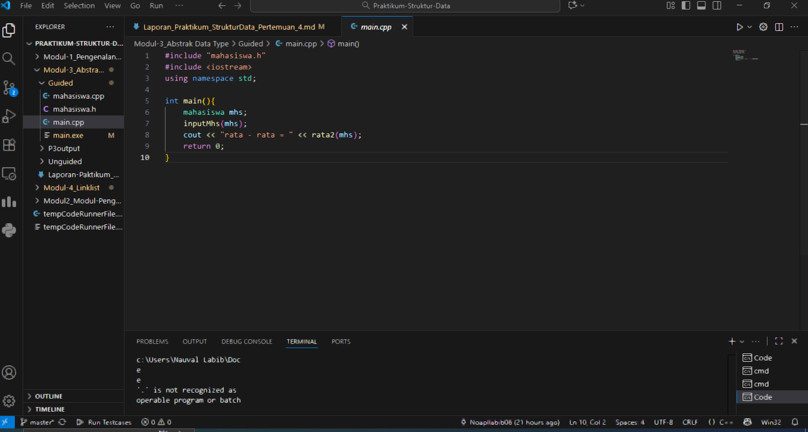
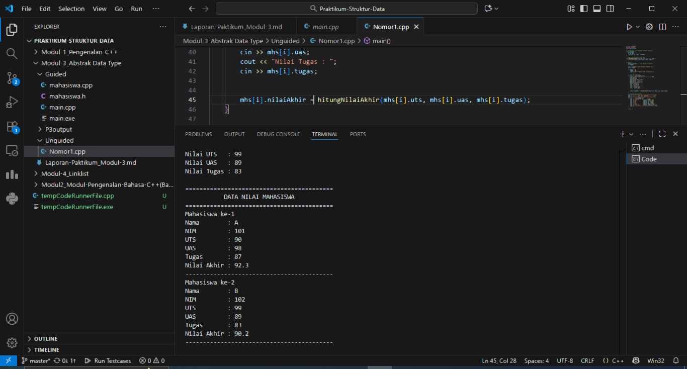
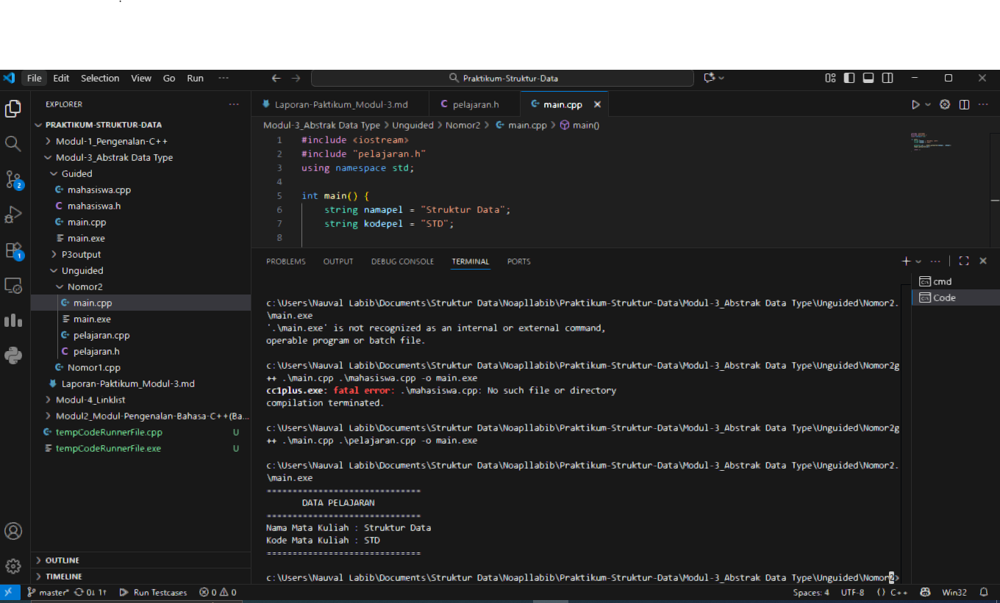

# <h1 align="center">Laporan Praktikum Modul 3 <br>Abstract Data Type</h1>

<p align="center">Naufal Labib Asyidiq 103112400108</p>

## Dasar Teori

Dasar teori dari program-program di atas berkaitan dengan struktur data (struct), array, pointer, dan fungsi dalam C++. Struktur data digunakan untuk mengelompokkan beberapa variabel dengan tipe data berbeda ke dalam satu kesatuan yang merepresentasikan satu entitas, seperti data mahasiswa atau pelajaran. Konsep ini mempermudah pengelolaan data yang kompleks dan memungkinkan penyimpanan banyak data dalam bentuk array struct. Selain itu, penggunaan fungsi dalam program berfungsi untuk memecah logika menjadi bagian-bagian yang lebih kecil dan terorganisir, seperti fungsi untuk menghitung nilai akhir, menampilkan data, atau membuat objek baru dari suatu struct.
Sementara itu, array dua dimensi dan pointer merupakan konsep penting dalam pengelolaan memori dan data di C++. Array dua dimensi digunakan untuk menyimpan data berbentuk tabel atau matriks, sedangkan pointer memungkinkan program untuk mengakses dan memanipulasi nilai variabel secara langsung melalui alamat memori. Dengan menggabungkan keduanya, program dapat melakukan operasi seperti pertukaran nilai antar elemen array atau antar variabel dengan efisien. Secara keseluruhan, dasar teori ini menunjukkan bagaimana konsep modular programming, data abstraction, dan memory manipulation diterapkan dalam C++ untuk membangun program yang efisien, terstruktur, dan mudah dikembangkan.


## Guided

### Soal 1
### Kode 1

```cpp
#ifndef MAHASISWA_H_INCLUDE
#define MAHASISWA_H_INCLUDE
struct mahasiswa
{
    char nim[10];
    int nilai1, nilai2;

};
void inputMhs(mahasiswa &m);
float rata2(mahasiswa m);
#endif
```

### Kode 2

```cpp
#include "mahasiswa.h"
#include <iostream>
using namespace std;

void inputMhs(mahasiswa &m){
    cout << "input nama = ";
    cin >> (m).nim;
    cout << "input nilai1 = ";
    cin >> (m).nilai1;
    cout << "input niali2 = ";
    cin >> (m).nilai2; 
}
float rata2(mahasiswa m) {
    return float(m.nilai1 + m.nilai2) / 2;
    
}
```

### Kode 3

```cpp
#include "mahasiswa.h"
#include <iostream>
using namespace std;

int main(){
    mahasiswa mhs;
    inputMhs(mhs);
    cout << "rata - rata = " << rata2(mhs);
    return 0;
}
```

> Output
> 

Penjelasan
Program ini merupakan contoh penggunaan array dan perulangan for di C++. Di dalam program, sebuah array bernama nilai berisi lima elemen yaitu 1 sampai 5. Melalui perulangan for, program menampilkan setiap elemen array satu per satu ke layar. Variabel i digunakan sebagai indeks untuk mengakses elemen ke-0 hingga ke-4 pada array. Setiap iterasi akan mencetak posisi elemen (Element ke-i) beserta nilainya. Setelah semua elemen ditampilkan, program selesai dijalankan.

## Unguided

### Soal 1

1. Buat program yang dapat menyimpan data mahasiswa (max. 10) ke dalam sebuah array
dengan field nama, nim, uts, uas, tugas, dan nilai akhir. Nilai akhir diperoleh dari FUNGSI
dengan rumus 0.3*uts+0.4*uas+0.3*tugas.

```cpp
#include <iostream>
#include <string>
using namespace std;


struct Mahasiswa {
    string nama;
    string nim;
    float uts, uas, tugas, nilaiAkhir;
};

float hitungNilaiAkhir(float uts, float uas, float tugas) {
    return (0.3 * uts) + (0.4 * uas) + (0.3 * tugas);
}

int main() {
    Mahasiswa mhs[10];
    int jumlah;

    cout << "Masukkan jumlah mahasiswa (maksimal 10): ";
    cin >> jumlah;

    if (jumlah > 10) {
        jumlah = 10;
        cout << "Jumlah dibatasi hanya 10 mahasiswa.\n";
    }

    for (int i = 0; i < jumlah; i++) {
        cout << "\nData mahasiswa ke-" << i + 1 << endl;
        cin.ignore();
        cout << "Nama   : ";
        getline(cin, mhs[i].nama);
        cout << "NIM    : ";
        getline(cin, mhs[i].nim);
        cout << "Nilai UTS   : ";
        cin >> mhs[i].uts;
        cout << "Nilai UAS   : ";
        cin >> mhs[i].uas;
        cout << "Nilai Tugas : ";
        cin >> mhs[i].tugas;

        
        mhs[i].nilaiAkhir = hitungNilaiAkhir(mhs[i].uts, mhs[i].uas, mhs[i].tugas);
    }

    // Menggunakan "====" biar rapih :)
    cout << "\n==========================================\n";
    cout << "           DATA NILAI MAHASISWA           \n";
    cout << "==========================================\n";
    for (int i = 0; i < jumlah; i++) {
        cout << "Mahasiswa ke-" << i + 1 << endl;
        cout << "Nama        : " << mhs[i].nama << endl;
        cout << "NIM         : " << mhs[i].nim << endl;
        cout << "UTS         : " << mhs[i].uts << endl;
        cout << "UAS         : " << mhs[i].uas << endl;
        cout << "Tugas       : " << mhs[i].tugas << endl;
        cout << "Nilai Akhir : " << mhs[i].nilaiAkhir << endl;
        cout << "------------------------------------------\n";
    }

    return 0;
}
```

> Output
> 

Program ini merupakan implementasi penyimpanan data mahasiswa menggunakan bahasa pemrograman C++. Dalam program ini digunakan struktur data (struct) bernama Mahasiswa yang memiliki beberapa atribut, yaitu nama, NIM, nilai UTS, nilai UAS, nilai tugas, dan nilai akhir. Struktur ini berfungsi sebagai wadah untuk menyimpan informasi lengkap setiap mahasiswa. Data beberapa mahasiswa disimpan dalam sebuah array dengan kapasitas maksimal sepuluh mahasiswa, sehingga program dapat mengelola lebih dari satu data secara bersamaan.
Perhitungan nilai akhir dilakukan menggunakan sebuah fungsi bernama hitungNilaiAkhir(), yang menerima tiga parameter berupa nilai UTS, UAS, dan tugas. Fungsi ini mengembalikan hasil perhitungan nilai akhir berdasarkan rumus: 0.3 * UTS + 0.4 * UAS + 0.3 * tugas, di mana setiap komponen memiliki bobot yang berbeda. Penggunaan fungsi ini membuat program lebih efisien dan mudah dipelihara karena perhitungan nilai akhir terpisah dari logika utama program.
Pada fungsi utama (main()), pengguna diminta memasukkan jumlah mahasiswa, kemudian mengisi data masing-masing mahasiswa seperti nama, NIM, serta nilai UTS, UAS, dan tugas. Setelah semua data dimasukkan, program otomatis menghitung nilai akhir setiap mahasiswa menggunakan fungsi yang telah dibuat sebelumnya. Selanjutnya, seluruh data mahasiswa, termasuk nilai akhir, akan ditampilkan kembali di layar sebagai hasil akhir. Dengan demikian, program ini menunjukkan penerapan konsep array, struct, dan fungsi dalam C++ untuk pengelolaan data yang terstruktur dan efisien.


### Soal 2
### Code 1

```cpp
#ifndef PELAJARAN_H_INCLUDED
#define PELAJARAN_H_INCLUDED

#include <string>
using namespace std;

struct pelajaran {
    string namaMapel;
    string kodeMapel;
};

pelajaran create_pelajaran(string namapel, string kodepel);
void tampil_pelajaran(pelajaran pel);

#endif
```

### Code 2

```cpp
#include "pelajaran.h"
#include <iostream>
using namespace std;

pelajaran create_pelajaran(string namapel, string kodepel) {
    pelajaran p;
    p.namaMapel = namapel;
    p.kodeMapel = kodepel;
    return p;
}

void tampil_pelajaran(pelajaran pel) {
    cout << "==============================" << endl;
    cout << "       DATA PELAJARAN         " << endl;
    cout << "==============================" << endl;
    cout << "Nama Mata Kuliah : " << pel.namaMapel << endl;
    cout << "Kode Mata Kuliah : " << pel.kodeMapel << endl;
    cout << "==============================" << endl;
}
```

### Code 3

```cpp
#include <iostream>
#include "pelajaran.h"
using namespace std;

int main() {
    string namapel = "Struktur Data";
    string kodepel = "STD";
    
    pelajaran pel = create_pelajaran(namapel, kodepel);
    tampil_pelajaran(pel);
    
    return 0;
}
```

> Output
> 

Penjelasan code
Program ini terdiri dari tiga file yang saling terhubung untuk membentuk ADT (Abstract Data Type) Pelajaran dalam bahasa C++. File pelajaran.h berfungsi sebagai header yang berisi definisi struktur pelajaran dengan dua atribut, yaitu namaMapel dan kodeMapel. Selain itu, file ini juga mendeklarasikan dua fungsi utama, yaitu create_pelajaran() untuk membuat data pelajaran baru dan tampil_pelajaran() untuk menampilkannya.
File pelajaran.cpp berisi implementasi kedua fungsi tersebut, sedangkan main.cpp digunakan untuk menjalankan program utama. Di dalam main(), program membuat objek pelajaran dengan nama “Struktur Data” dan kode “STD”, lalu menampilkannya ke layar menggunakan tampil_pelajaran(). Secara keseluruhan, program ini menunjukkan penerapan konsep modularisasi dan abstraksi data di mana deklarasi, implementasi, dan penggunaan dikelola dalam file yang terpisah agar kode lebih terstruktur dan mudah dipahami.

### Soal 3

Buatlah program dengan ketentuan :
- 2 buah array 2D integer berukuran 3x3 dan 2 buah pointer integer
- fungsi/prosedur yang menampilkan isi sebuah array integer 2D
- fungsi/proseduSTRUKTUR DATA 35
- fungsi/prosedur yang akan menukarkan isi dari variabel yang ditunjuk oleh 2 buah
pointer

```cpp
#include <iostream>
using namespace std;

// Fungsi untuk menampilkan isi array 2D
void tampilArray(int arr[3][3]) {
    cout << "Isi Array:" << endl;
    for (int i = 0; i < 3; i++) {
        for (int j = 0; j < 3; j++) {
            cout << arr[i][j] << "\t";
        }
        cout << endl;
    }
    cout << endl;
}

// Fungsi untuk menukar isi 2 array pada posisi tertentu
void tukarIsiArray(int arr1[3][3], int arr2[3][3], int baris, int kolom) {
    int temp = arr1[baris][kolom];
    arr1[baris][kolom] = arr2[baris][kolom];
    arr2[baris][kolom] = temp;
}

// Fungsi untuk menukar isi variabel yang ditunjuk oleh 2 pointer
void tukarPointer(int *a, int *b) {
    int temp = *a;
    *a = *b;
    *b = temp;
}

int main() {
    // Dua array 2D berukuran 3x3
    int A[3][3] = {
        {1, 2, 3},
        {4, 5, 6},
        {7, 8, 9}
    };

    int B[3][3] = {
        {9, 8, 7},
        {6, 5, 4},
        {3, 2, 1}
    };

    // Dua pointer integer
    int x = 10, y = 20;
    int *ptr1 = &x;
    int *ptr2 = &y;

    cout << "=== ARRAY SEBELUM DITUKAR ===" << endl;
    cout << "Array A:" << endl;
    tampilArray(A);
    cout << "Array B:" << endl;
    tampilArray(B);

    // Menukar elemen pada posisi [1][1]
    tukarIsiArray(A, B, 1, 1);

    cout << "=== ARRAY SETELAH DITUKAR (posisi [1][1]) ===" << endl;
    cout << "Array A:" << endl;
    tampilArray(A);
    cout << "Array B:" << endl;
    tampilArray(B);

    // Menampilkan nilai sebelum dan sesudah pertukaran pointer
    cout << "=== NILAI POINTER SEBELUM DITUKAR ===" << endl;
    cout << "x = " << x << ", y = " << y << endl;

    tukarPointer(ptr1, ptr2);

    cout << "=== NILAI POINTER SETELAH DITUKAR ===" << endl;
    cout << "x = " << x << ", y = " << y << endl;

    return 0;
}
```

> Output
> 

Penjelasan code
Program di atas merupakan implementasi penggunaan array dua dimensi dan pointer dalam bahasa C++. Program ini mendeklarasikan dua buah array 2D berukuran 3x3, yaitu A dan B, yang masing-masing berisi nilai berbeda. Selain itu, terdapat dua variabel integer, x dan y, yang diakses melalui pointer ptr1 dan ptr2. Program ini juga memanfaatkan beberapa fungsi untuk menampilkan dan menukar isi data.
Fungsi tampilArray() digunakan untuk menampilkan isi dari array dua dimensi dalam bentuk tabel, sedangkan fungsi tukarIsiArray() digunakan untuk menukar nilai elemen antara dua array pada posisi tertentu, misalnya pada indeks [1][1]. Sementara itu, fungsi tukarPointer() berfungsi untuk menukar nilai dari dua variabel yang ditunjuk oleh pointer menggunakan variabel sementara. Hasil dari program ini menunjukkan bahwa elemen array serta nilai variabel yang ditunjuk oleh pointer dapat saling bertukar dengan benar, sesuai konsep manipulasi data menggunakan pointer dan array dalam C++.


## Referensi

1. Huda, A., Ardi, N., & Muabi, A. (2021). Pengantar coding berbasis C/C++. UNP PRESS. https://books.google.com/books?hl=id&lr=&id=G9dbEAAAQBAJ&oi=fnd&pg=PA129&dq=pemrograman+modular+c%2B%2B&ots=6eIIbFgrdd&sig=3pUNrkbnuRiykKSRQfGuw2J_Hb4
2. Indahyanti, U., & Rahmawati, Y. (2020). Buku Ajar Algoritma Dan Pemrograman Dalam Bahasa C++. Umsida Press, 1-146 https://press.umsida.ac.id/index.php/umsidapress/article/view/978-623-6833-67-4
