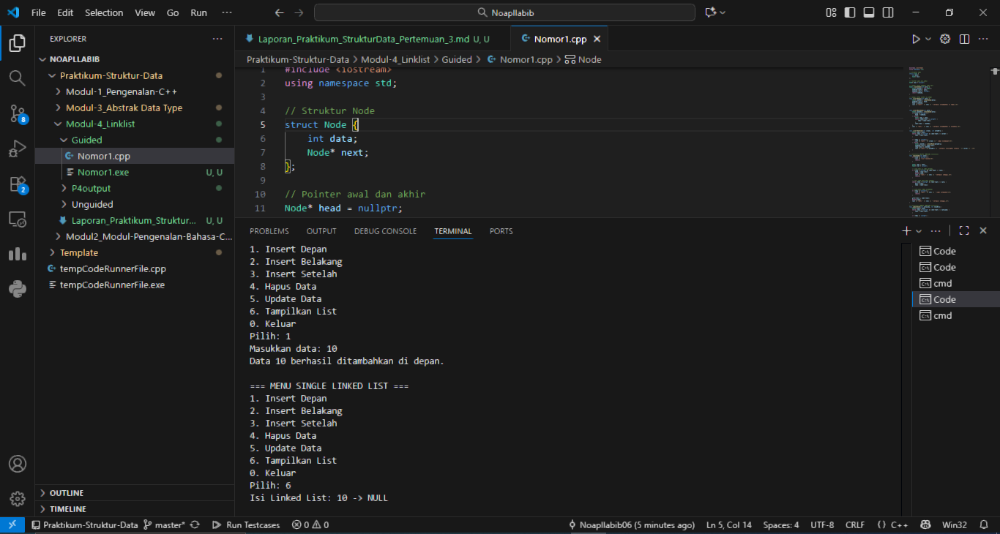
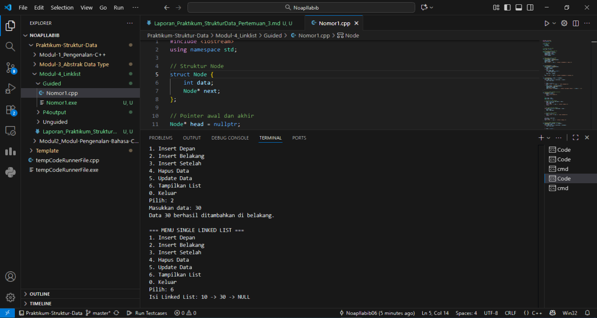
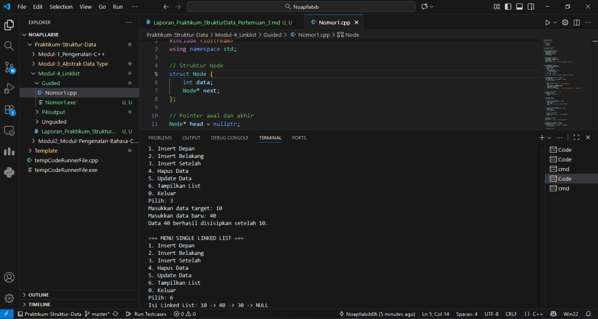
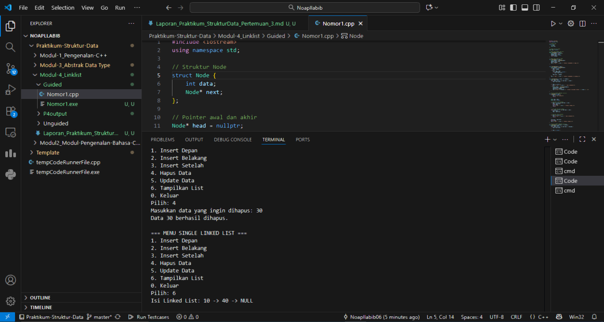
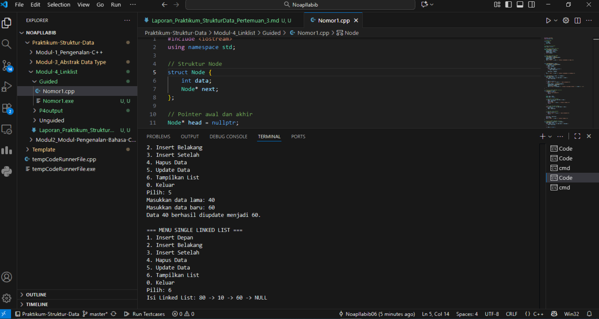
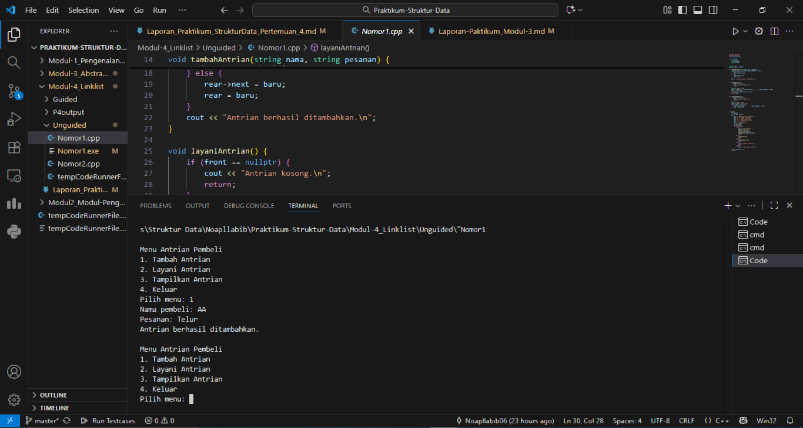
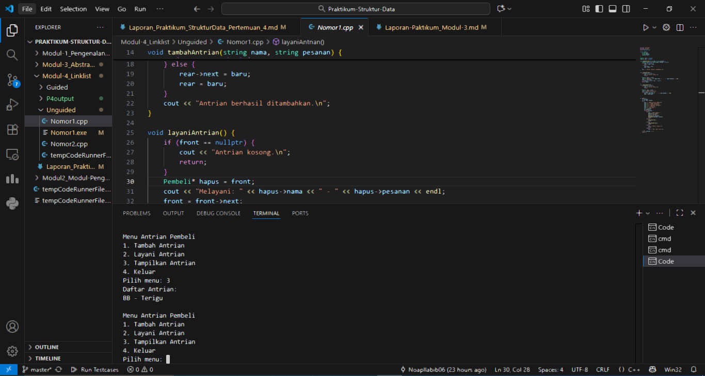
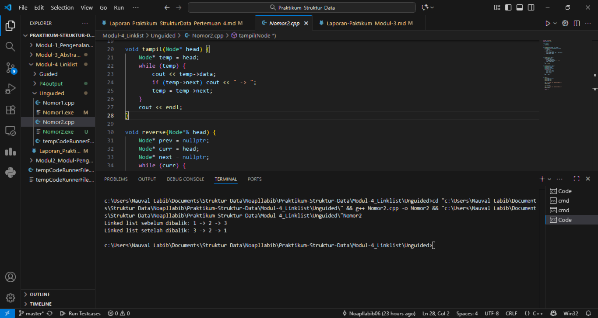

# <h1 align="center">Laporan Praktikum Modul 4 <br> Linked List</h1>
<p align="center">Naufal Labib Asyidiq - 103112400108</p>

## Dasar Teori

Dasar Teori

Linked List adalah struktur data dinamis yang terdiri dari elemen-elemen (node) yang saling terhubung melalui pointer. Setiap node berisi dua bagian, yaitu data untuk menyimpan nilai dan pointer (next) yang menunjuk ke node berikutnya. Berbeda dengan array yang berukuran tetap, linked list bersifat fleksibel karena dapat menambah atau menghapus data kapan saja tanpa mengatur ulang seluruh elemen.

Jenis yang digunakan pada praktikum ini adalah single linked list, di mana setiap node hanya memiliki satu pointer. Operasi utamanya meliputi penambahan data (insert) di depan, belakang, atau setelah node tertentu; penghapusan data (delete); pembaruan data (update); dan penampilan data (display). Selain itu, terdapat juga implementasi reverse, yaitu proses membalik urutan node dengan mengubah arah pointer menggunakan variabel bantu prev, curr, dan next.
Linked list juga dapat digunakan untuk membentuk struktur data queue (antrian) yang bekerja dengan prinsip FIFO (First In, First Out). Operasinya meliputi enqueue (tambah antrian), dequeue (layani antrian), dan tampilkan antrian.
Secara keseluruhan, linked list menunjukkan cara pengelolaan memori secara manual dengan pointer dalam C++, sekaligus memperkuat pemahaman konsep struktur data dinamis dan modularitas program melalui pembagian fungsi sesuai tugasnya.

## Guided

### soal 1 

```cpp
#include <iostream>
using namespace std;

struct Node {
    int data;
    Node* next;
};

Node* head = nullptr;

Node* createNode(int data) {
    Node* newNode = new Node();
    newNode->data = data;
    newNode->next = nullptr;
    return newNode;
}

void insertDepan(int data) {
    Node* newNode = createNode(data);
    newNode->next = head;
    head = newNode;
    cout << "Data " << data << " berhasil ditambahkan di depan.\n";
}


void insertBelakang(int data) {
    Node* newNode = createNode(data);
    if (head == nullptr) {
        head = newNode;
    } else {
        Node* temp = head;
        while (temp->next != nullptr) {
            temp = temp->next;
        }
        temp->next = newNode;
    }
    cout << "Data " << data << " berhasil ditambahkan di belakang.\n";
}

void insertSetelah(int target, int dataBaru) {
    Node* temp = head;
    while (temp != nullptr && temp->data != target) {
        temp = temp->next;
    }

    if (temp == nullptr) {
        cout << "Data " << target << " tidak ditemukan!\n";
    } else {
        Node* newNode = createNode(dataBaru);
        newNode->next = temp->next;
        temp->next = newNode;
        cout << "Data " << dataBaru << " berhasil disisipkan setelah " << target << ".\n";
    }
}
void hapusNode(int data) {
    if (head == nullptr) {
        cout << "List kosong!\n";
        return;
    }

    Node* temp = head;
    Node* prev = nullptr;

    if (temp != nullptr && temp->data == data) {
        head = temp->next;
        delete temp;
        cout << "Data " << data << " berhasil dihapus.\n";
        return;
    }

    while (temp != nullptr && temp->data != data) {
        prev = temp;
        temp = temp->next;
    }

    if (temp == nullptr) {
        cout << "Data " << data << " tidak ditemukan!\n";
        return;
    }

    prev->next = temp->next;
    delete temp;
    cout << "Data " << data << " berhasil dihapus.\n";
}

void updateNode(int dataLama, int dataBaru) {
    Node* temp = head;
    while (temp != nullptr && temp->data != dataLama) {
        temp = temp->next;
    }

    if (temp == nullptr) {
        cout << "Data " << dataLama << " tidak ditemukan!\n";
    } else {
        temp->data = dataBaru;
        cout << "Data " << dataLama << " berhasil diupdate menjadi " << dataBaru << ".\n";
    }
}

void tampilkanList() {
    if (head == nullptr) {
        cout << "List kosong!\n";
        return;
    }

    Node* temp = head;
    cout << "Isi Linked List: ";
    while (temp != nullptr) {
        cout << temp->data << " -> ";
        temp = temp->next;
    }
    cout << "NULL\n";
}

int main() {
    int pilihan, data, target, dataBaru;

    do {
        cout << "\n=== MENU SINGLE LINKED LIST ===\n";
        cout << "1. Insert Depan\n";
        cout << "2. Insert Belakang\n";
        cout << "3. Insert Setelah\n";
        cout << "4. Hapus Data\n";
        cout << "5. Update Data\n";
        cout << "6. Tampilkan List\n";
        cout << "0. Keluar\n";
        cout << "Pilih: ";
        cin >> pilihan;

        switch (pilihan) {
            case 1:
                cout << "Masukkan data: ";
                cin >> data;
                insertDepan(data);
                break;
            case 2:
                cout << "Masukkan data: ";
                cin >> data;
                insertBelakang(data);
                break;
            case 3:
                cout << "Masukkan data target: ";
                cin >> target;
                cout << "Masukkan data baru: ";
                cin >> dataBaru;
                insertSetelah(target, dataBaru);
                break;
            case 4:
                cout << "Masukkan data yang ingin dihapus: ";
                cin >> data;
                hapusNode(data);
                break;
            case 5:
                cout << "Masukkan data lama: ";
                cin >> data;
                cout << "Masukkan data baru: ";
                cin >> dataBaru;
                updateNode(data, dataBaru);
                break;
            case 6:
                tampilkanList();
                break;
            case 0:
                cout << "Program selesai.\n";
                break;
            default:
                cout << "Pilihan tidak valid!\n";
        }
    } while (pilihan != 0);

    return 0;
}

```
### OUTPUT UNTUK MASING-MASING CABANG

untuk opsi 1
> Output
> 

Pilihan ini menjalankan fungsi insertDepan(), yaitu untuk menambahkan node baru di awal linked list. Program meminta pengguna memasukkan data integer, kemudian membuat node baru dengan nilai tersebut, dan mengatur agar node baru menjadi head (elemen pertama). Jika sebelumnya sudah ada data, maka node baru akan menunjuk ke node lama sebagai next.

untuk opsi 2
> Output
> 

Case ini menjalankan fungsi insertBelakang(), yang menambahkan node baru di akhir linked list. Program akan mencari node terakhir dengan cara menelusuri list hingga menemukan node yang next-nya bernilai nullptr, kemudian menambahkan node baru di situ. Jika list masih kosong, node baru langsung menjadi head.

untuk opsi 3
> Output
> 

Pada case ini dipanggil fungsi insertSetelah(). Program meminta dua input: data target dan data baru. Fungsi akan mencari node yang berisi data target, lalu menyisipkan node baru setelah node tersebut. Jika data target tidak ditemukan, akan muncul pesan bahwa data tidak ditemukan.

untuk opsi 4
> Output
> 

Case ini menggunakan fungsi hapusNode() untuk menghapus node berdasarkan nilai datanya. Program mencari node yang berisi data yang ingin dihapus. Jika data tersebut berada di head, maka head diganti dengan node berikutnya. Jika berada di tengah atau akhir, maka pointer next dari node sebelumnya diubah agar melewati node yang dihapus.

untuk opsi 5
> Output
> 

Case ini menjalankan fungsi updateNode(), yang digunakan untuk mengubah nilai data dari node tertentu. Program meminta dua input: data lama dan data baru. Kemudian fungsi mencari node yang berisi data lama dan menggantinya dengan data baru. Jika tidak ditemukan, akan ditampilkan pesan kesalahan.

Opsi 6 Tidak perlu menggunakan Screenshoot mandiri karena sudah digunakan pada opsi opsi diatas


## Unguided
## Nomor 1
buatlah single linked list untuk Antrian yang menyimpan data pembeli( nama dan pesanan). program memiliki beberapa menu seperti tambah antrian,  layani antrian(hapus), dan tampilkan antrian. \*antrian pertama harus yang pertama dilayani


```cpp
#include <iostream>
#include <string>
using namespace std;

struct Pembeli {
    string nama;
    string pesanan;
    Pembeli* next;
};

Pembeli* front = nullptr;
Pembeli* rear = nullptr;

void tambahAntrian(string nama, string pesanan) {
    Pembeli* baru = new Pembeli{nama, pesanan, nullptr};
    if (rear == nullptr) {
        front = rear = baru;
    } else {
        rear->next = baru;
        rear = baru;
    }
    cout << "Antrian berhasil ditambahkan.\n";
}

void layaniAntrian() {
    if (front == nullptr) {
        cout << "Antrian kosong.\n";
        return;
    }
    Pembeli* hapus = front;
    cout << "Melayani: " << hapus->nama << " - " << hapus->pesanan << endl;
    front = front->next;
    if (front == nullptr) rear = nullptr;
    delete hapus;
}

void tampilkanAntrian() {
    if (front == nullptr) {
        cout << "Antrian kosong.\n";
        return;
    }
    Pembeli* temp = front;
    cout << "Daftar Antrian:\n";
    while (temp != nullptr) {
        cout << temp->nama << " - " << temp->pesanan << endl;
        temp = temp->next;
    }
}

int main() {
    int pilihan;
    string nama, pesanan;
    do {
        cout << "\nMenu Antrian Pembeli\n";
        cout << "1. Tambah Antrian\n";
        cout << "2. Layani Antrian\n";
        cout << "3. Tampilkan Antrian\n";
        cout << "4. Keluar\n";
        cout << "Pilih menu: ";
        cin >> pilihan;
        cin.ignore();
        switch (pilihan) {
            case 1:
                cout << "Nama pembeli: ";
                getline(cin, nama);
                cout << "Pesanan: ";
                getline(cin, pesanan);
                tambahAntrian(nama, pesanan);
                break;
            case 2:
                layaniAntrian();
                break;
            case 3:
                tampilkanAntrian();
                break;
            case 4:
                cout << "Keluar program.\n";
                break;
            default:
                cout << "Menu tidak valid.\n";
        }
    } while (pilihan != 4);
    return 0;
}
```

### Opsi 1 Tambah Antrian
>Output
> 

Pada bagian ini, program meminta pengguna untuk memasukkan nama pembeli dan pesanan. Data tersebut kemudian dikirim ke fungsi tambahAntrian(). Fungsi ini membuat node baru bertipe Pembeli dan menambahkannya ke akhir antrian. Jika antrian masih kosong, node baru akan menjadi elemen pertama (front) sekaligus terakhir (rear). Jika sudah ada antrian sebelumnya, maka node baru akan dihubungkan ke elemen terakhir dan rear diperbarui agar menunjuk ke node tersebut. Setelah itu, muncul pesan bahwa antrian berhasil ditambahkan.

### Opsi 2 Layani Antrian
>Output
> 

Bagian ini memanggil fungsi layaniAntrian() untuk melayani pembeli paling depan. Program akan menampilkan nama dan pesanan pembeli yang sedang dilayani, lalu menghapusnya dari antrian dengan cara memindahkan pointer front ke elemen berikutnya. Jika setelah dihapus antrian menjadi kosong, maka rear juga diset ke nullptr. Jika antrian kosong sejak awal, program menampilkan pesan bahwa tidak ada antrian yang bisa dilayani.

### Opsi 3 Tampilkan Antrian
>Output
> 

Case ini memanggil fungsi tampilkanAntrian(). Fungsi tersebut akan menelusuri seluruh node mulai dari front hingga rear, menampilkan nama dan pesanan setiap pembeli yang masih menunggu giliran. Jika antrian kosong, program akan menampilkan pesan “Antrian kosong.”

### Opsi 4 Tampilkan Antrian

Tidak Perlu Output, Opsi ini digunakan untuk menghentikan program sehingga program menghentikan perulangan unutuk switch case lalu program berhenti.

### soal 2
Buatlah program kode untuk membalik (reverse) singly linked list (1-2-3 menjadi 3-2-1) 

```cpp
#include <iostream>
using namespace std;

struct Node {
    int data;
    Node* next;
};

void insert(Node*& head, int value) {
    Node* baru = new Node{value, nullptr};
    if (!head) {
        head = baru;
    } else {
        Node* temp = head;
        while (temp->next) temp = temp->next;
        temp->next = baru;
    }
}

void tampil(Node* head) {
    Node* temp = head;
    while (temp) {
        cout << temp->data;
        if (temp->next) cout << " -> ";
        temp = temp->next;
    }
    cout << endl;
}

void reverse(Node*& head) {
    Node* prev = nullptr;
    Node* curr = head;
    Node* next = nullptr;
    while (curr) {
        next = curr->next;
        curr->next = prev;
        prev = curr;
        curr = next;
    }
    head = prev;
}

int main() {
    Node* head = nullptr;
    insert(head, 1);
    insert(head, 2);
    insert(head, 3);

    cout << "Linked list sebelum dibalik: ";
    tampil(head);

    reverse(head);

    cout << "Linked list setelah dibalik: ";
    tampil(head);

    return 0;
}
```

> Output
> 


Program di atas merupakan implementasi linked list tunggal dalam C++. Struktur Node menyimpan data berupa bilangan bulat dan pointer next untuk menunjuk ke elemen berikutnya. Fungsi insert() menambahkan node baru di akhir list; jika list kosong, node baru menjadi head, sedangkan jika sudah ada, program menelusuri hingga node terakhir lalu menambahkannya di sana. Fungsi tampil() menampilkan seluruh isi list dari awal hingga akhir dengan tanda panah “→” di antara elemen. Fungsi reverse() membalik urutan node dengan memutar arah pointer menggunakan tiga variabel (prev, curr, next) sehingga elemen terakhir menjadi head baru. Dalam fungsi main(), program menambahkan data 1, 2, dan 3, menampilkan list sebelum dibalik (1 → 2 → 3), lalu membalik urutannya dan menampilkan hasilnya (3 → 2 → 1).


## Referensi

1. Samala, A. D., Fajri, B. R., & Ranuarja, F. (2021). PEMROGRAMAN C++. UNP PRESS. https://books.google.com/books?hl=id&lr=&id=49ZbEAAAQBAJ&oi=fnd&pg=PA2&dq=pemrograman+c%2B%2B&ots=4sYIx_JYCx&sig=ouhrRQNOGTjAM3F2phz0_RIeUjY

2. Indahyanti, U., & Rahmawati, Y. (2020). Buku Ajar Algoritma Dan Pemrograman Dalam Bahasa C++. Umsida Press, 1-146. https://press.umsida.ac.id/index.php/umsidapress/article/view/978-623-6833-67-4
