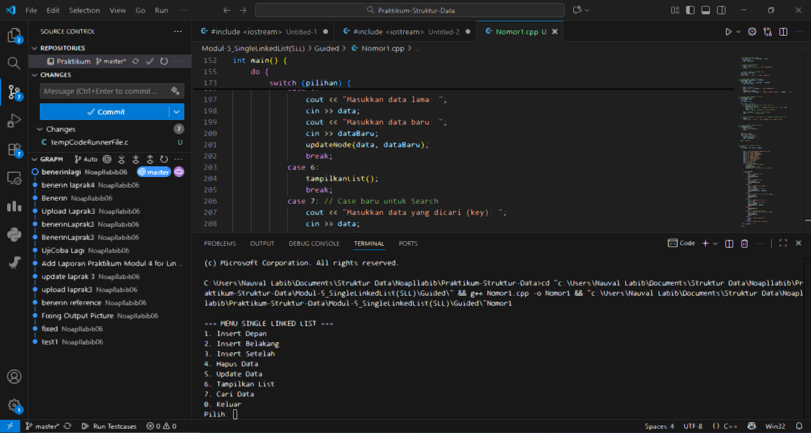
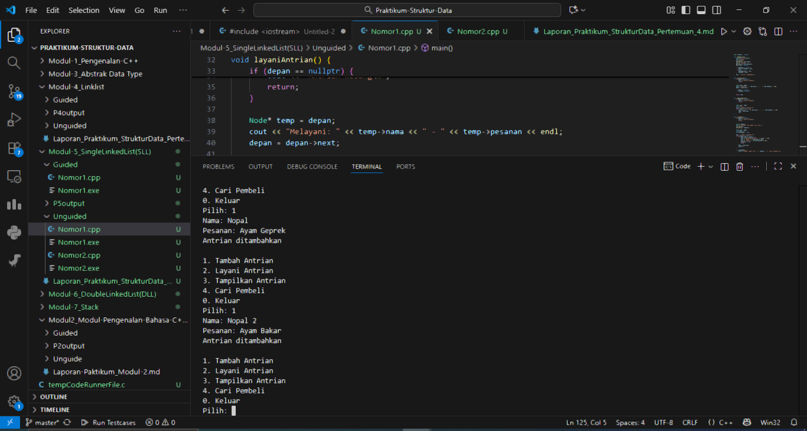
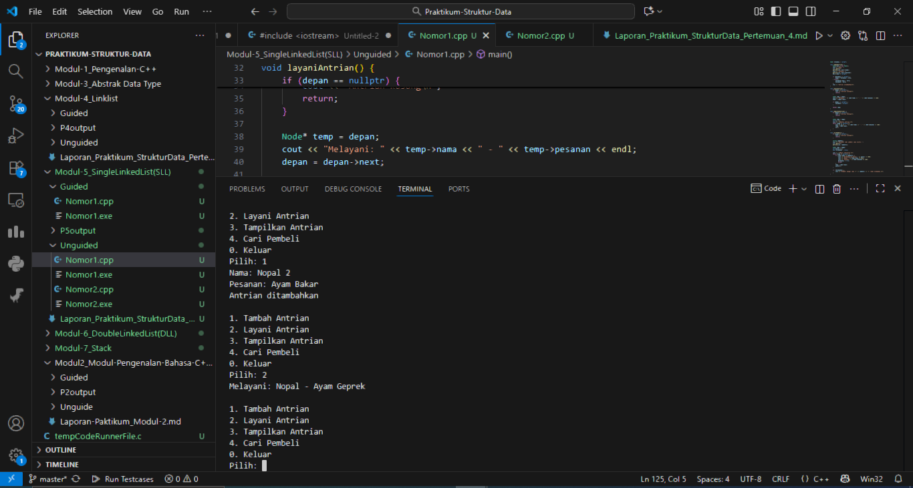
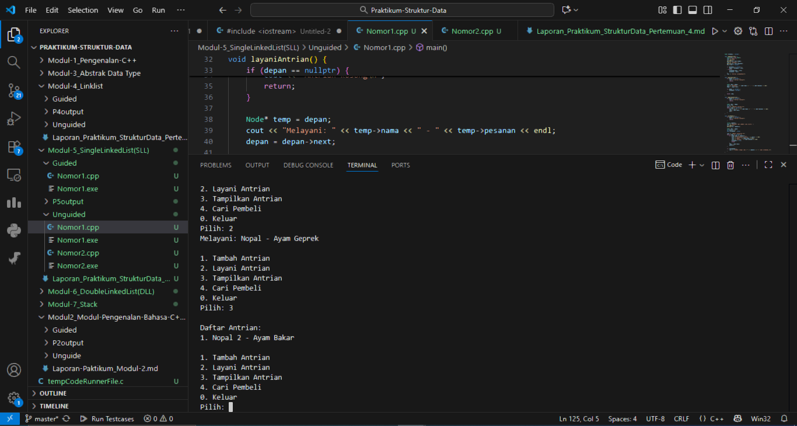
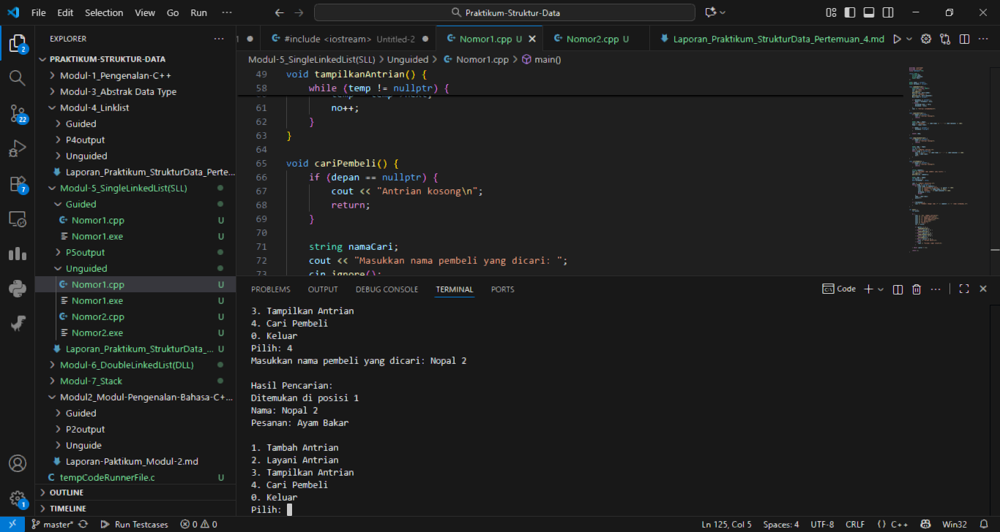
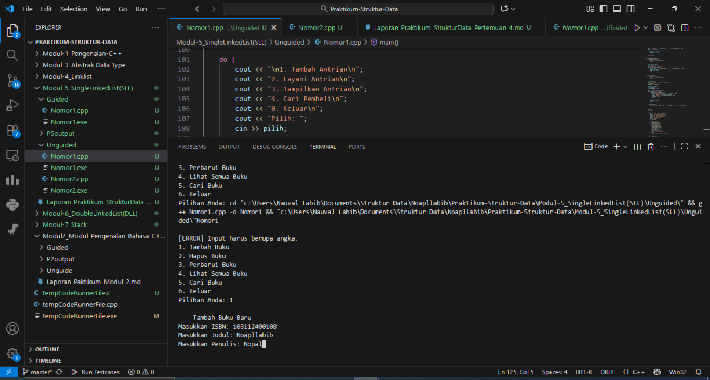
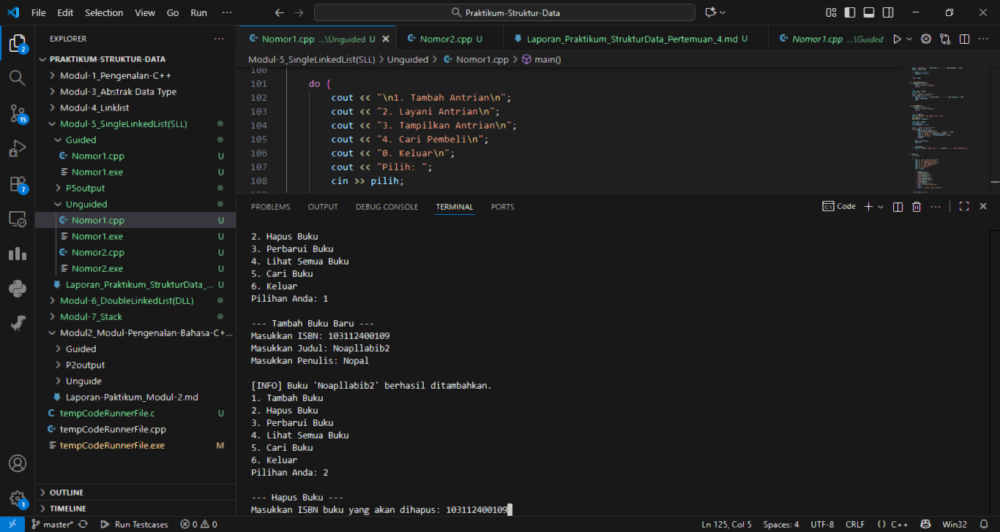
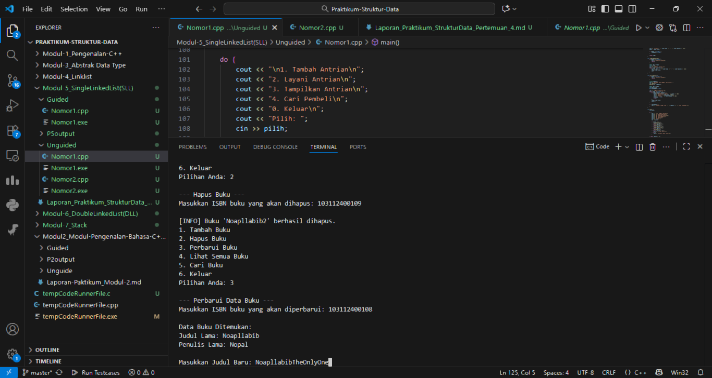
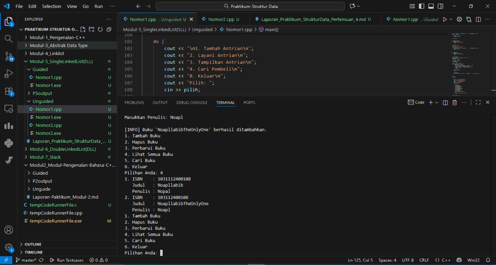
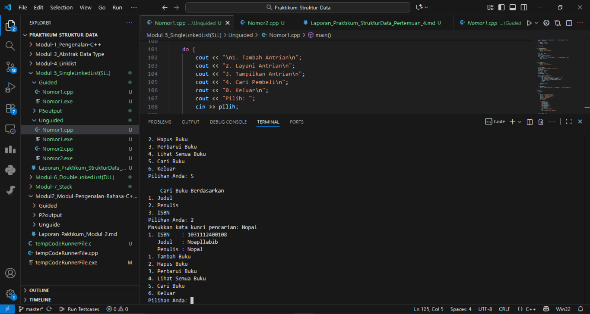

# <h1 align="center">Laporan Praktikum Modul 5 <br> Single Linked List</h1>
<p align="center">Naufal Labib Asyidiq - 103112400108</p>

## Dasar Teori

Dasar Teori

Linked list merupakan struktur data dinamis yang terdiri atas sekumpulan node yang saling terhubung melalui pointer. Setiap node memiliki dua bagian, yaitu data yang menyimpan nilai dan pointer yang menunjuk ke node berikutnya. Berbeda dengan array yang memiliki ukuran tetap dan tersimpan berurutan di memori, linked list bersifat fleksibel karena memungkinkan penambahan dan penghapusan elemen tanpa perlu menggeser data lain. Dalam praktikum ini digunakan Single Linked List, di mana setiap node hanya memiliki satu pointer. Operasi dasarnya meliputi penambahan, penghapusan, pembaruan, pencarian, dan penampilan data.

Selain menyimpan data berurutan, linked list juga dapat digunakan untuk membentuk struktur queue atau antrian dengan prinsip First In, First Out (FIFO). Pada struktur ini, elemen pertama yang masuk akan menjadi elemen pertama yang keluar. Operasi utamanya meliputi enqueue (menambah), dequeue (menghapus), dan display (menampilkan data). Melalui implementasi linked list, mahasiswa dapat memahami cara kerja pengelolaan memori menggunakan pointer serta membangun program yang dinamis dan efisien.

## Guided

### soal 1 

```cpp
#include <iostream>
using namespace std;

// Struktur Node
struct Node {
    int data;
    Node* next;
};
Node* head = nullptr;

// Fungsi untuk membuat node baru
Node* createNode(int data) {
    Node* newNode = new Node();
    newNode->data = data;
    newNode->next = nullptr;
    return newNode;
}

// ========== INSERT DEPAN FUNCTION (Penambahan) ==========
void insertDepan(int data) {
    Node* newNode = createNode(data);
    // Logika Insert First: Node baru menunjuk ke head lama, lalu head menunjuk ke Node baru.
    newNode->next = head;
    head = newNode;
    cout << "Data " << data << " berhasil ditambahkan di depan.\n";
}

void insertBelakang(int data) {
    Node* newNode = createNode(data);
    if (head == nullptr) {
        head = newNode;
    } else {
        Node* temp = head;
        while (temp->next != nullptr) {
            temp = temp->next;
        }
        temp->next = newNode;
    }
    cout << "Data " << data << " berhasil ditambahkan di belakang.\n";
}

void insertSetelah(int target, int dataBaru) {
    Node* temp = head;
    while (temp != nullptr && temp->data != target) {
        temp = temp->next;
    }

    if (temp == nullptr) {
        cout << "Data " << target << " tidak ditemukan!\n";
    } else {
        Node* newNode = createNode(dataBaru);
        // Logika Insert After: Sambungkan newNode ke temp->next, lalu temp ke newNode
        newNode->next = temp->next;
        temp->next = newNode;
        cout << "Data " << dataBaru << " berhasil disisipkan setelah " << target << ".\n";
    }
}

// ========== DELETE FUNCTION ==========
void hapusNode(int data) {
    if (head == nullptr) {
        cout << "List kosong!\n";
        return;
    }

    Node* temp = head;
    Node* prev = nullptr;

    // Jika data di node pertama (Delete First)
    if (temp != nullptr && temp->data == data) {
        head = temp->next;
        delete temp;
        cout << "Data " << data << " berhasil dihapus.\n";
        return;
    }

    // Cari node yang akan dihapus
    while (temp != nullptr && temp->data != data) {
        prev = temp;
        temp = temp->next;
    }

    // Jika data tidak ditemukan
    if (temp == nullptr) {
        cout << "Data " << data << " tidak ditemukan!\n";
        return;
    }

    // Putuskan tautan: prev melompati temp
    prev->next = temp->next;
    delete temp;
    cout << "Data " << data << " berhasil dihapus.\n";
}

// ========== UPDATE FUNCTION ==========
void updateNode(int dataLama, int dataBaru) {
    Node* temp = head;
    while (temp != nullptr && temp->data != dataLama) {
        temp = temp->next;
    }

    if (temp == nullptr) {
        cout << "Data " << dataLama << " tidak ditemukan!\n";
    } else {
        temp->data = dataBaru;
        cout << "Data " << dataLama << " berhasil diupdate menjadi " << dataBaru << ".\n";
    }
}

// ========== SEARCH FUNCTION  ==========
void searchData(int key) {
    Node *temp = head;
    int pos = 1;
    bool found = false;

    while (temp != nullptr) {
        // Cek apakah data di node saat ini sama dengan key
        if (temp->data == key) {
            cout << "Data " << key << " ditemukan pada posisi ke-" << pos << endl;
            found = true;
            break; // Hentikan perulangan jika sudah ditemukan
        }
        temp = temp->next; // Geser ke node berikutnya
        pos++;             // Tambah posisi
    }

    // PENTING: Menggunakan 'if (!found)' untuk mengoreksi kesalahan logika asli
    if (!found) { 
        cout << "Data " << key << " tidak ditemukan dalam linked list.\n";
    }
}


// ========== DISPLAY FUNCTION ==========
void tampilkanList() {
    if (head == nullptr) {
        cout << "List kosong!\n";
        return;
    }

    Node* temp = head;
    cout << "Isi Linked List: ";
    while (temp != nullptr) {
        cout << temp->data << " -> ";
        temp = temp->next;
    }
    cout << "NULL\n";
}


// ========== MAIN PROGRAM ==========
int main() {
    int pilihan, data, target, dataBaru;

    do {
        cout << "\n=== MENU SINGLE LINKED LIST ===\n";
        cout << "1. Insert Depan\n";
        cout << "2. Insert Belakang\n";
        cout << "3. Insert Setelah\n";
        cout << "4. Hapus Data\n";
        cout << "5. Update Data\n";
        cout << "6. Tampilkan List\n";
        cout << "7. Cari Data\n"; 
        cout << "0. Keluar\n";
        cout << "Pilih: ";
        if (!(cin >> pilihan)) {
            // Menangani input non-integer
            cin.clear(); 
            cin.ignore(10000, '\n');
            pilihan = -1; // Set pilihan ke nilai default
        }

        switch (pilihan) {
            case 1:
                cout << "Masukkan data: ";
                cin >> data;
                insertDepan(data); 
                break;
            case 2:
                cout << "Masukkan data: ";
                cin >> data;
                insertBelakang(data);
                break;
            case 3:
                cout << "Masukkan data target: ";
                cin >> target;
                cout << "Masukkan data baru: ";
                cin >> dataBaru;
                insertSetelah(target, dataBaru);
                break;
            case 4:
                cout << "Masukkan data yang ingin dihapus: ";
                cin >> data;
                hapusNode(data);
                break;
            case 5:
                cout << "Masukkan data lama: ";
                cin >> data;
                cout << "Masukkan data baru: ";
                cin >> dataBaru;
                updateNode(data, dataBaru);
                break;
            case 6:
                tampilkanList();
                break;
            case 7: // Case baru untuk Search
                cout << "Masukkan data yang dicari (key): ";
                cin >> data;
                searchData(data);
                break;
            case 0:
                cout << "Program selesai.\n";
                break;
            default:
                cout << "Pilihan tidak valid!\n";
        }
    } while (pilihan != 0);

    return 0;
}


```
### OUTPUT 

> Output
> 

Program pada bagian ini merupakan implementasi dasar dari Single Linked List yang digunakan untuk melakukan operasi penambahan, penghapusan, pembaruan, pencarian, dan penampilan data secara interaktif. Setiap elemen dalam list direpresentasikan oleh node yang berisi data bertipe integer dan pointer yang menunjuk ke node berikutnya. Proses penambahan data dapat dilakukan di awal, di akhir, atau setelah node tertentu, sedangkan penghapusan dilakukan dengan menyesuaikan pointer agar melompati node yang dihapus. Struktur program dibuat modular dengan fungsi-fungsi seperti insertDepan(), insertBelakang(), hapusNode(), updateNode(), dan searchData() untuk memudahkan pemeliharaan. Menu utama menggunakan switch-case agar pengguna dapat memilih operasi melalui input terminal. Implementasi ini menunjukkan bagaimana linked list dikelola secara manual menggunakan pointer dan bagaimana operasi dasar dapat berjalan efisien tanpa perlu menggeser data seperti pada array.


## Unguided
## Nomor 1
buatlah single linked list untuk Antrian yang menyimpan data pembeli( nama dan pesanan). program memiliki beberapa menu seperti tambah antrian, layani antrian(hapus), dan tampilkan antrian. *antrian pertama harus yang pertama dilayani


```cpp
#include <iostream>
#include <string>
using namespace std;

struct Node {
    string nama;
    string pesanan;
    Node* next;
};

Node* depan = nullptr;
Node* belakang = nullptr;

void tambahAntrian() {
    Node* baru = new Node();
    cout << "Nama: ";
    cin.ignore();
    getline(cin, baru->nama);
    cout << "Pesanan: ";
    getline(cin, baru->pesanan);
    baru->next = nullptr;
    
    if (belakang == nullptr) {
        depan = belakang = baru;
    } else {
        belakang->next = baru;
        belakang = baru;
    }
    cout << "Antrian ditambahkan\n";
}

void layaniAntrian() {
    if (depan == nullptr) {
        cout << "Antrian kosong\n";
        return;
    }
    
    Node* temp = depan;
    cout << "Melayani: " << temp->nama << " - " << temp->pesanan << endl;
    depan = depan->next;
    
    if (depan == nullptr) {
        belakang = nullptr;
    }
    
    delete temp;
}

void tampilkanAntrian() {
    if (depan == nullptr) {
        cout << "Antrian kosong\n";
        return;
    }
    
    Node* temp = depan;
    int no = 1;
    cout << "\nDaftar Antrian:\n";
    while (temp != nullptr) {
        cout << no << ". " << temp->nama << " - " << temp->pesanan << endl;
        temp = temp->next;
        no++;
    }
}

void cariPembeli() {
    if (depan == nullptr) {
        cout << "Antrian kosong\n";
        return;
    }
    
    string namaCari;
    cout << "Masukkan nama pembeli yang dicari: ";
    cin.ignore();
    getline(cin, namaCari);
    
    Node* temp = depan;
    int posisi = 1;
    bool ditemukan = false;
    
    cout << "\nHasil Pencarian:\n";
    while (temp != nullptr) {
        if (temp->nama == namaCari) {
            cout << "Ditemukan di posisi " << posisi << endl;
            cout << "Nama: " << temp->nama << endl;
            cout << "Pesanan: " << temp->pesanan << endl;
            ditemukan = true;
            break;
        }
        temp = temp->next;
        posisi++;
    }
    
    if (!ditemukan) {
        cout << "Pembeli dengan nama \"" << namaCari << "\" tidak ditemukan.\n";
    }
}

int main() {
    int pilih;
    
    do {
        cout << "\n1. Tambah Antrian\n";
        cout << "2. Layani Antrian\n";
        cout << "3. Tampilkan Antrian\n";
        cout << "4. Cari Pembeli\n";
        cout << "0. Keluar\n";
        cout << "Pilih: ";
        cin >> pilih;
        
        if (pilih == 1) {
            tambahAntrian();
        } else if (pilih == 2) {
            layaniAntrian();
        } else if (pilih == 3) {
            tampilkanAntrian();
        } else if (pilih == 4) {
            cariPembeli();
        } else if (pilih == 0) {
            cout << "Terima kasih!\n";
        } else {
            cout << "Pilihan tidak valid!\n";
        }
        
    } while (pilih != 0);
    
    return 0;
}
```

### Opsi 1 Tambah Antrian
>Output
> 

Fungsi ini digunakan untuk menambahkan pembeli baru ke dalam antrian. Proses dimulai dengan membuat node baru yang berisi nama dan pesanan pembeli, kemudian node tersebut dihubungkan ke bagian belakang antrian menggunakan pointer belakang. Jika antrian masih kosong, node baru akan menjadi elemen pertama yang ditunjuk oleh pointer depan dan belakang. Fungsi ini mencerminkan operasi enqueue pada konsep antrian.


### Opsi 2 Layani Antrian
>Output
> 

Fungsi ini berperan untuk melayani atau menghapus pembeli yang berada di urutan pertama dalam antrian. Mekanismenya dilakukan dengan menggeser pointer depan ke node berikutnya, kemudian menghapus node lama yang telah selesai dilayani. Jika setelah penghapusan antrian menjadi kosong, maka pointer belakang juga diatur menjadi nullptr. Fungsi ini merepresentasikan operasi dequeue dalam struktur data antrian.

### Opsi 3 Tampilkan Antrian
>Output
> 

Fungsi ini menampilkan seluruh pembeli beserta pesanannya dari posisi terdepan hingga terakhir dalam antrian. Prosesnya dilakukan dengan menelusuri setiap node menggunakan perulangan hingga pointer next bernilai nullptr. Output ditampilkan secara berurutan sehingga pengguna dapat melihat kondisi antrian secara keseluruhan. Fungsi ini membantu memantau isi antrian secara dinamis.

### Opsi 4 Cari Pembeli
>Output
> 

Fungsi ini digunakan untuk mencari data pembeli berdasarkan nama yang dimasukkan oleh pengguna. Program akan menelusuri setiap node dan membandingkan nilai nama pada setiap node dengan input pencarian. Jika ditemukan, sistem menampilkan informasi pembeli beserta pesanannya, sedangkan jika tidak ditemukan maka akan muncul pesan bahwa data tidak ada dalam antrian. Fungsi ini memudahkan pengguna dalam memeriksa keberadaan pembeli tertentu tanpa mengubah isi antrian.

## SOAL 2


```cpp
#include <iostream>
#include <string>

using namespace std;

struct infotype {
    string isbn;
    string judul;
    string penulis;
};

typedef struct elmlist *address;

struct elmlist {
    infotype info;
    address next;
};

struct List {
    address first;
};

void createList(List &L) {
    L.first = NULL;
}

address alokasi(infotype data) {
    address P = new elmlist;
    P->info.isbn = data.isbn;
    P->info.judul = data.judul;
    P->info.penulis = data.penulis;
    P->next = NULL;
    return P;
}

void dealokasi(address &P) {
    delete P;
}

address cariBukuByISBN(List L, string isbn) {
    address P = L.first;
    while (P != NULL) {
        if (P->info.isbn == isbn) {
            return P;
        }
        P = P->next;
    }
    return NULL;
}


void cariDanTampilkanBuku(List L) {
    if (L.first == NULL) {
        cout << "\n[INFO] Daftar buku masih kosong, tidak ada yang bisa dicari." << endl;
        return;
    }

    int pilihanCari;
    cout << "\n--- Cari Buku Berdasarkan ---" << endl;
    cout << "1. Judul" << endl;
    cout << "2. Penulis" << endl;
    cout << "3. ISBN" << endl;
    cout << "Pilihan Anda: ";
    cin >> pilihanCari;

    if (cin.fail() || pilihanCari < 1 || pilihanCari > 3) {
        cin.clear(); 
        cin.ignore(10000, '\n'); 
        cout << "\n[ERROR] Pilihan tidak valid." << endl;
        return;
    }

    string keyword;
    cout << "Masukkan kata kunci pencarian: ";
    cin.ignore(); 
    getline(cin, keyword);

    address P = L.first;
    bool ditemukan = false;
    int i = 1;

    while (P != NULL) {
        bool cocok = false;
        if (pilihanCari == 1 && P->info.judul.find(keyword) != string::npos) {
            cocok = true;
        } else if (pilihanCari == 2 && P->info.penulis.find(keyword) != string::npos) {
            cocok = true;
        } else if (pilihanCari == 3 && P->info.isbn == keyword) {
            cocok = true;
        }

        if (cocok) {
            cout << i << ". ISBN    : " << P->info.isbn << endl;
            cout << "   Judul   : " << P->info.judul << endl;
            cout << "   Penulis : " << P->info.penulis << endl;
            ditemukan = true;
            i++;
        }
        P = P->next;
    }

    if (!ditemukan) {
        cout << "   (Buku dengan kata kunci '" << keyword << "' tidak ditemukan)" << endl;
    }

}


void tambahBuku(List &L, infotype data) {
    address P = alokasi(data);
    if (L.first == NULL) {
        L.first = P;
    } else {
        address Q = L.first;
        while (Q->next != NULL) {
            Q = Q->next;
        }
        Q->next = P;
    }
    cout << "\n[INFO] Buku '" << data.judul << "' berhasil ditambahkan." << endl;
}

void hapusBuku(List &L, string isbn) {
    address P = cariBukuByISBN(L, isbn);

    if (P == NULL) {
        cout << "\n[ERROR] Buku dengan ISBN " << isbn << " tidak ditemukan." << endl;
        return;
    }

    if (P == L.first) {
        L.first = P->next;
    } else {
        address prev = L.first;
        while (prev->next != P) {
            prev = prev->next;
        }
        prev->next = P->next;
    }

    cout << "\n[INFO] Buku '" << P->info.judul << "' berhasil dihapus." << endl;
    dealokasi(P);
}

void updateBuku(List &L, string isbn) {
    address P = cariBukuByISBN(L, isbn);
    if (P != NULL) {
        cout << "\nData Buku Ditemukan:" << endl;
        cout << "Judul Lama: " << P->info.judul << endl;
        cout << "Penulis Lama: " << P->info.penulis << endl;

        cout << "\nMasukkan Judul Baru: ";
        cin.ignore();
        getline(cin, P->info.judul);

        cout << "Masukkan Penulis Baru: ";
        getline(cin, P->info.penulis);

        cout << "\n[INFO] Data buku berhasil diperbarui." << endl;
    } else {
        cout << "\n[ERROR] Buku dengan ISBN " << isbn << " tidak ditemukan." << endl;
    }
}

void lihatBuku(List L) {
    if (L.first == NULL) {
        cout << "               (Tidak ada buku di daftar)" << endl;
    } else {
        address P = L.first;
        int i = 1;
        while (P != NULL) {
            cout << i << ". ISBN    : " << P->info.isbn << endl;
            cout << "   Judul   : " << P->info.judul << endl;
            cout << "   Penulis : " << P->info.penulis << endl;
            P = P->next;
            i++;
        }
    }
}

int main() {
    List daftar_buku;
    createList(daftar_buku);
    int pilihan;
    string isbn;
    infotype dataBuku;

    do {
        cout << "1. Tambah Buku" << endl;
        cout << "2. Hapus Buku" << endl;
        cout << "3. Perbarui Buku" << endl;
        cout << "4. Lihat Semua Buku" << endl;
        cout << "5. Cari Buku" << endl;
        cout << "6. Keluar" << endl;
        cout << "Pilihan Anda: ";
        cin >> pilihan;
        

        if (cin.fail()) {
            cout << "\n[ERROR] Input harus berupa angka." << endl;
            cin.clear();
            cin.ignore(10000, '\n'); 
            pilihan = 0; 
            continue; 
        }


        switch (pilihan) {
            case 1:
                cout << "\n--- Tambah Buku Baru ---" << endl;
                cout << "Masukkan ISBN: ";
                cin >> dataBuku.isbn;
                cout << "Masukkan Judul: ";
                cin.ignore();
                getline(cin, dataBuku.judul);
                cout << "Masukkan Penulis: ";
                getline(cin, dataBuku.penulis);
                tambahBuku(daftar_buku, dataBuku);
                break;
            case 2:
                cout << "\n--- Hapus Buku ---" << endl;
                cout << "Masukkan ISBN buku yang akan dihapus: ";
                cin >> isbn;
                hapusBuku(daftar_buku, isbn);
                break;
            case 3:
                cout << "\n--- Perbarui Data Buku ---" << endl;
                cout << "Masukkan ISBN buku yang akan diperbarui: ";
                cin >> isbn;
                updateBuku(daftar_buku, isbn);
                break;
            case 4:
                lihatBuku(daftar_buku);
                break;
            case 5:
                cariDanTampilkanBuku(daftar_buku);
                break;
            case 6:
                cout << "\nTerima kasih! Program selesai." << endl;
                break;
            default:
                cout << "\n[ERROR] Pilihan tidak valid. Silakan coba lagi." << endl;
                break;
        }
    } while (pilihan != 6);

    return 0;
}
```

### Opsi 1 Tambah Buku
>Output
> 

Fungsi ini digunakan untuk menambahkan data buku baru ke dalam daftar. Program meminta pengguna memasukkan ISBN, judul, dan penulis, kemudian memanggil fungsi tambahBuku(). Fungsi tersebut membuat node baru bertipe elmlist dan menambahkannya di bagian akhir linked list. Jika daftar buku masih kosong, node baru menjadi elemen pertama. Setelah data tersimpan, sistem menampilkan pesan bahwa buku berhasil ditambahkan..

### Opsi 2 Hapus Buku
>Output
> 

Opsi ini memanggil fungsi hapusBuku() untuk menghapus data buku berdasarkan ISBN yang dimasukkan pengguna. Program terlebih dahulu mencari node dengan ISBN yang sesuai menggunakan cariBukuByISBN(). Jika ditemukan, node tersebut dihapus dari daftar dan memori dialokasikan ulang menggunakan dealokasi(). Jika tidak ditemukan, muncul pesan kesalahan bahwa data tidak tersedia.

### Opsi 3 Perbarui Buku
>Output
> 

Pada bagian ini, fungsi updateBuku() digunakan untuk memperbarui data buku yang sudah ada. Program mencari buku berdasarkan ISBN, lalu menampilkan judul dan penulis lama. Setelah itu, pengguna diminta memasukkan data baru untuk menggantinya. Jika ISBN ditemukan, informasi buku berhasil diperbarui, namun jika tidak ditemukan, sistem menampilkan pesan error.

### Opsi 4 Tampilkan Buku
>Output
> 

Fungsi lihatBuku() menampilkan seluruh daftar buku yang ada di dalam linked list. Setiap node ditampilkan secara berurutan beserta ISBN, judul, dan penulisnya. Jika daftar masih kosong, maka akan muncul pesan bahwa belum ada data yang tersimpan. Fungsi ini membantu pengguna melihat keseluruhan isi koleksi buku dengan mudah.

### Opsi 5 Cari Buku
>Output
> 

Opsi ini menjalankan fungsi cariDanTampilkanBuku() yang memungkinkan pengguna mencari buku berdasarkan judul, penulis, atau ISBN. Program akan menelusuri setiap node dan menampilkan semua buku yang mengandung kata kunci yang dicari. Jika tidak ditemukan hasil yang sesuai, maka sistem akan menampilkan pesan bahwa data tidak ditemukan.

## Referensi

1. Dinata, R. K., & Hasdyna, N. (2025). Algoritma dan Pemrograman: Konsep Dasar, Logika, dan Implementasi dengan C++ & Python. Serasi Media Teknologi. https://books.google.com/books?hl=id&lr=&id=6kBlEQAAQBAJ&oi=fnd&pg=PA1&dq=bahasa+pemrograman+c%2B%2B+array&ots=bk_HI3xSBN&sig=1Hpd0ZgsybwRJiWdhlV3mCEAe6w

2. Samala, A. D., Fajri, B. R., & Ranuarja, F. (2021). PEMROGRAMAN C++. UNP PRESS. https://books.google.com/books?hl=id&lr=&id=49ZbEAAAQBAJ&oi=fnd&pg=PA2&dq=pemrograman+c%2B%2B&ots=4sYIx_JYCx&sig=ouhrRQNOGTjAM3F2phz0_RIeUjY

3. Indahyanti, U., & Rahmawati, Y. (2020). Buku Ajar Algoritma Dan Pemrograman Dalam Bahasa C++. Umsida Press, 1-146. https://press.umsida.ac.id/index.php/umsidapress/article/view/978-623-6833-67-4
