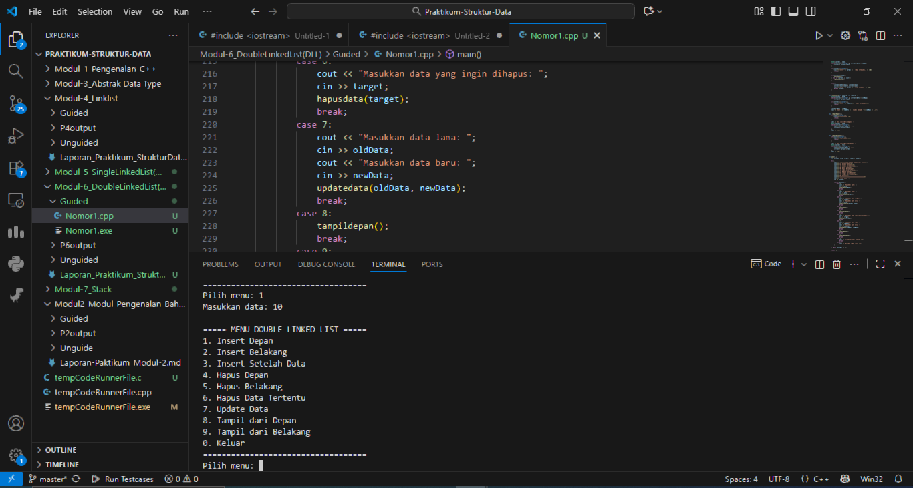
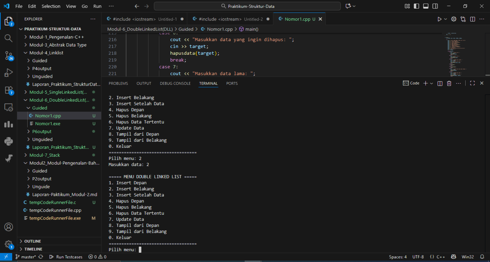
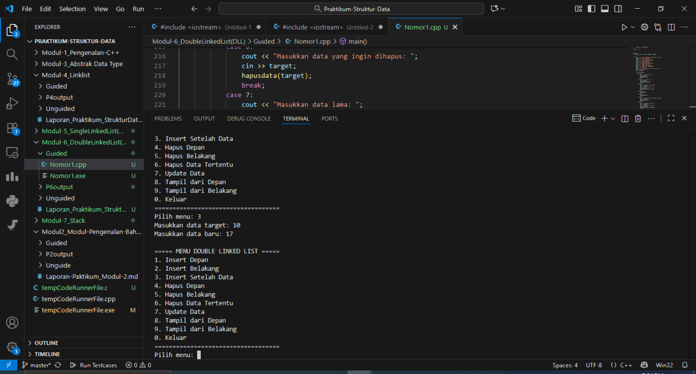
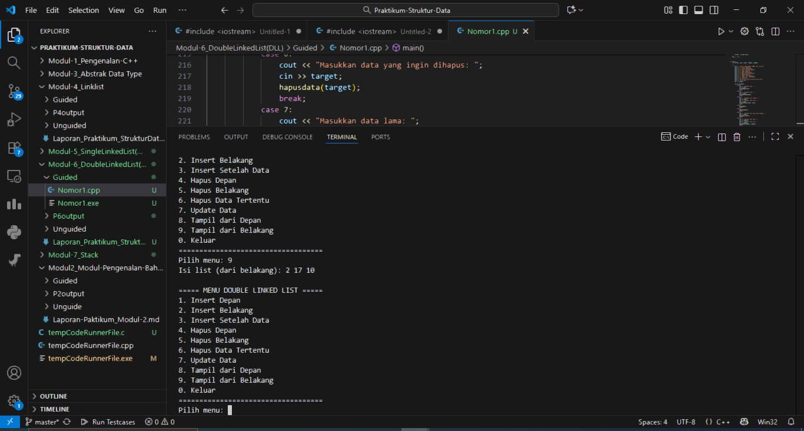
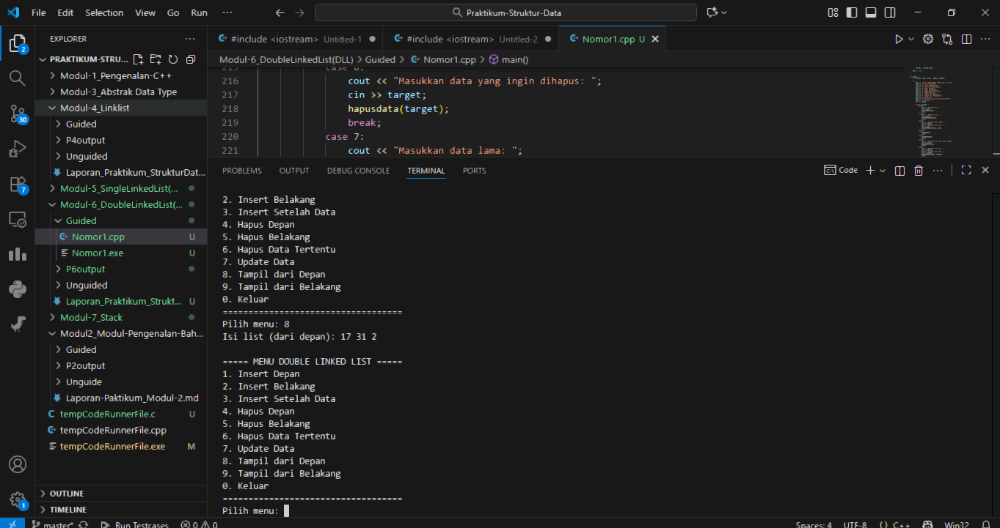
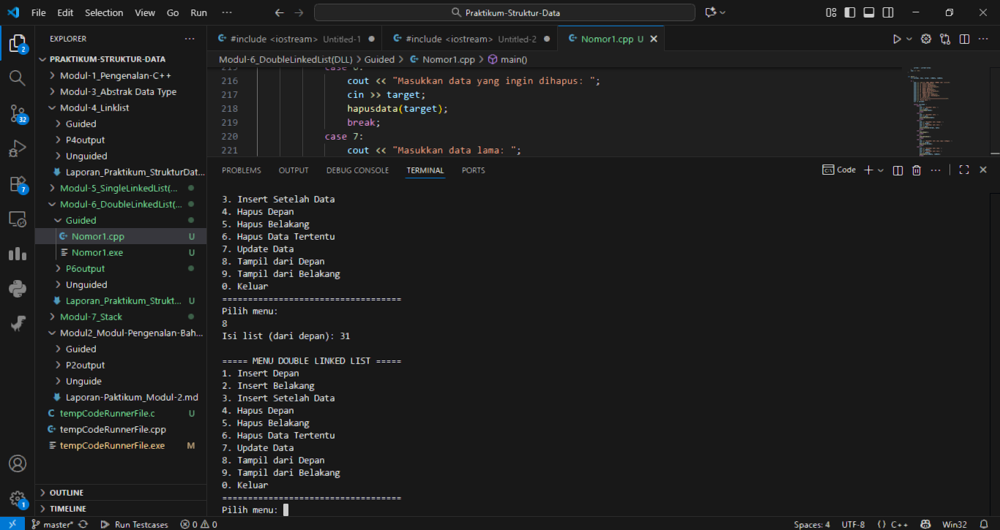
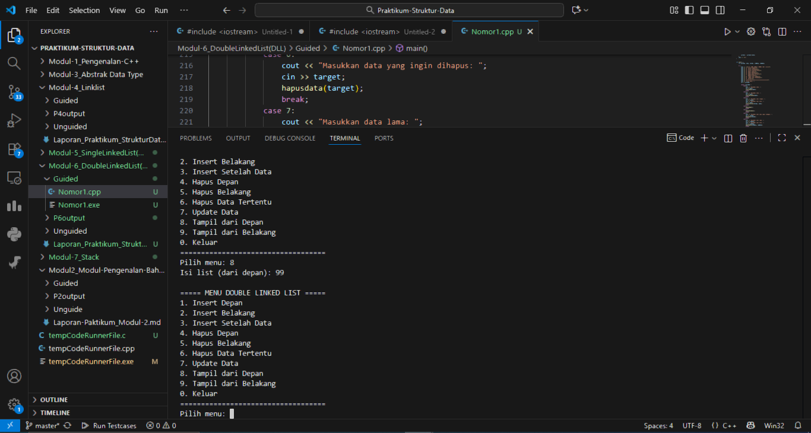
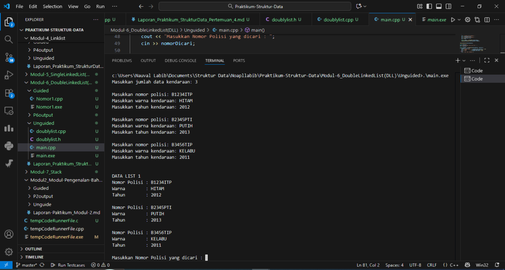
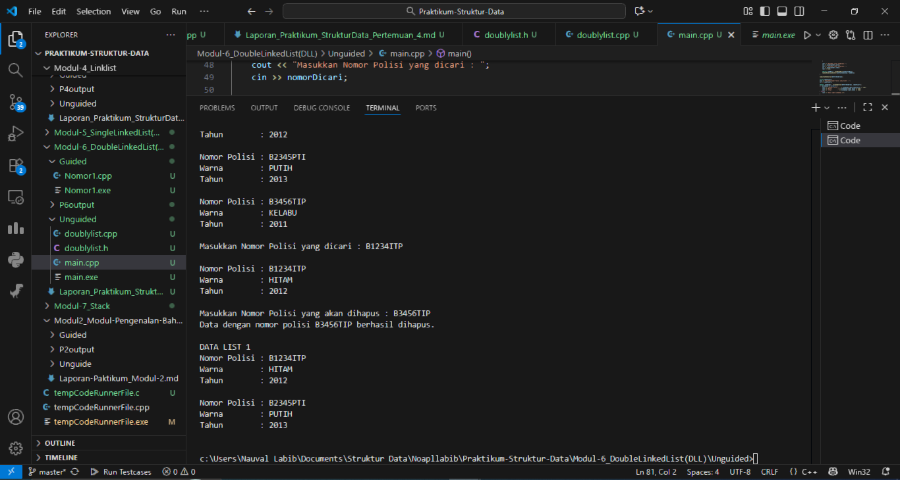

# <h1 align="center">Laporan Praktikum Modul 6 <br> Double Linked List</h1>
<p align="center">Naufal Labib Asyidiq - 103112400108</p>

## Dasar Teori

Dasar Teori

Double Linked List adalah salah satu jenis struktur data dinamis yang terdiri dari kumpulan simpul (node) yang saling terhubung dua arah melalui pointer next dan prev. Setiap simpul menyimpan dua informasi penting, yaitu data dan alamat simpul sebelumnya serta simpul berikutnya. Berbeda dengan Single Linked List yang hanya dapat ditelusuri dari satu arah, Double Linked List memungkinkan penelusuran maju maupun mundur secara efisien. Struktur ini sangat bermanfaat ketika dibutuhkan operasi penyisipan dan penghapusan data di posisi mana pun tanpa harus menggeser elemen lain seperti pada array. Selain itu, penggunaannya juga membantu memahami cara kerja alokasi dan manajemen memori dinamis dalam pemrograman C++.

Dalam implementasinya, Double Linked List mendukung berbagai operasi dasar seperti penambahan data di depan, belakang, atau setelah elemen tertentu, serta penghapusan dan pembaruan data. Proses manipulasi pointer menjadi aspek penting karena kesalahan kecil dapat menyebabkan kehilangan akses terhadap simpul dalam memori. Selain operasi dasar, struktur ini juga digunakan untuk membentuk sistem antrian, daftar kendaraan, atau data berurutan lainnya yang memerlukan navigasi dua arah. Kelebihannya terletak pada fleksibilitas dan efisiensi pengelolaan data secara langsung di tingkat memori. Dengan memahami konsep dan implementasinya, mahasiswa dapat memperkuat logika pemrograman serta wawasan mengenai struktur data non-linear yang mendasari pengembangan perangkat lunak modern.

## Guided

### soal 1 

```cpp
#include <iostream>
using namespace std;

struct Node {

    int data;
    Node* next;
    Node* prev;

};

Node* head = nullptr;
Node* tail = nullptr;

void insertdepan(int data){
    Node* newNode = new Node();
    newNode->data = data;
    newNode->next = head;
    newNode->prev = nullptr;

    if (head != nullptr) {
        head->prev = newNode;
    } else {
        tail = newNode; 
    }
    head = newNode;

}


void insertbelakang(int data){
    Node* newNode = new Node();
    newNode->data = data;
    newNode->next = nullptr;
    newNode->prev = tail;

    if (tail != nullptr) {
        tail->next = newNode;
    } else {
        head = newNode; 
    }
    tail = newNode;

}

void insertsetelah (int target, int data) {
    Node* current = head;
    while (current != nullptr && current->data != target) {
        current = current->next;
    }

    if (current != nullptr) {
        Node* newNode = new Node();
        newNode->data = data;
        newNode->next = current->next;
        newNode->prev = current;

        if (current->next != nullptr) {
            current->next->prev = newNode;
        } else {
            tail = newNode; 
        }
        current->next = newNode; 
    }
}
void hapusdepan() {
    if (head == nullptr){
        cout << "list kosong" << endl;
        return;
    } 

    Node* temp = head;
    head = head->next;

    if (head != nullptr) {
        head->prev = nullptr;
    } else {
        tail = nullptr; 
    }
    delete temp;
}

void hapusbelakang() {
    if (tail == nullptr){
        cout << "list kosong" << endl;
        return;
    } 

    Node* temp = tail;
    tail = tail->prev;

    if (tail != nullptr) {
        tail->next = nullptr;
    } else {
        head = nullptr; 
    }
    delete temp;
}

void hapusdata(int target) {
    Node* current = head;
    while (current != nullptr && current->data != target) {
        current = current->next;
    }

    if (current == nullptr) {
        cout << "Data " << target << " tidak ditemukan." << endl;
        return;
    }

    if (current == head) {
        hapusdepan();
    } else if (current == tail) {
        hapusbelakang();
    }

    else {
        current->prev->next = current->next;
        current->next->prev = current->prev;
        cout << "Data " << target << " telah dihapus." << endl; 
        delete current;
    }

}

void updatedata(int oldData, int newData) {
    Node* current = head;
    while (current != nullptr && current->data != oldData)
        current = current->next;

    if (current == nullptr) {
        cout << "Data " << oldData << " tidak ditemukan.\n";
        return;
    }

    current->data = newData;
    cout << "Data " << oldData << " diubah menjadi " << newData << ".\n";
}

void tampildepan() {
    if (head == nullptr) {
        cout << "List kosong.\n";
        return;
    }

    cout << "Isi list (dari depan): ";
    Node* current = head;
    while (current != nullptr) {
        cout << current->data << " ";
        current = current->next;
    }
    cout << "\n";
}


void tampilbelakang() {
    if (tail == nullptr) {
        cout << "List kosong.\n";
        return;
    }

    cout << "Isi list (dari belakang): ";
    Node* current = tail;
    while (current != nullptr) {
        cout << current->data << " ";
        current = current->prev;
    }
    cout << "\n";
}


int main() {
    int pilihan, data, target, oldData, newData;

    do {
        cout << "\n===== MENU DOUBLE LINKED LIST =====\n";
        cout << "1. Insert Depan\n";
        cout << "2. Insert Belakang\n";
        cout << "3. Insert Setelah Data\n";
        cout << "4. Hapus Depan\n";
        cout << "5. Hapus Belakang\n";
        cout << "6. Hapus Data Tertentu\n";
        cout << "7. Update Data\n";
        cout << "8. Tampil dari Depan\n";
        cout << "9. Tampil dari Belakang\n";
        cout << "0. Keluar\n";
        cout << "===================================\n";
        cout << "Pilih menu: ";
        cin >> pilihan;

        switch (pilihan) {
            case 1:
                cout << "Masukkan data: ";
                cin >> data;
                insertdepan(data);
                break;
            case 2:
                cout << "Masukkan data: ";
                cin >> data;
                insertbelakang(data);
                break;
            case 3:
                cout << "Masukkan data target: ";
                cin >> target;
                cout << "Masukkan data baru: ";
                cin >> data;
                insertsetelah(target, data);
                break;
            case 4:
                hapusdepan();
                break;
            case 5:
                hapusbelakang();
                break;
            case 6:
                cout << "Masukkan data yang ingin dihapus: ";
                cin >> target;
                hapusdata(target);
                break;
            case 7:
                cout << "Masukkan data lama: ";
                cin >> oldData;
                cout << "Masukkan data baru: ";
                cin >> newData;
                updatedata(oldData, newData);
                break;
            case 8:
                tampildepan();
                break;
            case 9:
                tampilbelakang();
                break;
            case 0:
                cout << "👋 Keluar dari program.\n";
                break;
            default:
                cout << "Pilihan tidak valid.\n";
        }

    } while (pilihan != 0);

    return 0;
}
```
### OUTPUT UNTUK MASING-MASING CABANG

untuk opsi 1
> Output
> 

Use case ini menjalankan fungsi insertdepan(), yaitu untuk menambahkan node baru di bagian awal dari double linked list.
Program meminta input data dari pengguna, lalu membuat node baru yang next-nya menunjuk ke head lama.
Jika list masih kosong, node baru akan menjadi head sekaligus tail.
Dengan demikian, setiap elemen baru akan selalu berada di posisi pertama.
Fungsi ini berguna untuk menambah data prioritas tinggi di bagian awal struktur.

untuk opsi 2
> Output
> 

Use case ini menggunakan fungsi insertbelakang() untuk menambahkan node baru di akhir linked list.
Node baru dihubungkan dengan node tail sebelumnya, lalu pointer tail diperbarui menunjuk ke node baru.
Jika list masih kosong, node baru menjadi head dan tail sekaligus.
Operasi ini ideal untuk menambahkan data secara berurutan tanpa mengubah urutan elemen sebelumnya.
Dengan cara ini, struktur data dapat bertambah dinamis dari belakang tanpa gangguan pada data lain.

untuk opsi 3
> Output
> 

Use case ini menjalankan fungsi insertsetelah(), yang menambahkan node setelah node tertentu berdasarkan nilai target.
Program meminta dua input: data target dan data baru yang ingin disisipkan.
Fungsi mencari node dengan data sesuai target, lalu mengatur pointer next dan prev agar node baru masuk di posisi tersebut.
Jika target tidak ditemukan, program menampilkan pesan bahwa data tidak ada dalam list.
Fungsi ini sangat berguna untuk penyisipan data di posisi tengah tanpa perlu menyalin seluruh elemen.

untuk opsi 8
> Output
> 

Use case ini memanggil fungsi tampildepan(), yang menampilkan seluruh isi linked list mulai dari head ke tail.
Program melakukan iterasi maju dengan menggunakan pointer next hingga mencapai nullptr.
Jika list kosong, program menampilkan pesan bahwa list belum memiliki data.
Outputnya menampilkan urutan data sesuai urutan penambahan dari awal.
Fungsi ini membantu pengguna untuk melihat kondisi terkini dari struktur data secara urut.

untuk opsi 9
> Output
> 

Fungsi tampilbelakang() digunakan untuk menampilkan data dari tail ke head menggunakan pointer prev.
Dengan kemampuan traversal dua arah, Double Linked List memungkinkan penelusuran terbalik dengan mudah.
Program mencetak seluruh data mulai dari akhir hingga awal list.
Jika list kosong, maka akan muncul pesan bahwa data belum tersedia.
Fungsi ini menunjukkan salah satu keunggulan utama Double Linked List dibanding Single Linked List.

untuk opsi 4
> Output
> 

Fungsi hapusdepan() digunakan untuk menghapus node yang berada di bagian awal (head) dari linked list.
Node pertama dihapus, dan head diperbarui untuk menunjuk ke node berikutnya.
Jika list hanya berisi satu node, maka head dan tail akan menjadi nullptr.
Proses ini efisien karena hanya melibatkan perubahan pointer tanpa pergeseran data.
Fungsi ini menggambarkan operasi dequeue pada struktur antrian.

untuk opsi 5
> Output
> 

Pada use case ini dijalankan fungsi hapusbelakang(), yaitu menghapus node yang berada di akhir (tail) linked list.
tail diperbarui untuk menunjuk ke node sebelumnya, dan node terakhir dihapus dari memori.
Jika hanya ada satu elemen, list akan menjadi kosong.
Operasi ini umum digunakan ketika data paling akhir sudah tidak dibutuhkan lagi.
Dengan mekanisme pointer dua arah, proses penghapusan dapat dilakukan tanpa perlu traversing dari depan.

untuk opsi 6
> Output
> 

Fungsi hapusdata() bertugas menghapus node dengan nilai tertentu yang dimasukkan oleh pengguna.
Program menelusuri list untuk menemukan data target, lalu menyesuaikan pointer next dan prev agar node tersebut terlepas.
Jika data berada di awal atau akhir, maka fungsi hapusdepan() atau hapusbelakang() akan dipanggil secara otomatis.
Pesan akan ditampilkan untuk memberi tahu apakah data berhasil dihapus atau tidak ditemukan.
Fitur ini sangat penting untuk pemeliharaan data yang spesifik di dalam struktur.

untuk opsi 7
> Output
> 

Use case ini menggunakan fungsi updatedata(), yang berfungsi mengubah nilai lama menjadi nilai baru.
Program meminta dua input, yaitu oldData dan newData.
Kemudian fungsi mencari node dengan data lama dan menggantinya dengan data baru jika ditemukan.
Jika tidak ditemukan, program menampilkan pesan bahwa data tidak tersedia.
Fitur ini berguna ketika pengguna ingin memperbarui isi data tanpa perlu menambah atau menghapus node.

## Unguided
## Nomor 1
### Nomor 1 Program 1

```cpp
#ifndef DOUBLYLIST_H
#define DOUBLYLIST_H

#include <iostream>
#include <string>
using namespace std;

struct Kendaraan {
    string nomorPolisi;
    string warna;
    int tahun;
};

typedef Kendaraan InfoKendaraan;

struct Node {
    InfoKendaraan data;
    Node* next;
    Node* prev;
};

typedef Node* Address;

struct List {
    Address first;
    Address last;
};

void buatListKosong(List &daftarKendaraan);
Address buatNodeBaru(InfoKendaraan kendaraanBaru);
void hapusNode(Address node);
void tambahKendaraanDiAkhir(List &daftarKendaraan, Address nodeBaru);
void tampilkanKendaraan(List daftarKendaraan);
Address cariKendaraan(List daftarKendaraan, string nomorPolisi);
void hapusKendaraanPertama(List &daftarKendaraan, Address &node);
void hapusKendaraanTerakhir(List &daftarKendaraan, Address &node);
void hapusKendaraanSetelah(Address sebelum, Address &node);

#endif
```

### Nomor 1 Program 2

```cpp
#include "Doublylist.h"

void buatListKosong(List &daftarKendaraan) {
    daftarKendaraan.first = nullptr;
    daftarKendaraan.last = nullptr;
}

Address buatNodeBaru(InfoKendaraan kendaraanBaru) {
    Address node = new Node;
    node->data = kendaraanBaru;
    node->next = nullptr;
    node->prev = nullptr;
    return node;
}

void hapusNode(Address node) {
    delete node;
}

void tambahKendaraanDiAkhir(List &daftarKendaraan, Address nodeBaru) {
    if (daftarKendaraan.first == nullptr) {
        daftarKendaraan.first = nodeBaru;
        daftarKendaraan.last = nodeBaru;
    } else {
        daftarKendaraan.last->next = nodeBaru;
        nodeBaru->prev = daftarKendaraan.last;
        daftarKendaraan.last = nodeBaru;
    }
}

void tampilkanKendaraan(List daftarKendaraan) {
    Address node = daftarKendaraan.first;
    cout << "\nDATA LIST 1\n";
    while (node != nullptr) {
        cout << "Nomor Polisi : " << node->data.nomorPolisi << endl;
        cout << "Warna        : " << node->data.warna << endl;
        cout << "Tahun        : " << node->data.tahun << endl << endl;
        node = node->next;
    }
}

Address cariKendaraan(List daftarKendaraan, string nomorPolisi) {
    Address node = daftarKendaraan.first;
    while (node != nullptr) {
        if (node->data.nomorPolisi == nomorPolisi) {
            return node;
        }
        node = node->next;
    }
    return nullptr;
}

void hapusKendaraanPertama(List &daftarKendaraan, Address &node) {
    if (daftarKendaraan.first != nullptr) {
        node = daftarKendaraan.first;
        if (daftarKendaraan.first == daftarKendaraan.last) {
            daftarKendaraan.first = nullptr;
            daftarKendaraan.last = nullptr;
        } else {
            daftarKendaraan.first = daftarKendaraan.first->next;
            daftarKendaraan.first->prev = nullptr;
            node->next = nullptr;
        }
    }
}

void hapusKendaraanTerakhir(List &daftarKendaraan, Address &node) {
    if (daftarKendaraan.last != nullptr) {
        node = daftarKendaraan.last;
        if (daftarKendaraan.first == daftarKendaraan.last) {
            daftarKendaraan.first = nullptr;
            daftarKendaraan.last = nullptr;
        } else {
            daftarKendaraan.last = daftarKendaraan.last->prev;
            daftarKendaraan.last->next = nullptr;
            node->prev = nullptr;
        }
    }
}

void hapusKendaraanSetelah(Address sebelum, Address &node) {
    if (sebelum != nullptr && sebelum->next != nullptr) {
        node = sebelum->next;
        sebelum->next = node->next;
        if (node->next != nullptr) {
            node->next->prev = sebelum;
        }
        node->next = nullptr;
        node->prev = nullptr;
    }
}
```

### Nomor 1 Program 3

```cpp
#include "Doublylist.h"

bool cekDuplikat(List daftarKendaraan, string nomorPolisi) {
    Address node = daftarKendaraan.first;
    while (node != nullptr) {
        if (node->data.nomorPolisi == nomorPolisi) {
            return true;
        }
        node = node->next;
    }
    return false;
}

int main() {
    List daftarKendaraan;
    buatListKosong(daftarKendaraan);

    int jumlah;
    cout << "Masukkan jumlah data kendaraan: ";
    cin >> jumlah;
    cout << endl;

    for (int i = 0; i < jumlah; i++) {
        InfoKendaraan kendaraanBaru;

        cout << "Masukkan nomor polisi: ";
        cin >> kendaraanBaru.nomorPolisi;

        if (cekDuplikat(daftarKendaraan, kendaraanBaru.nomorPolisi)) {
            cout << "Nomor polisi sudah terdaftar\n\n";
            i--;
            continue;
        }

        cout << "Masukkan warna kendaraan: ";
        cin >> kendaraanBaru.warna;
        cout << "Masukkan tahun kendaraan: ";
        cin >> kendaraanBaru.tahun;
        cout << endl;

        Address nodeBaru = buatNodeBaru(kendaraanBaru);
        tambahKendaraanDiAkhir(daftarKendaraan, nodeBaru);
    }

    tampilkanKendaraan(daftarKendaraan);

    string nomorDicari;
    cout << "Masukkan Nomor Polisi yang dicari : ";
    cin >> nomorDicari;

    Address ditemukan = cariKendaraan(daftarKendaraan, nomorDicari);
    if (ditemukan != nullptr) {
        cout << "\nNomor Polisi : " << ditemukan->data.nomorPolisi << endl;
        cout << "Warna        : " << ditemukan->data.warna << endl;
        cout << "Tahun        : " << ditemukan->data.tahun << endl;
    } else {
        cout << "Data tidak ditemukan.\n";
    }

    string nomorDihapus;
    cout << "\nMasukkan Nomor Polisi yang akan dihapus : ";
    cin >> nomorDihapus;

    Address nodeDihapus = cariKendaraan(daftarKendaraan, nomorDihapus);
    if (nodeDihapus != nullptr) {
        if (nodeDihapus == daftarKendaraan.first) {
            hapusKendaraanPertama(daftarKendaraan, nodeDihapus);
        } else if (nodeDihapus == daftarKendaraan.last) {
            hapusKendaraanTerakhir(daftarKendaraan, nodeDihapus);
        } else {
            hapusKendaraanSetelah(nodeDihapus->prev, nodeDihapus);
        }
        hapusNode(nodeDihapus);
        cout << "Data dengan nomor polisi " << nomorDihapus << " berhasil dihapus.\n";
    } else {
        cout << "Data tidak ditemukan.\n";
    }

    tampilkanKendaraan(daftarKendaraan);
    return 0;
}
```

### OUTPUT
>Output
> 

>Output
> 

Program Unguided 2 ini merupakan implementasi Abstract Data Type (ADT) pada struktur data Double Linked List menggunakan bahasa C++. ADT digunakan untuk memisahkan antara definisi struktur data dan implementasi operasionalnya, sehingga program lebih modular dan mudah dikembangkan. Pada bagian header (.h), didefinisikan tipe data Node dan List yang merepresentasikan elemen dan keseluruhan daftar ganda. Setiap node memiliki dua pointer (next dan prev) yang memungkinkan penelusuran maju maupun mundur. Selain itu, fungsi dasar seperti create list, insert, delete, dan display juga dideklarasikan di dalamnya. Dengan pendekatan ini, program memiliki rancangan yang terstruktur dan mudah digunakan kembali pada konteks lain tanpa mengubah logika internalnya.
Pada bagian implementasi (.cpp), setiap fungsi dari header direalisasikan untuk melakukan operasi pada list secara langsung. Misalnya, fungsi insert digunakan untuk menambahkan node baru baik di depan, belakang, maupun setelah elemen tertentu, sedangkan delete berfungsi menghapus node berdasarkan posisi atau nilai. Fungsi display menampilkan seluruh isi list untuk memastikan hasil operasi berjalan sesuai harapan. Program utama (main.cpp) kemudian berperan sebagai interface bagi pengguna untuk mengakses fungsi-fungsi tersebut melalui menu pilihan. Dengan menggunakan konsep ADT, pemisahan antara logika dan struktur menjadikan kode lebih bersih, terorganisir, dan mudah diuji. Pendekatan ini juga mencerminkan prinsip encapsulation dalam pemrograman berorientasi objek.


## Referensi

1. Samala, A. D., Fajri, B. R., & Ranuarja, F. (2021). PEMROGRAMAN C++. UNP PRESS. https://books.google.com/books?hl=id&lr=&id=49ZbEAAAQBAJ&oi=fnd&pg=PA2&dq=pemrograman+c%2B%2B&ots=4sYIx_JYCx&sig=ouhrRQNOGTjAM3F2phz0_RIeUjY

2. Indahyanti, U., & Rahmawati, Y. (2020). Buku Ajar Algoritma Dan Pemrograman Dalam Bahasa C++. Umsida Press, 1-146. https://press.umsida.ac.id/index.php/umsidapress/article/view/978-623-6833-67-4

3. Guntara, R. G. (2023). ALGORITMA DAN PEMROGRAMAN DASAR: Menggunakan Bahasa Pemrograman C++ dengan Contoh Kasus Aplikasi untuk Bisnis dan Manajemen. CV. Ruang Tentor. https://books.google.com/books?hl=id&lr=&id=NO_LEAAAQBAJ&oi=fnd&pg=PP1&dq=bahasa+pemrograman+c%2B%2B+array&ots=2Fy9t5bo-6&sig=IEpObWmOGnSM-_hcwcGMRc3y-2A

4. Anita Sindar, R. M. S. (2019). Struktur Data Dan Algoritma Dengan C++ (Vol. 1). CV. AA. RIZKY. https://books.google.com/books?hl=id&lr=&id=GP_ADwAAQBAJ&oi=fnd&pg=PA23&dq=bahasa+pemrograman+c%2B%2B+pointer&ots=86j8Vl4PeN&sig=Y8PH3MxqztsFCr6HnjJIKfS--ow
