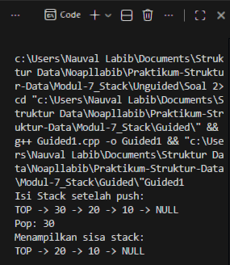
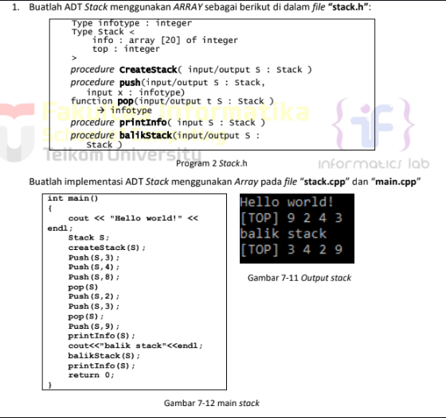
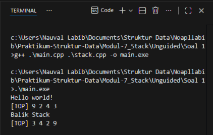
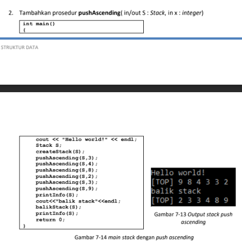
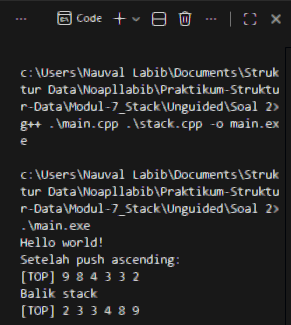
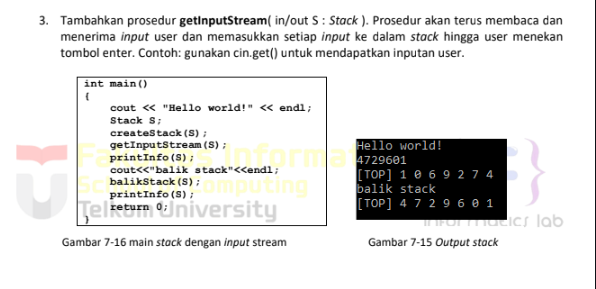
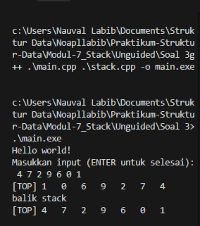

# <h1 align="center">Laporan Praktikum Modul 7 <br> Stack</h1>
<p align="center">Naufal Labib Asyidiq - 103112400108</p>

## Dasar Teori

Dasar Teori

Struktur data stack adalah salah satu bentuk struktur linier yang menerapkan prinsip LIFO (Last In, First Out), yaitu elemen yang terakhir masuk akan menjadi elemen pertama yang keluar. Stack dapat diimplementasikan menggunakan array maupun linked list, di mana keduanya memiliki operasi dasar yang sama, yaitu push untuk menambahkan data ke bagian atas stack, pop untuk menghapus dan mengambil elemen teratas, serta isEmpty dan isFull untuk memeriksa kondisi stack. Dalam implementasi menggunakan array, posisi teratas ditandai oleh variabel top, sedangkan pada linked list menggunakan pointer ke node paling atas. Operasi printInfo digunakan untuk menampilkan isi stack dari elemen paling atas ke paling bawah, sementara balikStack membalik urutan isi stack dengan memindahkan elemen satu per satu ke stack sementara hingga urutan menjadi terbalik. Pada beberapa kasus, seperti fungsi pushAscending, stack juga dapat diatur agar tetap terurut melalui proses pemindahan sementara. Selain itu, prosedur getInputStream memungkinkan stack menerima input karakter secara berurutan dari user menggunakan cin.get(), yang kemudian disimpan ke dalam stack hingga tombol Enter ditekan. Dengan berbagai operasi tersebut, stack menjadi struktur data penting untuk berbagai kebutuhan komputasi seperti pengolahan input, simulasi proses rekursif, hingga pembalikan data.

## Guided
```cpp
#include <iostream>
using namespace std;

struct Node {
    int data;
    Node* next;
};

bool isEmpty(Node *top) {
    return top == nullptr;
}

void push(Node *&top, int data) {
    Node* newNode = new Node();
    newNode->data = data;
    newNode->next = top;
    top = newNode;
}

int pop(Node *&top)
{
    if (isEmpty(top)){
        cout << "Stack Kosong, Tidak Bisa Pop" << endl;
        return 0;
    }

    int poppedData = top->data;
    Node *temp = top;
    top = top->next;

    delete temp;
    return poppedData;
}

void show(Node *top) { 
    if (isEmpty(top)) {
        cout << "Stack kosong.\n";
        return;
    }

    cout << "TOP -> ";
    Node *temp = top;

    while (temp != nullptr) {
        cout << temp->data << " -> ";
        temp = temp->next;
    }
    cout << "NULL" << endl;
}

int main(){
    Node *stack = nullptr;

    push(stack, 10);
    push(stack, 20);
    push(stack, 30);

    cout << "Isi Stack setelah push:\n";
    show(stack);

    cout << "Pop: " << pop(stack) << endl;

    cout << "Menampilkan sisa stack: \n";
    show(stack);

    return 0;

}
```
### OUTPUT

> Output
> 

Kode ini membuat struktur data stack menggunakan linked list. Setiap elemen disimpan dalam node yang berisi nilai dan pointer ke node berikutnya. Fungsi push menambah elemen baru di bagian atas stack dengan membuat node baru dan menjadikannya top. Fungsi pop menghapus elemen teratas dan mengembalikan nilainya, serta menampilkan pesan jika stack kosong. Fungsi show mencetak isi stack dari atas ke bawah. Pada fungsi main, program membuat stack kosong, menambah tiga nilai (10, 20, 30), menampilkan isinya, melakukan satu pop (menghapus 30), lalu menampilkan stack yang tersisa.


## UNGUIDED
### SOAL 1
> Output
> 

#### Stack.h

```cpp
#ifndef STACK_H
#define STACK_H

#include <iostream>
using namespace std;

typedef int infotype;

struct Stack {
    infotype info[20];
    int top;
};

void createStack(Stack &S);
void push(Stack &S, infotype x);
infotype pop(Stack &S);
void printInfo(Stack S);
void balikStack(Stack &S);
bool isEmpty(Stack S);
bool isFull(Stack S);

#endif
```

##### Stack.cpp
```cpp
#include "stack.h"

void createStack(Stack &S) {
    S.top = -1;
}

bool isEmpty(Stack S) {
    return S.top == -1;
}

bool isFull(Stack S) {
    return S.top == 19;
}

void push(Stack &S, infotype x) {
    if (isFull(S)) {
        cout << "Stack penuh!" << endl;
    } else {
        S.top++;
        S.info[S.top] = x;
    }
}

infotype pop(Stack &S) {
    infotype x = 0;
    if (isEmpty(S)) {
        cout << "Stack kosong!" << endl;
    } else {
        x = S.info[S.top];
        S.top--;
    }
    return x;
}

void printInfo(Stack S) {
    if (isEmpty(S)) {
        cout << "Stack kosong!" << endl;
    } else {
        cout << "[TOP] ";
        for (int i = S.top; i >= 0; i--) {
            cout << S.info[i] << " ";
        }
        cout << endl;
    }
}

void balikStack(Stack &S) {
    Stack temp;
    createStack(temp);
    
    while (!isEmpty(S)) {
        push(temp, pop(S));
    }
    
    S = temp;
}
```

#### main.cpp
```cpp
#include "stack.h"

int main()
{
    cout << "Hello world!" << endl;
    Stack S;
    createStack(S);
    push(S,3);
    push(S,4);
    push(S,8);
    pop(S);
    push(S,2);
    push(S,3);
    pop(S);
    push(S,9);
    printInfo(S);
    cout<<"Balik Stack"<<endl;
    balikStack(S);
    printInfo(S);
    return 0;
}
```
#### OUTPUT

> Output
> 

Kode tersebut mengimplementasikan struktur data stack berbasis array dengan kapasitas maksimal 20 elemen. Pada file Stack.h, didefinisikan tipe data infotype sebagai int, kemudian dibuat sebuah struct Stack yang menyimpan array info[20] untuk menampung elemen serta variabel top untuk menandai posisi elemen paling atas. Selain itu, dideklarasikan pula beberapa fungsi penting seperti membuat stack kosong, menambahkan elemen (push), menghapus elemen teratas (pop), menampilkan isi stack, membalik urutan stack, serta pengecekan kosong atau penuhnya stack. Implementasi dari fungsi-fungsi tersebut terdapat pada Stack.cpp. Fungsi createStack menginisialisasi nilai top menjadi -1, menandakan bahwa stack masih kosong. Fungsi isEmpty dan isFull masing-masing memeriksa apakah stack kosong atau sudah penuh. Fungsi push menambah elemen ke posisi teratas jika stack belum penuh, sedangkan pop menghapus elemen teratas jika tidak kosong. Fungsi printInfo mencetak semua elemen stack dari atas ke bawah. Terdapat juga fungsi balikStack yang menggunakan stack sementara untuk membalik urutan elemen, yaitu dengan memindahkan elemen dari stack utama ke stack sementara satu per satu. Pada file main.cpp, program dimulai dengan membuat sebuah stack bernama S, kemudian beberapa operasi push dan pop dijalankan. Isi stack ditampilkan, lalu stack dibalik menggunakan balikStack dan hasilnya dicetak kembali. Program ini secara keseluruhan bertujuan menunjukkan cara kerja operasi dasar pada stack menggunakan array.


### SOAL 2
> Output
> 

#### Stack.h

```cpp
#ifndef STACK_H
#define STACK_H

const int MAX_SIZE = 20;

typedef int infotype;

struct Stack {
    infotype info[MAX_SIZE];
    int top;
};

void createStack(Stack &S);
bool isFull(Stack S);
bool isEmpty(Stack S);
void push(Stack &S, infotype x);
infotype pop(Stack &S);
void printInfo(Stack S);
void balikStack(Stack &S);
void pushAscending(Stack &S, infotype x);

#endif
```

#### Stack.cpp
```cpp
#include "stack.h"
#include <iostream>
using namespace std;


void createStack(Stack &S) {
    S.top = -1;
}

bool isFull(Stack S) {
    return S.top == MAX_SIZE - 1;
}

bool isEmpty(Stack S) {
    return S.top == -1;
}
void push(Stack &S, infotype x) {
    if (!isFull(S)) {
        S.top++;
        S.info[S.top] = x;
    } else {
        cout << "Stack penuh!" << endl;
    }
}

infotype pop(Stack &S) {
    infotype x = -1;
    if (!isEmpty(S)) {
        x = S.info[S.top];
        S.top--;
    }
    return x;
}

void printInfo(Stack S) {
    cout << "[TOP] ";
    for (int i = S.top; i >= 0; i--) {
        cout << S.info[i] << " ";
    }
    cout << endl;
}

void balikStack(Stack &S) {
    Stack temp;
    createStack(temp);
    
    while (!isEmpty(S)) {
        push(temp, pop(S));
    }
    
    S = temp;
}

void pushAscending(Stack &S, infotype x) {
    if (isFull(S)) {
        cout << "Stack penuh!" << endl;
        return;
    }
    
    if (isEmpty(S) || x >= S.info[S.top]) {
        push(S, x);
    } else {
        Stack temp;
        createStack(temp);
        
        while (!isEmpty(S) && S.info[S.top] > x) {
            push(temp, pop(S));
        }

        push(S, x);
    
        while (!isEmpty(temp)) {
            push(S, pop(temp));
        }
    }
}
```

#### main.cpp
```cpp
#include "stack.h"
#include <iostream>
using namespace std;

int main() {
    Stack S;
    
    cout << "Hello world!" << endl;
    createStack(S);
    
    pushAscending(S, 3);
    pushAscending(S, 4);
    pushAscending(S, 8);
    pushAscending(S, 2);
    pushAscending(S, 3);
    pushAscending(S, 9);
    
    cout << "Setelah push ascending:" << endl;
    printInfo(S);
    
    cout << "Balik stack" << endl;
    balikStack(S);
    printInfo(S);
    
    return 0;
}
```
#### OUTPUT

> Output
> 

Kode tersebut mengimplementasikan sebuah ADT (Abstract Data Type) bertipe Stack berbasis array dengan kapasitas maksimum 20 elemen. Struktur stack disimpan dalam sebuah struct berisi array info dan penanda posisi elemen teratas (top). Fungsi-fungsi dasar stack seperti createStack, isEmpty, isFull, push, pop, dan printInfo diimplementasikan pada Stack.cpp. Fungsi createStack menginisialisasi stack dengan top = -1 sehingga stack berada dalam keadaan kosong. Fungsi push menambahkan elemen baru ke bagian atas selama stack belum penuh, sedangkan pop menghapus serta mengembalikan elemen teratas selama stack tidak kosong. Fungsi printInfo menampilkan isi stack mulai dari elemen teratas hingga terbawah.
Program juga memiliki dua fungsi tambahan. Pertama, balikStack, yang membalik seluruh isi stack menggunakan stack sementara: elemen dipindahkan satu per satu dari stack utama ke stack sementara sehingga urutannya terbalik. Kedua, pushAscending, yaitu fungsi khusus yang memasukkan elemen dengan menjaga agar isi stack tetap tersusun dalam urutan ascending dari bawah ke atas, atau dengan kata lain descending ketika ditampilkan dari TOP. Jika elemen baru lebih besar dari atau sama dengan elemen teratas, elemen tersebut langsung dipush. Namun, jika lebih kecil, fungsi memindahkan elemen-elemen yang lebih besar ke stack sementara hingga menemukan posisi yang tepat, memasukkan elemen tersebut, lalu mengembalikan elemen yang dipindahkan sebelumnya.
Pada main.cpp, program dimulai dengan membuat stack S dan melakukan beberapa operasi pushAscending dengan nilai tertentu. Karena fungsi ini memasukkan elemen sambil menjaga urutan, maka hasil akhir sebelum dibalik adalah [TOP] 9 8 4 3 3 2. Selanjutnya, fungsi balikStack digunakan untuk membalik isi stack, menghasilkan urutan baru [TOP] 2 3 3 4 8 9. Program ini menampilkan contoh penggunaan stack sekaligus demonstrasi fungsi penyisipan terurut dan pembalikan isi stack.

### SOAL 3
> Output
> 

#### Stack.h

```cpp
#ifndef STACK_H
#define STACK_H

#include <iostream>
using namespace std;

const int MAX_SIZE = 20;
typedef char infotype;

struct Stack {
    infotype info[MAX_SIZE];
    int top;
};

void createStack(Stack &S);
bool isEmpty(Stack S);
bool isFull(Stack S);

void push(Stack &S, infotype x);
infotype pop(Stack &S);

void printInfo(Stack S);
void balikStack(Stack &S);

void getInputStream(Stack &S);

#endif
```

#### Stack.cpp
```cpp
#include "stack.h"

void createStack(Stack &S) {
    S.top = -1;
}

bool isEmpty(Stack S) {
    return S.top == -1;
}

bool isFull(Stack S) {
    return S.top == MAX_SIZE - 1;
}

void push(Stack &S, infotype x) {
    if (!isFull(S)) {
        S.info[++S.top] = x;
    }
}

infotype pop(Stack &S) {
    if (!isEmpty(S)) {
        return S.info[S.top--];
    }
    return '\0';
}

void printInfo(Stack S) {
    cout << "[TOP] ";
    for (int i = S.top; i >= 0; i--) {
        cout << S.info[i] << " ";
    }
    cout << endl;
}

void balikStack(Stack &S) {
    Stack temp;
    createStack(temp);

    while (!isEmpty(S)) {
        push(temp, pop(S));
    }

    S = temp;
}

void getInputStream(Stack &S) {
    cout << "Masukkan input (ENTER untuk selesai): ";

    char c;
    while (true) {
        c = cin.get();

        if (c == '\n')
            break;

        if (!isFull(S))
            push(S, c);
    }
}
```

#### main.cpp
```cpp
#include <iostream>
#include "stack.h"
using namespace std;

int main() {
    cout << "Hello world!" << endl;

    Stack S;
    createStack(S);

    getInputStream(S);

    printInfo(S);

    cout << "balik stack" << endl;
    balikStack(S);

    printInfo(S);

    return 0;
}
```
#### OUTPUT

> Output
> 

Kode ADT stack ini menggunakan linked list sebagai struktur penyimpanan, dengan setiap elemen direpresentasikan oleh node yang berisi data dan pointer ke node berikutnya; file stack.h mendeklarasikan tipe Node, tipe Stack, dan fungsi‐fungsi operasi stack seperti createStack, isEmpty, push, pop, printInfo, balikStack, dan getInputStream. Implementasinya berada di stack.cpp, di mana push menambah elemen baru di atas stack, pop menghapus elemen teratas, printInfo menampilkan isi stack dari top ke bottom, balikStack membalik urutan elemen menggunakan stack sementara, dan getInputStream membaca input karakter satu per satu dari user menggunakan cin.get() hingga user menekan Enter lalu memasukkan setiap karakter sebagai elemen stack. Pada main.cpp, program membuat stack baru, membaca input dari user melalui getInputStream, menampilkan isi stack, lalu membalik stack dan menampilkannya kembali.

## Referensi

1. Samala, A. D., Fajri, B. R., & Ranuarja, F. (2021). PEMROGRAMAN C++. UNP PRESS. https://books.google.com/books?hl=id&lr=&id=49ZbEAAAQBAJ&oi=fnd&pg=PA2&dq=pemrograman+c%2B%2B&ots=4sYIx_JYCx&sig=ouhrRQNOGTjAM3F2phz0_RIeUjY

2. Indahyanti, U., & Rahmawati, Y. (2020). Buku Ajar Algoritma Dan Pemrograman Dalam Bahasa C++. Umsida Press, 1-146. https://press.umsida.ac.id/index.php/umsidapress/article/view/978-623-6833-67-4

3. Santoso, L. E. (2004). STANDARD TEMPLATE LIBRARY C++ UNTUK MENGAJARKAN STRUKTUR DATA. Jurnal FASILKOM Vol, 2(2). https://www.academia.edu/download/56411324/standard-template-library-c__-untuk-mengajarkan-struktur-data.pdf
