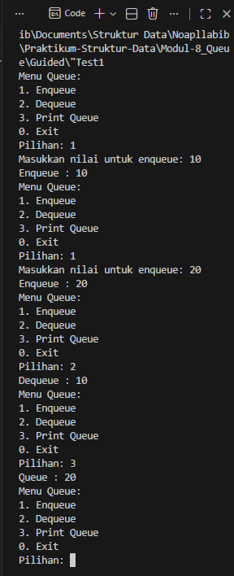
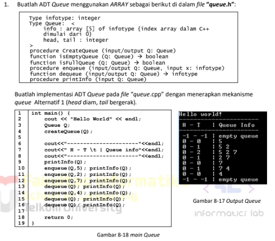
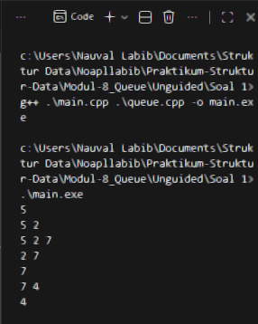
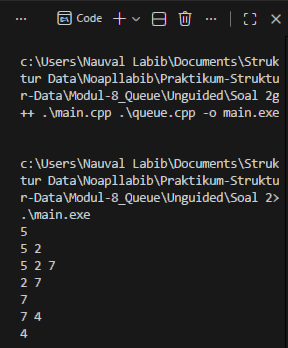
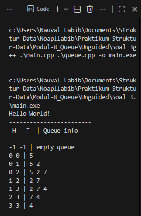

# <h1 align="center">Laporan Praktikum Modul 8 <br> Queue </h1>
<p align="center">Naufal Labib Asyidiq - 103112400108</p>

## Dasar Teori

Dasar Teori

Dasar teori dari tiga variasi implementasi queue ini berangkat dari konsep FIFO (First In, First Out), yaitu elemen yang masuk lebih dulu harus keluar lebih dulu, kemudian diterapkan pada tiga mekanisme berbeda dalam pengelolaan indeks head dan tail pada array statis: Alternatif 1 menggeser seluruh elemen setiap kali dequeue sehingga posisi head tetap di indeks 0 dan tail selalu menunjuk elemen terakhir, namun metode ini boros operasi karena tiap dequeue memindahkan banyak data; Alternatif 2 menghindari penggeseran elemen dengan membiarkan head dan tail terus maju ke kanan, sehingga dequeue hanya menaikkan head dan enqueue menambah tail selama tail belum menyentuh batas array, tetapi ruang kosong di awal array tidak bisa dipakai ulang; sedangkan Alternatif 3 (Circular Queue) menyelesaikan masalah tersebut dengan membuat array “melingkar” melalui operasi modulo sehingga head dan tail dapat kembali ke indeks awal ketika mencapai akhir array, memungkinkan seluruh slot digunakan kembali tanpa geseran dan tetap mempertahankan aturan FIFO secara efisien.


## Guided
```cpp
#include <iostream>
using namespace std;

#define MAX 100

struct Queue {
    int data[MAX];
    int head;
    int tail;
}; 

void createQueue(Queue &Q) {
    Q.head = -1;
    Q.tail = -1;
}

bool isEmpty(Queue Q) {
    return (Q.head == -1 && Q.tail == -1);
}

bool isFull(Queue Q) {
    return (Q.tail == MAX - 1);
}

void printQueue(Queue Q) {
    if (isEmpty(Q)) {
        cout << "Queue kosong!" << endl;
    } else {
        cout << "Queue : ";
        for (int i = Q.head; i <= Q.tail; i++) {
            cout << Q.data[i] << " ";
        }
        cout << endl;
    }
}

void enqueue(Queue &Q, int x) {
    if (isFull(Q)) {
        cout << "Queue penuh!" << endl;
    } else {
        if (isEmpty(Q)) {
            Q.head = Q.tail = 0;
        } else {
            Q.tail++;
        }
        Q.data[Q.tail] = x;
        cout << "Enqueue : " << x << endl;
    }
}

int dequeue(Queue &Q) {
    if (isEmpty(Q)) {
        cout << "Queue kosong!" << endl; 
    } else {
        cout << "Dequeue : " << Q.data[Q.head] << endl;
        if (Q.head == Q.tail) {
            Q.head = Q.tail = -1; 
        } else {
            for (int i = Q.head; i < Q.tail; i++) {
                Q.data[i] = Q.data[i + 1];
            }
            Q.tail--;
        }
    }
    return 0;
}

int main() {
    Queue Q;
    createQueue(Q);
    int pilihan;
    string nama;

    do {
        cout << "Menu Queue:\n";
        cout << "1. Enqueue\n";
        cout << "2. Dequeue\n";
        cout << "3. Print Queue\n";
        cout << "0. Exit\n";
        cout << "Pilihan: ";
        cin >> pilihan;

        switch (pilihan) {
            case 1:
                cout << "Masukkan nilai untuk enqueue: ";
                cin >> nama;
                enqueue(Q, stoi(nama));
                break;
            case 2:
                dequeue(Q);
                break;
            case 3:
                printQueue(Q);
                break;
            case 0:
                cout << "Keluar dari program.\n";
                break;
            default:
                cout << "Pilihan tidak valid!\n";
        }
    } while (pilihan != 0);
    return 0;
}
```
### OUTPUT

> Output
> 

Kode ini mengimplementasikan struktur data queue berbasis array dengan ukuran maksimum 100 elemen menggunakan pendekatan FIFO (First In, First Out), di mana elemen pertama yang masuk akan menjadi elemen pertama yang keluar. Struct Queue menyimpan array data, serta dua indeks yaitu head dan tail yang menandai posisi elemen pertama dan terakhir. Fungsi createQueue menginisialisasi queue agar kosong, sementara isEmpty dan isFull memeriksa apakah queue kosong atau penuh. Operasi enqueue menambahkan elemen ke bagian belakang queue; jika queue kosong maka head dan tail di-set ke 0, jika tidak tail dinaikkan. Sebaliknya, dequeue menghapus elemen paling depan; jika hanya ada satu elemen, queue dikosongkan kembali, sedangkan jika lebih dari satu, semua elemen digeser satu posisi ke kiri. Fungsi printQueue menampilkan seluruh isi queue dari head hingga tail. Pada fungsi main, program menampilkan menu interaktif yang memungkinkan pengguna melakukan enqueue, dequeue, dan mencetak isi queue, hingga memilih keluar dari program.

## UNGUIDED
### SOAL 1
> Output
> 

#### queue.h

```cpp
#ifndef QUEUE_H
#define QUEUE_H

typedef int infotype;

struct Queue {
    infotype info[5];
    int head;
    int tail;
};

void createQueue(Queue &Q);
bool isEmptyQueue(Queue Q);
bool isFullQueue(Queue Q);
void enqueue(Queue &Q, infotype x);
infotype dequeue(Queue &Q);
void printInfo(Queue Q);

#endif
```

##### queue.cpp
```cpp
#include <iostream>
#include "queue.h"
using namespace std;

void createQueue(Queue &Q) {
    Q.head = -1;
    Q.tail = -1;
}

bool isEmptyQueue(Queue Q) {
    return (Q.head == -1);
}

bool isFullQueue(Queue Q) {
    return (Q.tail == 4);
}

void enqueue(Queue &Q, infotype x) {
    if (isFullQueue(Q)) {
        cout << "Queue penuh!" << endl;
        return;
    }

    if (isEmptyQueue(Q)) {
        Q.head = 0;
        Q.tail = 0;
    } else {
        Q.tail++;
    }

    Q.info[Q.tail] = x;
}

infotype dequeue(Queue &Q) {
    if (isEmptyQueue(Q)) {
        cout << "Queue kosong!" << endl;
        return -1;
    }

    infotype temp = Q.info[Q.head];
    Q.head++;

    if (Q.head > Q.tail) {
        Q.head = -1;
        Q.tail = -1;
    }

    return temp;
}

void printInfo(Queue Q) {
    if (isEmptyQueue(Q)) {
        cout << "empty" << endl;
        return;
    }

    for (int i = Q.head; i <= Q.tail; i++) {
        cout << Q.info[i] << " ";
    }
    cout << endl;
}
```

#### main.cpp
```cpp
#include <iostream>
#include "queue.h"
using namespace std;

int main() {
    Queue Q;
    createQueue(Q);

    enqueue(Q, 5);  printInfo(Q);
    enqueue(Q, 2);  printInfo(Q);
    enqueue(Q, 7);  printInfo(Q);
    dequeue(Q);     printInfo(Q);
    dequeue(Q);     printInfo(Q);
    enqueue(Q, 4);  printInfo(Q);
    dequeue(Q);     printInfo(Q);

    return 0;
}
```
#### OUTPUT

> Output
> 

Queue ini bekerja dengan cara head dan tail maju tanpa menggeser isi array, sehingga setiap kali enqueue, elemen baru ditambahkan pada posisi tail yang terus bertambah, sedangkan setiap kali dequeue, head berpindah ke indeks berikutnya sehingga elemen di depan dianggap keluar dari queue tanpa perlu memindahkan data lain; akibatnya urutan output terbentuk secara alami: memasukkan 5 menghasilkan [5], memasukkan 2 menjadi [5,2], memasukkan 7 menjadi [5,2,7], lalu saat dequeue pertama, 5 diabaikan dan queue menjadi [2,7], dequeue berikutnya menghapus 2 sehingga menyisakan [7], enqueue 4 menjadikannya [7,4], dan dequeue terakhir menghapus 7 sehingga tersisa [4], persis dengan urutan output yang kamu minta.

### SOAL 2
> Output
> 

#### Stack.h

```cpp
#ifndef QUEUE_H
#define QUEUE_H

typedef int infotype;

struct Queue {
    infotype info[5];
    int head;
    int tail;
};

void createQueue(Queue &Q);
bool isEmptyQueue(Queue Q);
bool isFullQueue(Queue Q);
void enqueue(Queue &Q, infotype x);
infotype dequeue(Queue &Q);
void printInfo(Queue Q);

#endif
```

#### Stack.cpp
```cpp
#include <iostream>
#include "queue.h"
using namespace std;

void createQueue(Queue &Q) {
    Q.head = -1;
    Q.tail = -1;
}

bool isEmptyQueue(Queue Q) {
    return (Q.head == -1);
}

bool isFullQueue(Queue Q) {
    return (Q.tail == 4);
}

void enqueue(Queue &Q, infotype x) {
    if (isFullQueue(Q)) {
        cout << "Queue penuh!" << endl;
        return;
    }

    if (isEmptyQueue(Q)) {
        Q.head = 0;
        Q.tail = 0;
    } else {
        Q.tail++;
    }

    Q.info[Q.tail] = x;
}

infotype dequeue(Queue &Q) {
    if (isEmptyQueue(Q)) {
        cout << "Queue kosong!" << endl;
        return -1;
    }

    infotype temp = Q.info[Q.head];
    Q.head++;

    if (Q.head > Q.tail) {
        Q.head = -1;
        Q.tail = -1;
    }

    return temp;
}

void printInfo(Queue Q) {
    if (isEmptyQueue(Q)) {
        cout << "empty" << endl;
        return;
    }

    for (int i = Q.head; i <= Q.tail; i++) {
        cout << Q.info[i] << " ";
    }
    cout << endl;
}
```

#### main.cpp
```cpp
#include <iostream>
#include "queue.h"
using namespace std;

int main() {
    Queue Q;
    createQueue(Q);

    enqueue(Q, 5);  printInfo(Q);
    enqueue(Q, 2);  printInfo(Q);
    enqueue(Q, 7);  printInfo(Q);
    dequeue(Q);     printInfo(Q);
    dequeue(Q);     printInfo(Q);
    enqueue(Q, 4);  printInfo(Q);
    dequeue(Q);     printInfo(Q);
    return 0;
}
```
#### OUTPUT

> Output
> 

Kode queue ini memakai array berukuran tetap dan menerapkan mekanisme alternatif kedua, yaitu head dan tail sama-sama bergerak tanpa menggeser isi array; saat queue dibuat, head dan tail diset ke –1 sebagai tanda kosong, lalu enqueue akan menaikkan tail satu langkah (atau menginisialisasi head dan tail ke 0 jika sebelumnya kosong) dan menempatkan nilai baru pada posisi tersebut selama tail belum mencapai indeks terakhir, sedangkan dequeue mengambil elemen pada posisi head lalu menaikkan head satu langkah tanpa menghapus isi array secara fisik, dan ketika head melewati tail maka queue dianggap kosong kembali dan kedua indeks di-reset ke –1; kondisi penuh dicek saat tail sudah mencapai batas array, sedangkan printInfo hanya menampilkan semua elemen dari head hingga tail sehingga output mencerminkan urutan asli operasi tanpa pemindahan elemen internal.


### SOAL 3
> Output
> 

#### Stack.h

```cpp
#ifndef QUEUE_H
#define QUEUE_H

#include <iostream>
using namespace std;

const int MAX = 5;

typedef int infotype;

struct Queue {
    infotype info[MAX];
    int head;
    int tail;
};

void createQueue(Queue &Q);
bool isEmptyQueue(const Queue &Q);
bool isFullQueue(const Queue &Q);
void enqueue(Queue &Q, infotype x);
infotype dequeue(Queue &Q);
void printInfo(const Queue &Q);

#endif
```

#### Stack.cpp
```cpp
#include "queue.h"

void createQueue(Queue &Q) {
    Q.head = -1;
    Q.tail = -1;
}

bool isEmptyQueue(const Queue &Q) {
    return (Q.head == -1 && Q.tail == -1);
}
bool isFullQueue(const Queue &Q) {
    return ((Q.tail + 1) % MAX == Q.head);
}

void enqueue(Queue &Q, infotype x) {
    if (isFullQueue(Q)) {
        cout << "Queue Penuh!" << endl;
    } else {
        if (isEmptyQueue(Q)) {
            Q.head = 0;
            Q.tail = 0;
        } else {
            Q.tail = (Q.tail + 1) % MAX;
        }
        Q.info[Q.tail] = x;
    }
}

infotype dequeue(Queue &Q) {
    infotype val = -1;
    if (isEmptyQueue(Q)) {
        cout << "Queue Kosong!" << endl;
    } else {
        val = Q.info[Q.head]; 
        
        if (Q.head == Q.tail) {
            createQueue(Q);
        } else {
            Q.head = (Q.head + 1) % MAX;
        }
    }
    return val;
}

void printInfo(const Queue &Q) {
    if (isEmptyQueue(Q)) {
        cout << -1 << " " << -1 << " | empty queue" << endl;
    } else {
        cout << Q.head << " " << Q.tail << " | ";
        int i = Q.head;
        while (true) {
            cout << Q.info[i] << " ";
            
            if (i == Q.tail) break;
            
            i = (i + 1) % MAX; 
        }
        cout << endl;
    }
}
```

#### main.cpp
```cpp
#include <iostream>
#include "queue.h"

using namespace std;

int main() {
    cout << "Hello World!" << endl;
    
    Queue Q;
    createQueue(Q);
    
    cout << "------------------------" << endl;
    cout << " H - T  | Queue info" << endl;
    cout << "------------------------" << endl;
    
    printInfo(Q);
    
    enqueue(Q, 5); printInfo(Q);
    enqueue(Q, 2); printInfo(Q);
    enqueue(Q, 7); printInfo(Q);
    
    dequeue(Q);    printInfo(Q); 
    
    enqueue(Q, 4); printInfo(Q);
    
    dequeue(Q);    printInfo(Q);
    dequeue(Q);    printInfo(Q); 
    
    return 0;
}
```
#### OUTPUT

> Output
> 

Kode ini mengimplementasikan Circular Queue (Alternatif 3) menggunakan array berukuran tetap, di mana head dan tail berputar dengan operasi modulo sehingga ruang yang sudah dilewati head dapat dipakai kembali; queue diawali dengan head dan tail bernilai –1 sebagai tanda kosong, lalu enqueue akan mengecek kondisi penuh dengan rumus (tail + 1) % MAX == head, dan jika queue kosong maka head dan tail diset ke 0, sedangkan jika tidak kosong tail digeser ke (tail + 1) % MAX sebelum menulis data baru; dequeue mengambil elemen pada posisi head dan jika setelah pengambilan head bertemu tail berarti queue kembali kosong sehingga head dan tail di-reset ke –1, sedangkan jika tidak, head diputar maju dengan (head + 1) % MAX; printInfo mencetak posisi head dan tail lalu menampilkan seluruh elemen dari head ke tail dengan loop yang terus maju secara melingkar menggunakan modulo sampai posisi tail tercapai, sehingga seluruh operasi berjalan efisien tanpa penggeseran elemen dan seluruh slot array bisa digunakan kembali secara optimal.


## Referensi

1. Samala, A. D., Fajri, B. R., & Ranuarja, F. (2021). PEMROGRAMAN C++. UNP PRESS. https://books.google.com/books?hl=id&lr=&id=49ZbEAAAQBAJ&oi=fnd&pg=PA2&dq=pemrograman+c%2B%2B&ots=4sYIx_JYCx&sig=ouhrRQNOGTjAM3F2phz0_RIeUjY

2. Indahyanti, U., & Rahmawati, Y. (2020). Buku Ajar Algoritma Dan Pemrograman Dalam Bahasa C++. Umsida Press, 1-146. https://press.umsida.ac.id/index.php/umsidapress/article/view/978-623-6833-67-4

3. Santoso, L. E. (2004). STANDARD TEMPLATE LIBRARY C++ UNTUK MENGAJARKAN STRUKTUR DATA. Jurnal FASILKOM Vol, 2(2). https://www.academia.edu/download/56411324/standard-template-library-c__-untuk-mengajarkan-struktur-data.pdf
